---
title: "Abenteuer Informatik TUW"
subtitle: "A notebook and summary"
author: [Michael Obernhumer]
date: \the\day.\the\month.\the\year
titlepage: true
titlepage-background: "../../template/background10.pdf"
footnotes-pretty: true
...

<!--toc:start-->

- [Sag mir wohin](#sag-mir-wohin)
  - [Der Dijkstra-Algorithmus](#der-dijkstra-algorithmus)
  - [Was steck dahinter](#was-steck-dahinter)
    - [Runtime](#runtime)
    - [Komplexität](#komplexität)
  - [Das ist Informatik: Probleme lösen](#das-ist-informatik-probleme-lösen)
    - [Lösungsschemen](#lösungsschemen)
    - [Lösungsschemen angewandt in Dijkstra](#lösungsschemen-angewandt-in-dijkstra)
    - [Resümee](#resümee)
- [Ordnung muss sein!](#ordnung-muss-sein)
  - [Die Problemgröße](#die-problemgröße)
  - [Das Prinzip „divide et impera“](#das-prinzip-divide-et-impera)
  - [Selection-Sort](#selection-sort)
  - [Bubble-Sort](#bubble-sort)
  - [Elementaroperationen](#elementaroperationen)
  - [Die Aufwandsabschätzung](#die-aufwandsabschätzung)
  - [nlogn oder die Kür des Sortierens](#nlogn-oder-die-kür-des-sortierens)
- [Notizen](#notizen)
<!--toc:end-->

# Sag mir wohin

## Der Dijkstra-Algorithmus

**Dijkstra-Algorithmus als Blockdiagramm:**

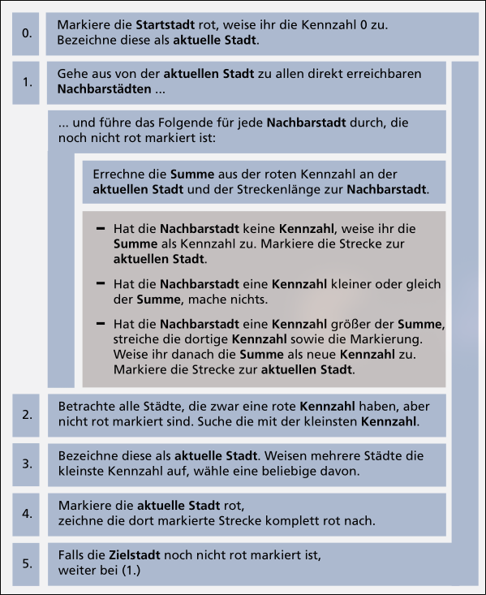

**Fertige Landkarte nach Durchlauf des Dijkstra-Algorithmus (I $\rightarrow$ O):**

## Was steck dahinter

Man unterscheidet ungerichtete Graphen, also solche, bei denen die Verbindung zweier Knoten in beide Richtungen geht (ohne Pfeil), und gerichtete Graphen (mit Pfeil).

**Verwendung:**

- Landkarte bzw. der Stadtplan
- Produktionspläne
- Mathematische Gleichungen

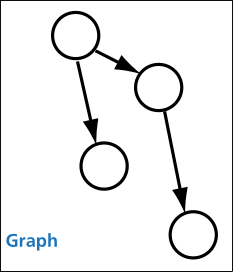
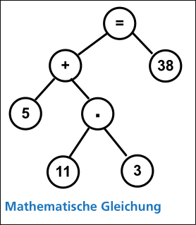

### Runtime

Wenn man versuchen würde den kürzesten Weg durch den Graphen zu Brutforcen würde die Dauer exponentiell ansteigen:
$(n - 1) * (n - 1)!$

Optimal wäre ein linearer Aufwand.
Das bedeutet, dass zur Lösung eines Problems der Größe $n$ der Aufwand $x * n$ beträgt (mit konstantem $x$).
Leider gibt es kaum Algorithmen, die so gut sind.

**Aufwand von Dijkstra:**\
Vom Startknoten aus werden alle benachbarten Knoten (also die, zu denen eine Verbindung besteht) betrachtet.
Bei einem vollständigen Graphen mit $n$ Knoten sind das $(n - 1)$.

Nun wird der Knoten mit der kleinsten Markierung gesucht und von dort geht es wiederum zu allen benachbarten Knoten - das sind $(n - 2)$

Dies setzt sich fort.
Daher ist der Aufwand für den Dijkstra-Algorithmus:
$(n-1) + (n-2) + (n-3) + ... + (1)$

### Komplexität

Die Komplexität gibt an, wie stark die Rechenzeit in Relation zur Problemgröße anwächst.
Im Falle von Brute-Force ist die Komplexität $n^n$, während Dijkstra eine Komplexität von $n^2$ aufweist.

Alles, was sich in polynomieller Laufzeit lösen lässt, gehört zur Klasse „P“.
Das bedeutet, die Laufzeit steigt im Verhältnis zur Problemgröße in einem Verhältnis an, das sich durch ein Polynom ausdrücken lässt.
(z.B.: $n^2$, $n^4+ n^2+ n$, $n*log(n)$ oder auch $n^{100}$)

Darüber hinaus gibt es die Klasse der „**N**icht **P**raktisch berechenbaren“ Probleme oder
„NP“.
Diese haben eine Laufzeit, die sich nicht durch ein Polynom ausdrücken lässt.
Dies bedeutet, dass in der Komplexitätsfunktion die Problemgröße irgendwo in einem Exponenten auftaucht.

NP-Komplexitäten sind $2^n$, $n!$ oder $n^n$.

## Das ist Informatik: Probleme lösen

### Lösungsschemen

Allgemeines Problemlöseschema:

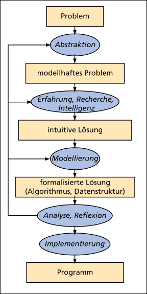

Struktogramm:

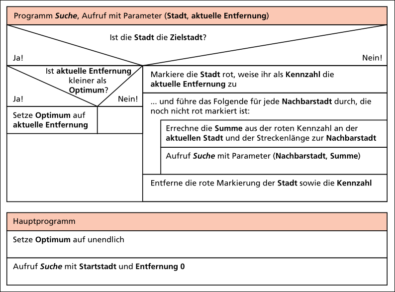

### Lösungsschemen angewandt in Dijkstra

Dijkstra nutzt recht uneingeschränkt die Breitensuche und erkundet den Graphen daher ohne Bevorzugung einer Richtung.

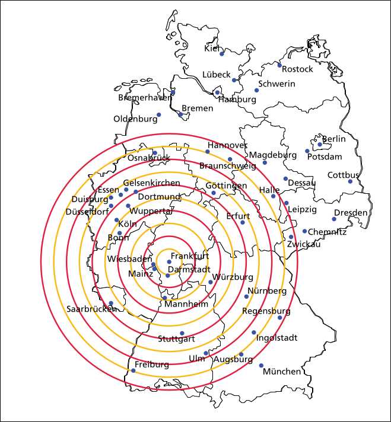

Ein gedachtes Rechteck um Start und Ziel grenzt die Suche ein, indem nun alle Orte außerhalb des Rechtecks nicht mehr in das Verfahren einbezogen werden.

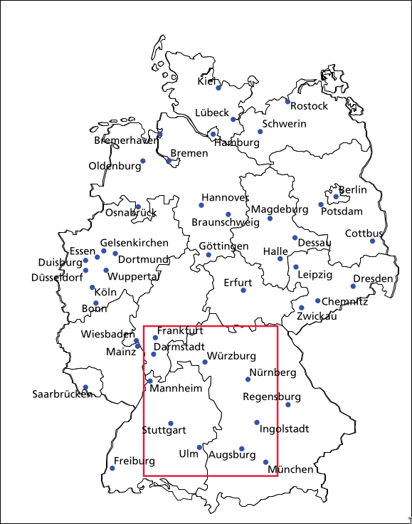

Die Methode der Bounding-Box könnte dazu führen, die beste Strecke gar nicht zu finden:
Woher wissen wir, dass es nicht günstiger ist, ein paar Kilometer in Gegenrichtung zu fahren,
um dann eine schnurgerade Autobahn zu erreichen, auf der man den Umweg leicht wieder hereinholt?

Besser ist, zwar den Fokus der Suche in Richtung des Ziels zu lenken, aber trotzdem noch alle Optionen offenzuhalten.
Wir könnten daher viel leicht die Länge der direkten Strecke zum Ziel (Luftlinie) als eine Art „Lustfaktor“ in den Algorithmus einbeziehen:
Je kürzer die Luftlinie, desto williger steuern wir einen Ort an, werden aber die anderen Orte auch nicht ignorieren.

Neben den tatsächlich ermittelten Strecken zu den Orten vom Start aus,
können wir auch die Summe (violett) aus tatsächlicher Strecke vom Start (rot) und minimaler Strecke zum Ziel (blau) ermittelten.
Das ist gleichzeitig eine minimale Strecke zum Ziel bei Nutzung des Ortes als Teilziel.

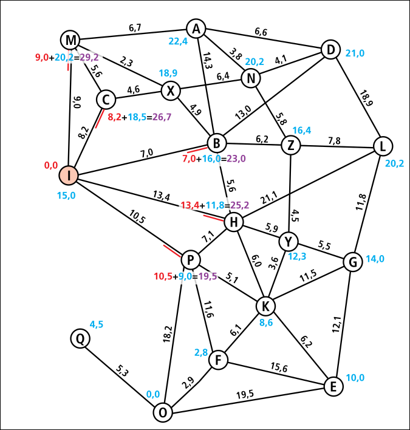

Hier wird auch ein ganz wesentlicher Vorteil der sehr allgemeinen, abstrakten Beschreibung eines Algorithmus deutlich.
Verbesserungen und Veränderungen sind so meistens nur sehr geringfügig.
Es wird sofort offensichtlich, an welchen Stellen die Programmierer auch die Implementierung überarbeiten müssen.

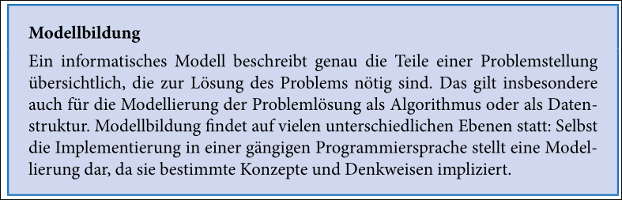

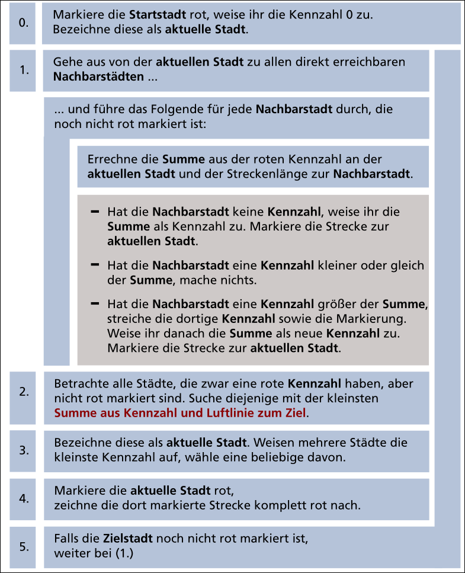

Unser Wunsch nach besserer (Ausführungs-)Geschwindigkeit ist mit A-Stern erfüllt worden:
Statt in alle Richtungen gleichermaßen zu suchen, bevorzugt der neue Ansatz die Richtung zum Ziel.

### Resümee

Anhand der Lösung des Wegeproblems haben wir wichtige Werkzeuge der Erkenntnisgewinnung in der Informatik kennen gelernt.
Abstraktion und Modellbildung - das gezielte Weglassen irrelevanter Information und die übersichtliche Darstellung
der relevanten - sind die wichtigsten Voraussetzungen, um eine Aufgabe zu lösen.
Wenn man durch Intuition, Analogiebildung oder Verwendung bekannter Algorithmen einen Ansatz gefunden hat,
hilft es wiederum, diesen formal zu beschreiben,
um durch Analyse herauszufinden, ob er für die zur Verfügung stehenden Ressourcen wie Rechenzeit und Speicherplatz auch funktioniert.

# Ordnung muss sein!

## Die Problemgröße

Ein wichtiger Vorgang bei der Lösung von Aufgaben aus der Informationstechnik ist das Bestimmen der sogenannten Problemgröße.
Sie stellt ein Maß dar, wie schwierig bzw. umfangreich die Aufgabe bzw. das Problem ist.
Daher hängt von der Problemgröße entscheidend der zu leistende Aufwand ab.

## Das Prinzip „divide et impera“

Sehr häufig hat man im Leben Probleme zu lösen, die zu unüberschaubar und groß sind, um sie in einem Ansatz zu lösen.
Vielmehr teilen wir das Gesamtproblem auf in mehrere, handhabbare Stücke, die wir lösen.
Die Teillösungen werden danach nur noch zusammengefasst.

Dieses Prinzip wird auch in der Informatik sehr stark verwendet:
Ein Programm zerlegt die gestellte Aufgabe zunächst in mehrere kleinere Einheiten,
genannt Teilprobleme (divide = teile), und weist danach andere Programme an,
diese zu lösen (impera = herrsche, befehlige).
Dabei ist sehr wichtig, dass die Teilprobleme unabhängig voneinander gelöst werden können,
denn sonst müssten die Programme miteinander kommunizieren,
unter Umständen auf Lösungen voneinander warten, was den Aufwand wiederum sehr erhöht.

## Selection-Sort

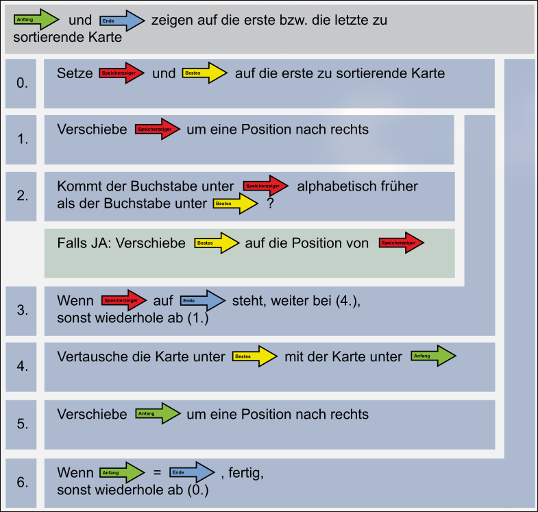

## Bubble-Sort

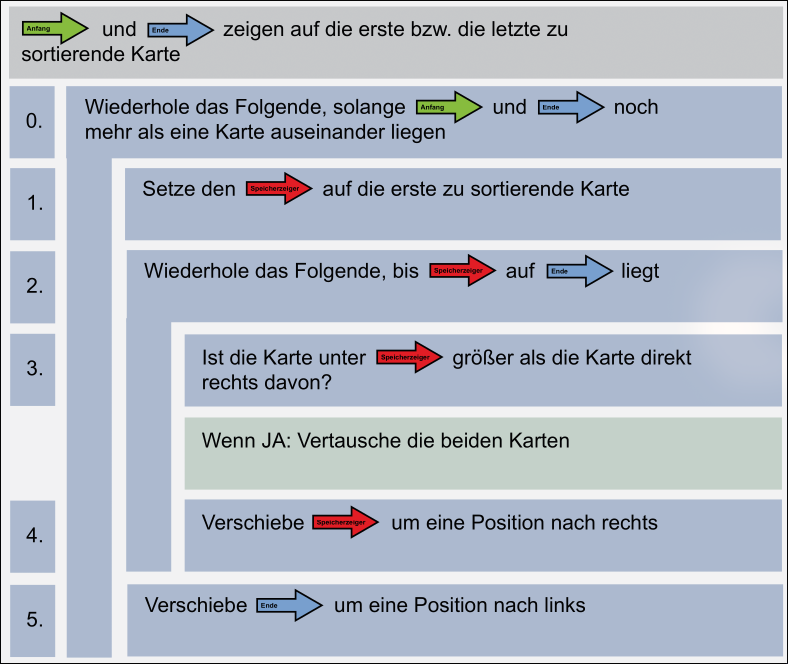

## Elementaroperationen

Operationen bzw. Arbeitsschritte, die wir bei der Bestimmung der Laufzeit eines Algorithmus für wichtig bzw. zeitkritisch erachten.
Welche Operationen hier ausgewählt werden, ist nicht global definiert, sondern vom jeweiligen Anwendungsfall abhängig.
Oft handelt es sich um Speichervorgänge (Lesen und Schreiben im Speicher).

## Die Aufwandsabschätzung

Mit der Aufwandsabschätzung wird in der Informatik oft die Qualität von Algorithmen bestimmt.
Diese Abschätzung gibt an, wie stark die notwendige Rechenzeit in Bezug zur Problemgröße anwächst.
Konstante Faktoren werden hier nicht berücksichtigt.
Auf diese Weise kann für kleine Problemgrößen die tatsächliche Rechenzeit eines „schlechteren“ Algorithmus unter der des besseren liegen.

## nlogn oder die Kür des Sortierens

**Tournament sort**

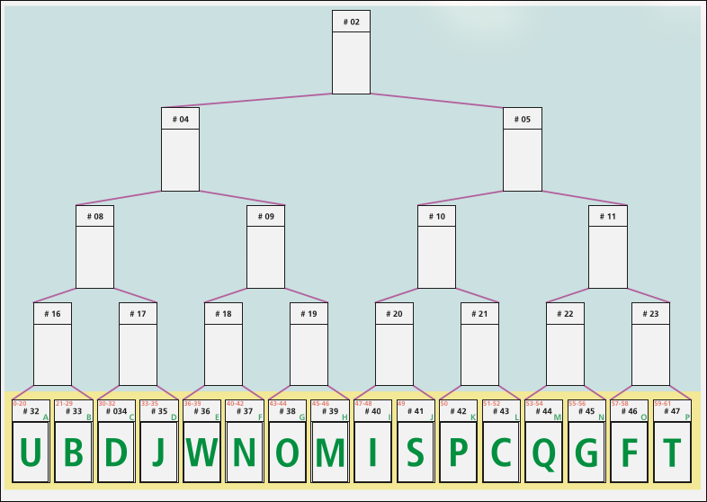
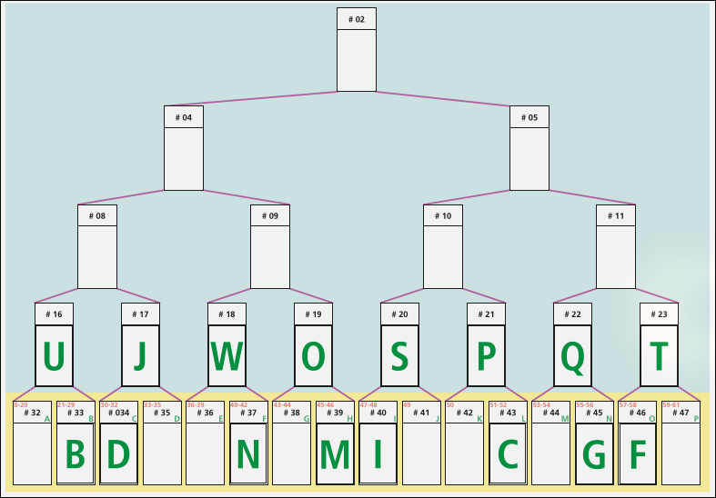
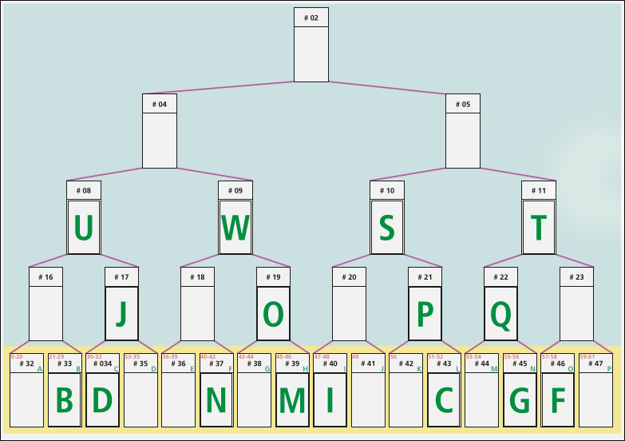
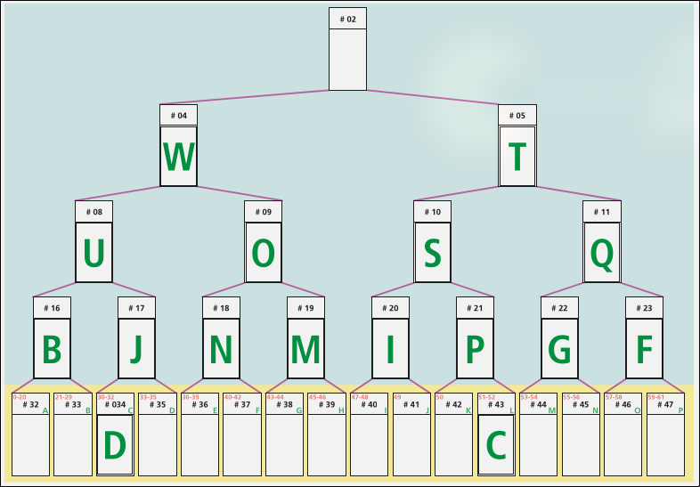
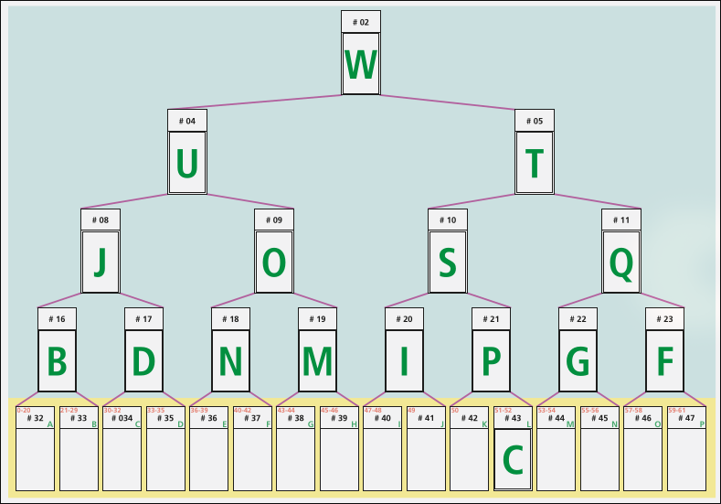
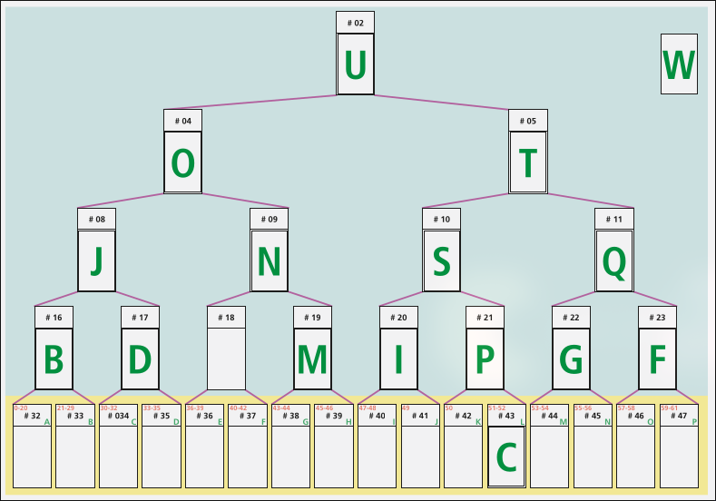
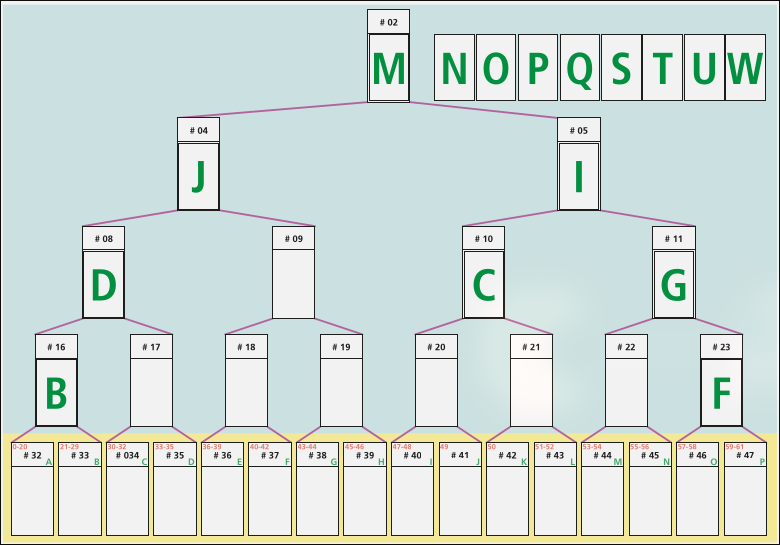
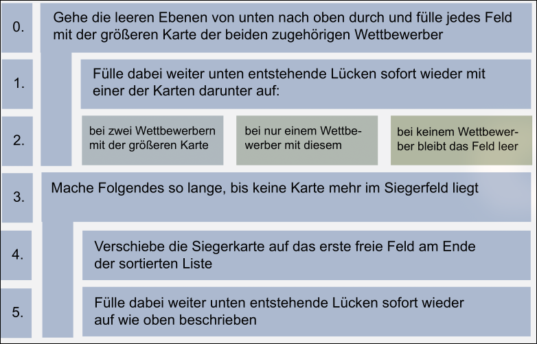

Auf der untersten Ebene im gelben Bereich befinden sich $n$ Felder mit den unsortierten Karten.
Auf der untersten K.-o.-Ebene sind es halb so viele, da je eine von zwei Karten gewinnt.
Es folgen wiederum halb so viele, also ein Viertel usw., bis nur noch ein Feld, das Siegerfeld, in der obersten Ebene steht.

Insgesamt gibt es also $\frac{n}{2}+\frac{n}{4}+\frac{n}{8}+...+1$ Felder auf den Siegerebenen.
Einer mathematischen Rechenregel nach ergibt diese sogenannte geometrische Reihe ungefähr wieder $n$.

# Notizen

Lesezeichen: Digital 83/ Buch 72
