---
title: "Design Patterns: Elements of Reusable Object-Oriented Software"
subtitle: "A notebook and summary"
author: [Michael Obernhumer]
date: \the\day.\the\month.\the\year
titlepage: true
titlepage-background: "../../template/background10.pdf"
footnotes-pretty: true
...

# Introduction

## What is a design pattern

In general, a pattern has four essential elements:

1. The **pattern name** is a handle we can use to describe a design problem, its solutions, and consequences in a word or two.
2. The **problem** describes when to apply the pattern.
3. The **solution** describes the elements that make up the design, their relationships, responsibilities, and collaborations.
4. The **consequences** are the results and trade-offs of applying the pattern.

## Describing Design Patterns

### Pattern Name and Classification

The pattern's name conveys the essence of the pattern succinctly. A good name is vital, because it will become part of your design vocabulary. The pattern's classification reflects the scheme we introduce in Section 1.5.

### Intent

A short statement that answers the following questions: What does the design pattern do? What is its rationale and intent? What particular design issue or problem does it address?

### Also Known As

Other well-known names for the pattern, if any.

### Motivation

A scenario that illustrates a design problem and how the class and object structures in the pattern solve the problem. The scenario will help you understand the more abstract description of the pattern that follows.

### Applicability

What are the situations in which the design pattern can be applied? What are examples of poor designs that the pattern can address? How can you recognize these situations?

### Structure

A graphical representation of the classes in the pattern using a notation based on the Object Modeling Technique (OMT). We also use interaction diagrams to illustrate sequences of requests and collaborations between objects. Appendix B describes these notations in detail.

### Participants

The classes and/or objects participating in the design pattern and their responsibilities.

### Collaborations

How the participants collaborate to carry out their responsibilities.

### Consequences

How does the pattern support its objectives? What are the trade-offs and results of using the pattern? What aspect of system structure does it let you vary independently?

### Implementation

What pitfalls, hints, or techniques should you be aware of when implementing the pattern? Are there language-specific issues?

### Sample Code

Code fragments that illustrate how you might implement the pattern in C++ or Smalltalk.

### Known Uses

Examples of the pattern found in real systems. We include at least two examples from different domains.

### Related Patterns

What design patterns are closely related to this one? What are the important differences? With which other patterns should this one be used?

## Organising the Catalogue

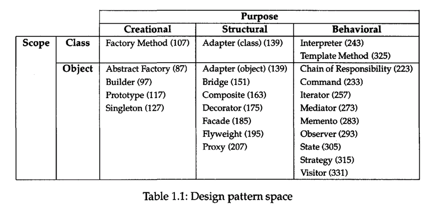

We classify design patterns by two criteria (Table 1.1). The first criterion, called purpose, reflects what a pattern does. Patterns can have either creational, structural, or behavioral purpose.

- Creational patterns concern the process of object creation.
- Structural patterns deal with the composition of classes or objects.
- Behavioral patterns characterize the ways in which classes or objects interact and distribute responsibility.

The second criterion, called scope, specifies whether the pattern applies primarily to classes or to objects.

## How Design Patterns Solve Design Problems

### Finding Appropriate Objects

Object-oriented programs are made up of **objects**. An object packages both data and the procedures that operate on that data. The procedures are typically called **methods** or operations. An object performs an operation when it receives a **request** (or **message**) from a **client**.

Requests are the only way to get an object to execute an operation. Operations are the only way to change an object's internal data. Because of these restrictions, the object's internal state is said to be **encapsulated**; it cannot be accessed directly, and its representation is invisible from outside the object.

### Specifying Object Implementations

Our OMT-based notation (summarized in Appendix B) depicts a class as a rectangle with the class name in bold.

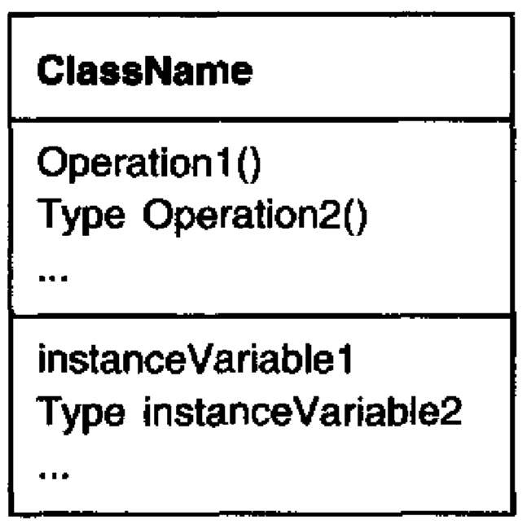

A dashed arrowhead line indicates a class that instantiates objects of another class. The arrow points to the class of the instantiated objects.

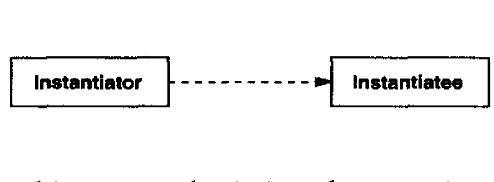

We indicate the subclass relationship with a vertical line and a triangle.

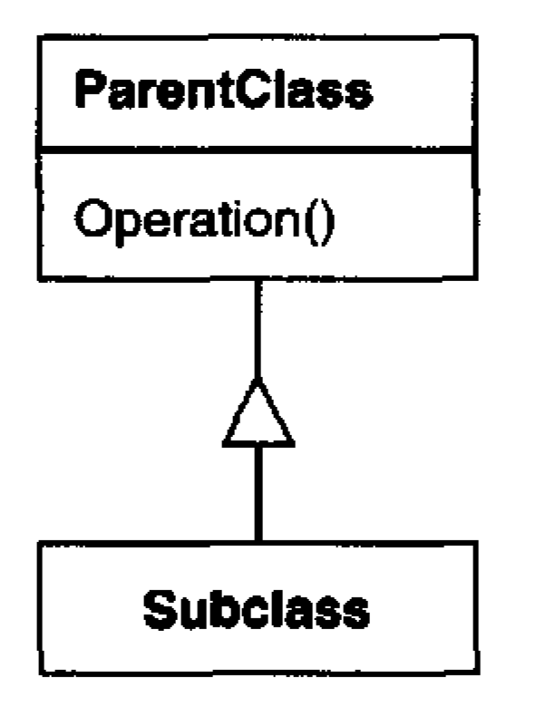

The names of abstract classes appear in slanted type to distinguish them from concrete classes. Slanted type is also used to denote abstract operations. A diagram may include pseudocode for an operation's implementation; if so, the code will appear in a dogeared box connected by a dashed line to the operation it implements.

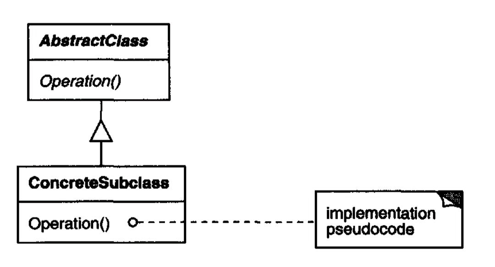

A **mixin** class is a class that's intended to provide an optional interface or functionality to other classes. It's similar to an abstract class in that it's not intended to be instantiated. Mixin classes require multiple inheritance:

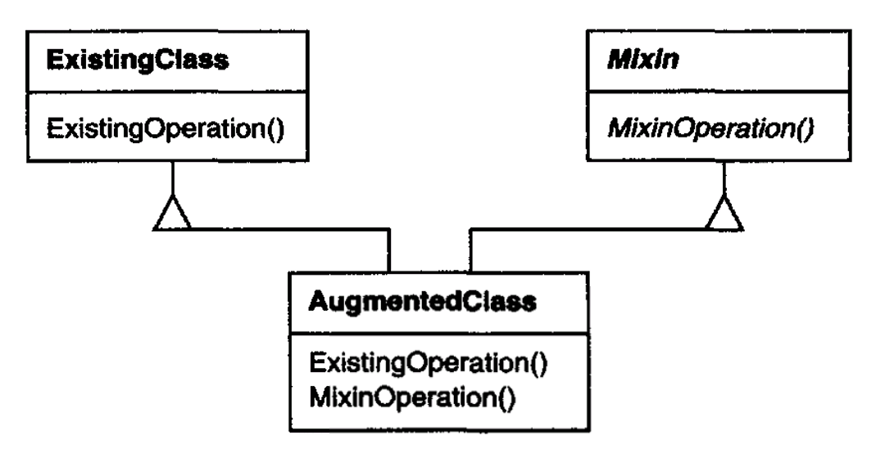

### Programming to an Interface, not an Implementation

There are two benefits to manipulating objects solely in terms of the interface defined by abstract classes:

1. Clients remain unaware of the specific types of objects they use, as long as the objects adhere to the interface that clients expect.
2. Clients remain unaware of the classes that implement these objects. Clients only know about the abstract class(es) defining the interface.

This so greatly reduces implementation dependencies between subsystems that it leads to the following principle of reusable object-oriented design:

> Program to an interface, not an implementation.

## Putting Reuse Mechanisms to Work

### Inheritance versus Composition

Favoring object composition over class inheritance helps you keep each class encapsulated and focused on one task. Your classes and class hierarchies will remain small and will be less likely to grow into unmanageable monsters. On the other hand, a design based on object composition will have more objects (if fewer classes), and the system's behavior will depend on their interrelationships instead of being defined in one class.

That leads us to our second principle of object-oriented design:

> Favor object composition over class inheritance.

### Delegation

Instead of making class Window a subclass of Rectangle (because windows happen to be rectangular), the Window class might reuse the behaviour of Rectangle by keeping a Rectangle instance variable and delegating Rectangle-specific behaviour to it.

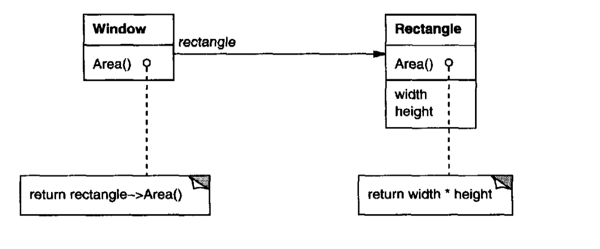

A plain arrowhead line indicates that a class keeps a reference to an instance of another class. The reference has an optional name, "rectangle" in this case.

Delegation has a disadvantage it shares with other techniques that make software more flexible through object composition: Dynamic, highly parameterized software is harder to understand than more static software. Delegation is a good design choice only when it simplifies more than it complicates.

### Inheritance versus Parameterized Types

- Object composition lets you change the behavior being composed at run-time, but it also requires indirection and can be less efficient.
- Inheritance lets you provide default implementations for operations and lets subclasses override them.
- Parameterized types let you change the types that a class can use.

But neither inheritance nor parameterized types can change at run-time. Which approach is best depends on your design and implementation constraints.

### Relating Run-Time and Compile-Time Structures

**Aggregation** implies that one object owns or is responsible for another object. Generally we speak of an object having or being part of another object. Aggregation implies that an aggregate object and its owner have identical lifetimes.

**Acquaintance** implies that an object merely knows of another object. Sometimes acquaintance is called "association" or the "using" relationship. Acquainted objects may request operations of each other, but they aren't responsible for each other. Acquaintance is a weaker relationship than aggregation and suggests much looser coupling between objects.

In our diagrams, a plain arrowhead line denotes acquaintance. An arrowhead line with a diamond at its base denotes aggregation:

### Designing for Change

Here are some common causes of redesign along with the design pattern(s) that address them:

1. Creating an object by specifying a class explicitly.
2. Dependence on specific operations.
3. Dependence on hardware and software platform.
4. Dependence on object representations or implementations.
5. Algorithmic dependencies.
6. Tight coupling.
7. Extending functionality by subclassing.
8. Inability to alter classes conveniently

#### Frameworks

- Design patterns are more abstract than frameworks.
- Design patterns are smaller architectural elements than frameworks.
- Design patterns are less specialized than frameworks

## How to select a design pattern

- Consider how design patterns solve design problems.
- Scan Intent sections.
- Study how patterns interrelate.
- Study patterns of like purpose.
- Examine a cause of redesign.
- Consider what should be variable in your design.

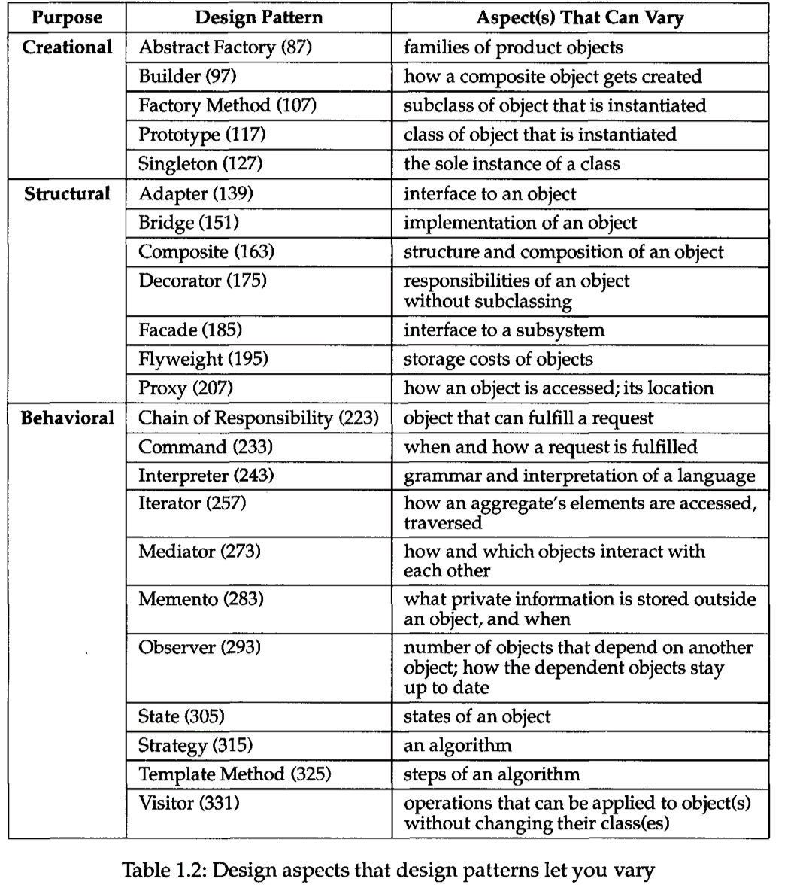

## How to use a design pattern

1. Read the pattern once through for an overview.
2. Go back and study the Structure, Participants, and Collaborations sections.
3. Look at the Sample Code section to see a concrete example of the pattern in code.
4. Choose names for pattern participants that are meaningful in the application
5. Define the classes.
6. Define application-specific names for operations in the pattern.
7. Implement the operations to carry out the responsibilities and collaborations in the pattern.

# A Case Study: Designing a Document Editor

## Design Problems

We will examine seven problems in Lexi's design:

1. Document structure.
2. Formatting
3. Embellishing the user interface.
4. Supporting multiple look-and-feel standards
5. Supporting multiple window systems
6. User operations
7. Spelling checking and hyphenation.

## Document Structure

### Recursive Composition

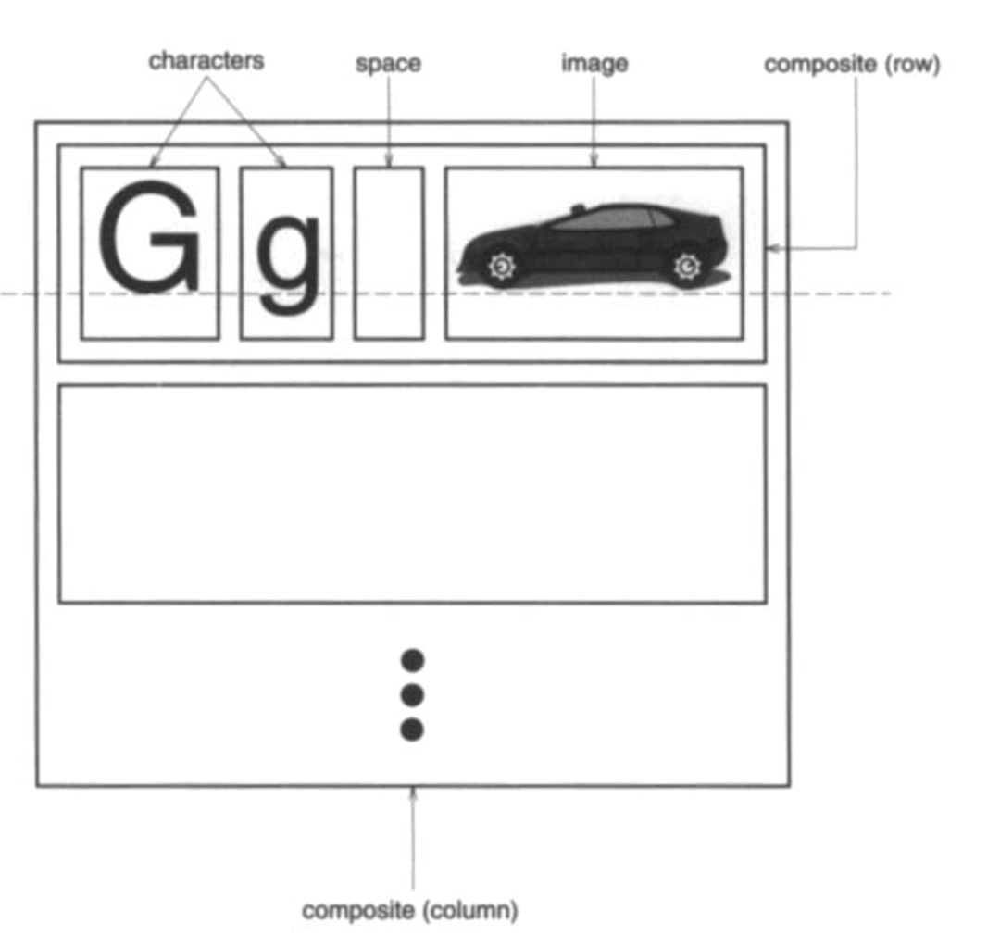

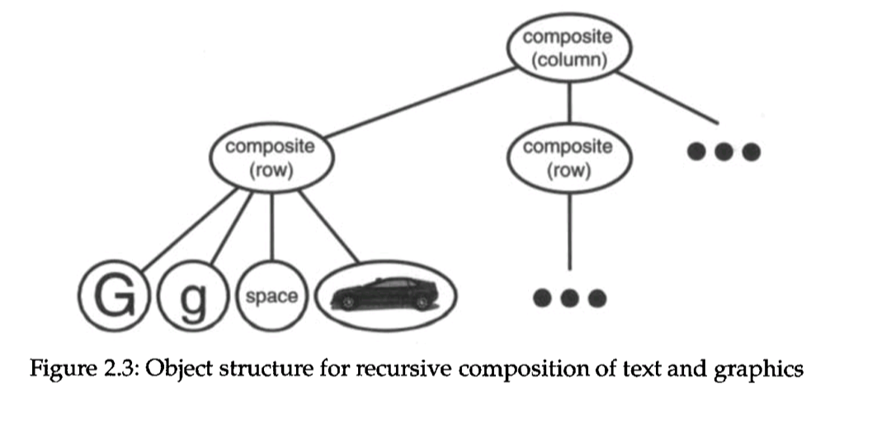

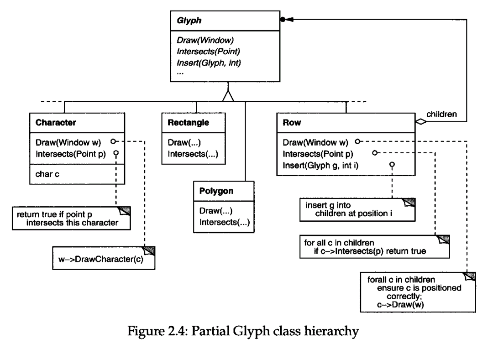

### Glyphs

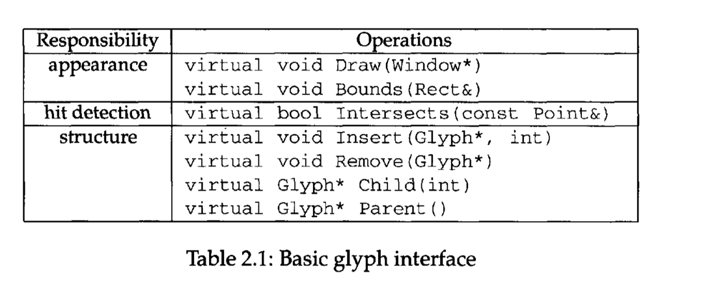

### Composite Pattern

Recursive composition is good for more than just documents.
We can use it to represent any potentially complex, hierarchical structure.
The Composite (163) pattern captures the essence of recursive composition in object-oriented terms.

## Formatting

### Compositor and Composition

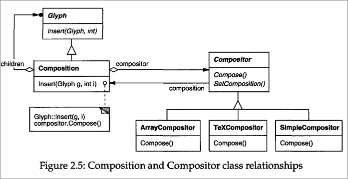
