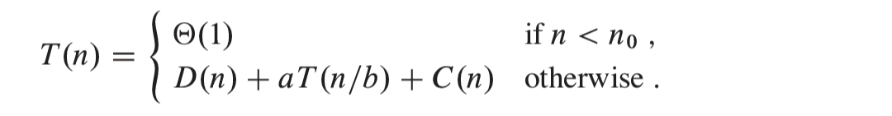

---
title: "Introduction to Algorithms Fourth Edition"
subtitle: "A notebook and summary"
author: [Michael Obernhumer]
date: \the\day.\the\month.\the\year
titlepage: true
titlepage-background: "../../template/background10.pdf"
footnotes-pretty: true
...

**Written by:**

> Thomas H. Cormen \
> Charles E. Leiserson \
> Ronald L. Rivest \
> Clifford Stein

<h1>Content</h1>

<!--toc:start-->
- [Foundations](#foundations)
- [The Role of Algorithms in Computing](#the-role-of-algorithms-in-computing)
  - [Algorithms](#algorithms)
    - [Exercises:](#exercises)
      - [1.1-1:](#11-1)
      - [1.1-2:](#11-2)
      - [1.1-3:](#11-3)
      - [1.1-4:](#11-4)
      - [1.1-5:](#11-5)
      - [1.1-6:](#11-6)
  - [Algorithms as a technology](#algorithms-as-a-technology)
    - [Exercises](#exercises)
      - [1.2-1:](#12-1)
      - [1.2-2:](#12-2)
      - [1.2-3:](#12-3)
- [Getting Started](#getting-started)
  - [Insertion sort](#insertion-sort)
    - [The Algorithm](#the-algorithm)
    - [What are loop invariants](#what-are-loop-invariants)
    - [Insertion sort loop invariant](#insertion-sort-loop-invariant)
    - [Pseudocode conventions](#pseudocode-conventions)
    - [Exercises](#exercises)
      - [2.1-1:](#21-1)
      - [2.1-2:](#21-2)
      - [2.1-3:](#21-3)
      - [2.1-4:](#21-4)
      - [2.1-5:](#21-5)
  - [Analyzing algorithms](#analyzing-algorithms)
    - [RAM (Random Access Machine)-Model](#ram-random-access-machine-model)
    - [Analysis of insertion sort](#analysis-of-insertion-sort)
      - [Running time & inputs](#running-time-inputs)
      - [Analysis of insertion sort \](#analysis-of-insertion-sort)
      - [Worst-case and average-case analysis](#worst-case-and-average-case-analysis)
      - [Order of growth](#order-of-growth)
      - [Exercises](#exercises)
  - [Designing algorithms](#designing-algorithms)
    - [The divide-and-conquer method](#the-divide-and-conquer-method)
      - [The Method](#the-method)
      - [Merge Sort](#merge-sort)
      - [The merge step](#the-merge-step)
      - [Merge runtime](#merge-runtime)
      - [merge sort step](#merge-sort-step)
    - [Analyzing divide-and-conquer algorithms](#analyzing-divide-and-conquer-algorithms)
      - [conventions](#conventions)
      - [Analysis of merge sort](#analysis-of-merge-sort)
<!--toc:end-->

# Foundations

# The Role of Algorithms in Computing

## Algorithms

### Exercises:

#### 1.1-1:

Describe your own real-world example that requires sorting.
Describe one that requires ûnding the shortest distance between two points.

#### 1.1-2:

Other than speed, what other measures of efûciency might you need to consider in a real-world setting?

#### 1.1-3:

Select a data structure that you have seen, and discuss its strengths and limitations.

#### 1.1-4:

How are the shortest-path and traveling-salesperson problems given above similar?
How are they different?

#### 1.1-5:

Suggest a real-world problem in which only the best solution will do.
Then come up with one in which approximately the best solution is good enough.

#### 1.1-6:

Describe a real-world problem in which sometimes the entire input is available before you need to solve the problem, but other times the input is not entirely available in advance and arrives over time.

## Algorithms as a technology

- Total system performance depends on choosing eficient algorithms as much as on choosing fast hardware

### Exercises

#### 1.2-1:

Give an example of an application that requires algorithmic content at the application level, and discuss the function of the algorithms involved.

#### 1.2-2:

Suppose that for inputs of size $n$ on a particular computer, insertion sort runs in $8n^2$ steps and merge sort runs in $64n\ \log n$ steps.
For which values of n does insertion sort beat merge sort?

#### 1.2-3:

What is the smallest value of n such that an algorithm whose running time is $100n^2$ runs faster than an algorithm whose running time is $2^n$ on the same machine?

# Getting Started

## Insertion sort

### The Algorithm

**Input:** A sequence of $n$ numbers $\left\langle a_1, a_2, ... ,a_n \right\rangle$.

**Output:** A permutation (reordering) $\left\langle a'_1, a'_2, ... ,a'_n \right\rangle$ of the input sequence such that $\left\langle a'_1 \leq a'_2 \leq ... \leq a'_n \right\rangle$.

- The numbers to be sorted are also known as the keys.
- When we want to sort numbers, it’s often because they are the keys associated with other data, which we call satellite data.
  Together, a key and satellite data form a record.

**INSERTION-SORT $(A;n)$:**


**Visualized:**


### What are loop invariants

Loop invariants help us understand why an algorithm is correct.
When you’re using a loop invariant, you need to show three things:

**Initialization:** It is true prior to the first iteration of the loop.

**Maintenance:** If it is true before an iteration of the loop, it remains true before the next iteration.

**Termination:** The loop terminates, and when it terminates, the invariant _- usually along with the reason that the loop terminated -_ gives us a useful property that helps show that the algorithm is correct.

### Insertion sort loop invariant

**Initialization:**

We start by showing that the loop invariant holds before the first loop iteration, when $i=2$.
The subarray $A[1:i-1]$ consists of just the single element $A[1]$ , which is in fact the original element in $A[1]$ .
Moreover, this subarray is sorted (after all, how could a subarray with just one value not be sorted?), which shows that the loop invariant holds prior to the first iteration of the loop.

**Maintenance:**

Next, we tackle the second property: showing that each iteration maintains the loop invariant.
Informally, the body of the **for** loop works by moving the values in $A[i-1], A[i-2], A[i-3]$ and so on by one position to the right until it finds the proper position for $A[i]$ (lines 4-7), at which point it inserts the value of $A[i]$ (line 8).
The subarray $A[1:i]$ then consists of the elements originally in $A[1:i]$ , but in sorted order.
`Incrementing` i (increasing its value by 1 ) for the next iteration of the **for** loop then preserves the loop invariant.

A more formal treatment of the second property would require us to state and show a loop invariant for the **while** loop of lines 5-7.
Let’s not get bogged down in such formalism just yet.
Instead, we’ll rely on our informal analysis to show that the second property holds for the outer loop.

**Termination:**

Finally, we examine loop termination.
The loop variable $i$ starts at 2 and increases by 1 in each iteration.
Once $i’s$ value exceeds $n$ in line 1, the loop terminates.
That is, the loop terminates once $i$ equals $n + 1$.
Substituting $n + 1$ for $i$ in the wording of the loop invariant yields that the subarray $A[1:n]$ consists of the elements originally in $A[1:n]$ , but in sorted order.
Hence, the algorithm is correct.

### Pseudocode conventions

Although many programming languages enforce 0-origin indexing for arrays (0 is the smallest valid index), we choose whichever indexing scheme is clearest for human readers to understand.
Because people usually start counting at 1, not 0, most - but not all - of the arrays in this book use 1-origin indexing.
To be clear about whether a particular algorithm assumes 0-origin or 1-origin indexing, we’ll specify the bounds of the arrays explicitly.

### Exercises

#### 2.1-1:

Using Figure 2.2 as a model, illustrate the operation of INSERTION-SORT on an array initially containing the sequence $\left\langle 31,41,59,26,41,58 \right\rangle$.

#### 2.1-2:

Consider the procedure SUM-ARRAY on the facing page.
It computes the sum of the $n$ numbers in array $A[1:n]$.
State a loop invariant for this procedure, and use its initialization, maintenance, and termination properties to show that the SUM-ARRAY procedure returns the sum of the numbers in $A[1:n]$.


#### 2.1-3:

Rewrite the INSERTION-SORT procedure to sort into monotonically decreasing instead of monotonically increasing order.

#### 2.1-4:

Consider the `searching problem`:

**Input:** A sequence of $n$ numbers $\left\langle a_1, a_2, ..., a_n \right\rangle$ stored in array $A[1:n]$ and a value x .

**Output:** An index $i$ such that $x$ equals $A[i]$ or the special value NIL if $x$ does not appear in $A$ .

Write pseudocode for `linear search`, which scans through the array from beginning to end, looking for $x$ .
Using a loop invariant, prove that your algorithm is correct.
Make sure that your loop invariant fulûlls the three necessary properties.

#### 2.1-5:

Consider the problem of adding two $n$-bit binary integers $a$ and $b$ , stored in two $n$-element arrays $A[0:n-1]$ and $B[0:n-1]$, where each element is either 0 or 1, $a=\sum_{i=0}^{n-1} A[i]*2^i$, and $b=\sum_{i=0}^{n-1} B[i]*2^i$. The sum $c=a+b$ of the two integers should be stored in binary form in an $(n+1)$-element array $C[0:n]$, where $c=\sum_{i=0}^{n} C[i]*2^i$. Write a procedure ADD-BINARY-INTEGERS that takes as input arrays $A$ and $B$, along with the length $n$, and returns array $C$ holding the sum.

## Analyzing algorithms

### RAM (Random Access Machine)-Model

- The RAM model contains instructions commonly found in real computers: arithmetic (such as add, subtract, multiply, divide, remainder, floor, ceiling), data movement (load, store, copy), and control (conditional and unconditional branch, subroutine call and return).
- The RAM model does not account for the memory hierarchy that is common in contemporary computers. It models neither caches nor virtual memory

### Analysis of insertion sort

#### Running time & inputs

- From running just one implementation of insertion sort on just one computer and on just one input, what would you be able to determine about insertion sort’s running time if you were to give it a different input, if you were to run it on a different computer, or if you were to implement it in a different programming language? Not much.
- Even though the running time can depend on many features of the input, we’ll focus on the one that has been shown to have the greatest effect, namely the size of the input, and describe the running time of a program as a function of the size of its input
- The best notion for input size depends on the problem being studied. For many problems, such as sorting, the most nat- ural measure is the number of items in the input - for example, the number n of items being sorted. For many other problems, such as multiplying two integers, the best measure of input size is the total number of bits needed to represent the input in ordinary binary notation.
- The running time of an algorithm on a particular input is the number of instructions and data accesses executed. How we account for these costs should be independent of any particular computer, but within the framework of the RAM model. For the moment, let us adopt the following view. A constant amount of time is required to execute each line of our pseudocode. One line might take more or less time than another line, but we’ll assume that each execution of the $k$th line takes $c_k$ time, where $c_k$ is a constant. This viewpoint is in keeping with the RAM model, and it also reflects how the pseudocode would be implemented on most actual computers.

#### Analysis of insertion sort \


#### Worst-case and average-case analysis

- Our analysis of insertion sort looked at both the best case, in which the input array was already sorted, and the worst case, in which the input array was reverse sorted. For the remainder of this book, though, we’ll usually (but not always) concentrate on finding only the worst case running time, that is, the longest running time for **any** input of size $n$.
- The worst-case running time of an algorithm gives an upper bound on the running time for any input.
- For some algorithms, the worst case occurs fairly often.
- The "average case" is often roughly as bad as the worst case.

#### Order of growth

- In order to ease our analysis of the INSERTION-SORT procedure, we used some simplifying abstractions.
- We ignored not only the actual statement costs, but also the abstract costs $c_k$.
- Let’s now make one more simplifying abstraction: it is the `rate of growth`, or `order of growth`, of the running time that really interests us. We therefore consider only the leading term of a formula (e.g., $an^2$), since the lower-order terms are relatively insignificant for large values of $n$. We also ignore the leading term’s constant coefficient, since constant factors are less significant than the rate of growth in determining computational efficiency for large inputs.
- We write that insertion sort has a worst-case running time of $\Theta(n^2)$. We also write that insertion sort has a best-case running time of $\Theta(n)$. For now, think of ‚$\Theta$-notation as saying "roughly proportional when $n$ is large," so that $\Theta(n^2)$ means "roughly proportional to $n^2$ when $n$ is large" and $\Theta(n^2)$ means "roughly proportional to $n$ when $n$ is large"
- We usually consider one algorithm to be more efficient than another if its worst-case running time has a lower order of growth

#### Exercises

**2.2-1:**
Express the function $n^3 /1000+100n^2 -100n + 3$ in terms of $\Theta$-notation.

**Answer**: $\Theta(n^3)$

**2.2-2**


**Answer:**

```
SELECTION SORT(A,n)
for i = 1 to n-1 do
	low=i
    for j = i+1 to n do
		if A[low] > A[j] then
			low=j
	key=A[low]
	A[low]=A[i]
	A[i]=key
```

The loop invariant of selection sort is as follows: At each iteration of the first for loop, the subarray $A[1..i - 1]$ contains the i - 1 smallest elements of A in increasing order. After n - 1 iterations of the loop, the n - 1 smallest elements of A are in the first n - 1 positions of A in increasing order, so the nth element is necessarily the largest element. Therefore we do not need to run the loop a final time.

The best-case and worst-case running times of selection sort are $\Theta(n^2)$. This is because regardless of how the elements are initially arranged, on the i th iteration of the main for loop the algorithm always inspects each of the remaining n-i elements to find the smallest one remaining.

**2.2-3:**
Consider linear search again (see Exercise 2.1-4). How many elements of the input array need to be checked on the average, assuming that the element being searched for is equally likely to be any element in the array? How about in the worst case? Using $\Theta$-notation, give the average-case and worst-case running times of linear search. Justify your answers.

**2.2-4:**
How can you modify any sorting algorithm to have a good best-case running time?

## Designing algorithms

### The divide-and-conquer method

#### The Method

- **Divide** the problem into one or more subproblems that are smaller instances of the same problem.
- **Conquer** the subproblems by solving them recursively.
- **Combine** the subproblem solutions to form a solution to the original problem.

#### Merge Sort

The `merge sort` algorithm closely follows the divide-and-conquer method. In each step, it sorts a subarray $A[p:r]$ , starting with the entire array $A[1:n]$ and recursing down to smaller and smaller subarrays.

- **Divide** the subarray $A[p:r]$ to be sorted into two adjacent subarrays, each of half the size. To do so, compute the midpoint $q$ of $A[p:r]$ (taking the average of $p$ and $r$), and divide $A[p:r]$ into subarrays $A[p:q]$ and $A[q+1:r]$.
- **Conquer** by sorting each of the two subarrays $A[p:r]$ and $A[q+1:r]$ recursively using merge sort.
- **Combine** by merging the two sorted subarrays $A[p:q]$ and $A[q+1:r]$ back into $A[p:r]$, producing the sorted answer.

The recursion "bottoms out" - it reaches the base case - when the sub array $A[p:r]$ to be sorted has just 1 element, that is, when $p$ equals $r$.

#### The merge step

The merge operation is performed by the auxiliary procedure $MERGE(A,p,q,r)$, where $A$ is an array and $p$ , $q$ , and $r$ are indices into the array such that $p \leq q < r$ . The procedure assumes that the adjacent subarrays $A[p:q]$ and $A[q+1:r]$ were already recursively sorted. It merges the two sorted subarrays to form a single sorted subarray that replaces the current subarray $A[p:r]$.


#### Merge runtime

To see that the MERGE procedure runs in $\Theta(n)$ time, where $n = r - p + 1$ observe that each of lines 1-3 and 8-10 takes constant time, and the **for** loops of lines 4-7 take $\Theta(n_L + n_R) = \Theta(n)$ time. To account for the three while loops of lines 12-18, 20-23, and 24-27, observe that each iteration of these loops copies exactly one value from $L$ or $R$ back into $A$ and that every value is copied back into $A$ exactly once. Therefore, these three loops together make a total of $n$ iterations. Since each iteration of each of the three loops takes constant time, the total time spent in these three loops is $\Theta(n)$

#### merge sort step

MERGE-SORT runs the divide, conquer, and combine steps. The divide step simply computes an index $q$ that partitions $A[p:r]$ into two adjacent subarrays: $A[p:q]$, containing $[n/2]$ elements, and $A[q+1:r]$, containing $[n/2]$ elements.


### Analyzing divide-and-conquer algorithms

When an algorithm contains a recursive call, you can often describe its running time by a `recurrence equation` or `recurrence`, which describes the overall running time on a problem of size $n$ in terms of the running time of the same algorithm on smaller inputs.

As we did for insertion sort, let $T(n)$ be the worst-case running time on a problem of size $n$ . If the problem size is small enough, say $n < n_0$ for some constant $n_0 > 0$, the straightforward solution takes constant time, which we write as $\Theta(1)$ . Suppose that the division of the problem yields $a$ subproblems, each with size $n/b$, that is, $1/b$ the size of the original. For merge sort, both $a$ and $b$ are 2, but we’ll see other divide-and-conquer algorithms in which $a \neq b$ . It takes $T(n/b)$ time to solve one subproblem of size $n/b$, and so it takes $aT(n/b)$ time to solve all a of them. If it takes $D(n)$ time to divide the problem into subproblems and $C(n)$ time to combine the solutions to the subproblems into the solution to the original problem, we get the recurrence




#### conventions

Chapter 4 shows how to solve common recurrences of this form. Sometimes, the $n/b$ size of the divide step isn’t an integer. For example, the MERGE-SORT procedure divides a problem of size $n$ into subproblems of sizes $\lceil n/2 \rceil$ and $\lfloor n/2 \rfloor$. Since the difference between $\lceil n/2 \rceil$ and $\lfloor n/2 \rfloor$ is at most 1, which for large $n$ is much smaller than the effect of dividing $n$ by 2 , we’ll squint a little and just call them both size $n/2$. As Chapter 4 will discuss, this simplification of ignoring floors and ceilings does not generally affect the order of growth of a solution to a divide-and-conquer recurrence.

Another convention we’ll adopt is to omit a statement of the base cases of the recurrence, which we’ll also discuss in more detail in Chapter 4. The reason is that the base cases are pretty much always $T(n)=\Theta(1)$ if $n < n_0$ for some constant $n_0 > 0$. That’s because the running time of an algorithm on an input of constant size is constant. We save ourselves a lot of extra writing by adopting this convention.

#### Analysis of merge sort

Here’s how to set up the recurrence for $T(n)$, the worst-case running time of merge sort on $n$ numbers.

- **Divide**: The divide step just computes the middle of the subarray, which takes constant time. Thus $T(n)=\Theta(1)$.
- **Conquer**: Recursively solving two subproblems, each of size $n/2$, contributes $2T(2/n)$ to the running time (ignoring the floors and ceilings, as we discussed).
- **Combine**: Since the MERGE procedure on an n-element subarray takes $2/n$ time, we have $C(n)=\Theta(n)$.
