<!--toc:start-->

- [General](#general)
  - [Goals](#goals)
  - [Basics](#basics)
  - [Syntax](#syntax)
  - [Symmetrical Encryption](#symmetrical-encryption)
- [Block cipher](#block-cipher)
  - [The ideal block cipher](#the-ideal-block-cipher)
  - [Practice](#practice)
- [Block modes](#block-modes)
  - [Padding](#padding)
  - [Overview](#overview)
  - [Electronic Code Book Mode (ECB)](#electronic-code-book-mode-ecb)
  - [Cipher Block Chaining (CBC)](#cipher-block-chaining-cbc)
  - [Counter Mode (CTR)](#counter-mode-ctr)
  - [Which Mode?](#which-mode)
- [AES (Advanced Encryption Standard)](#aes-advanced-encryption-standard)
  - [How it works simplified](#how-it-works-simplified)
  - [How it works in general](#how-it-works-in-general)
  - [How it works in detail](#how-it-works-in-detail)
    - [Visualization](#visualization)
    - [The SubBytes step](#the-subbytes-step)
    - [The ShiftRows step](#the-shiftrows-step)
    - [The MixColumns step](#the-mixcolumns-step)
    - [AddRoundKey step](#addroundkey-step)
  - [Usage](#usage)
- [Testing security](#testing-security)
  - [CPA (Chosen Plaintext Attack)](#cpa-chosen-plaintext-attack)
  - [CCA (Chosen ciphertext attack)](#cca-chosen-ciphertext-attack)
- [Sources](#sources)
<!--toc:end-->

# General

## Goals

- **Confidentiality**
  - Access protection for authorized persons only
- **Integrity/protection against alteration**
  - Recognition of changes
- **Authenticity (authentication)**
  Protection against forgery
  - Originator of the data is clearly identifiable
- **Non-repudiation/repudiation protection**
  - Authorship cannot be disputed

## Basics

Modern cryptography is based on Bit level and not on letters.
Key is a pseudo-random bit pattern.

```plain
plain text: 100110101011
key:        010111101010
cipher:     110001000001
```

cipher text= plain text `XOR` key

plain text = cipher text `XOR` key

**Things needed:**

- Very good random number generators
- Clever substitution / transposition
- Mathematics (number theory)
  - Galois fields
  - (Very large) prime numbers - thousands of digits

**Security:**

A procedure is considered secure if only brute force is known as an attack
and at least $2^{90}$ attempts are necessary to find the correct key.

## Syntax

```
c ... cipher text
m ... message (same as p)
p ... plain text
k ... key
E ... Encryption function
D ... Decryption function
```

## Symmetrical Encryption

**Symmetrical** = sender and receiver have the same key - `shared secret key`

| Advantages                          | Disadvantages                                                     |
| ----------------------------------- | ----------------------------------------------------------------- |
| faster than public key cryptography | A key exchange has to happen beforehand. (potential attack point) |
| can be used for data > 1kB          |                                                                   |

**Procedures:**

- one-time-pad
- stream-cipher
- block-cipher

**Properties:**

- plain text, key, cipher text: bit strings
- cipher text: same number of bits as plain text

Alice and Bob both have the same $K_e$ _(Key)_ .

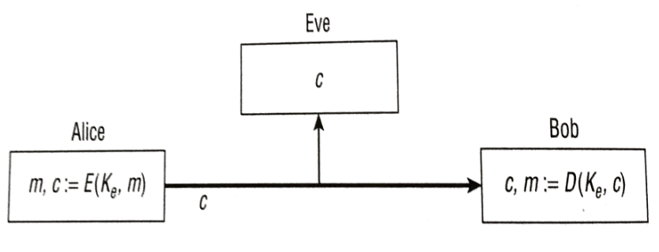

# Block cipher

- **Older**: DES, Triple-DES, Data Encryption Standard
- **Current:** AES, Advanced Encryption Standard
- **Basic idea:** plain text is divided into 128-bit long blocks.
  A block cipher uses the key to turn a block of plain text into a block of cipher text of the same length.
- **Very symmetrical** - encryption (E) and decryption (D) similar
- Can be implemented **efficiently**, also in hardware (FPGA)

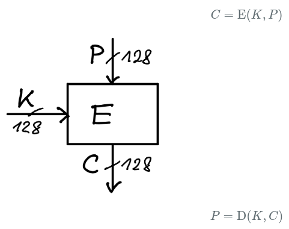

## The ideal block cipher

A number (=plain text block) is assigned another number (=cipher text block) = permutation.
A permutation is a function that takes a set of elements and rearranges them in a different order.

E.g. numbers 0,...,3 in a different arrangement.

| number | permutation |
| ------ | ----------- |
| 0      | 2           |
| 1      | 3           |
| 2      | 1           |
| 3      | 0           |

The description of the permutation is the key.

An ideal block cipher would define a permutation of all possible values of the block.
The number of values grows exponentially with the block size.

> Key length calculation:
> $bits*2^{bits}$

- **Example**: With a block size of 4 bits, there would be $2^4 = 16$ possible values.
  The permutation of these values requires $4 * 2^4 = 64$ bits of key.
- **Problem**: In practice, block sizes of 64 to 128 bits are often used.
  An ideal block cipher with a 128 bit block size would require a key of $128*2^{128}$ bits.

Such keys are **impractically** large!

## Practice

- Key too large, therefore approximation in practice: **Pseudo Random Permutation** (PRP) -
  indistinguishable from a completely random permutation by the attacker.
- smaller (and therefore cryptographically weaker) permutations
- **executed several times (rounds)** in succession (e.g. 16) - this results in strong encryption.
- A different key is used for each round (**round keys**), obtained from the original key per **key expansion**.
- There are even special CPU extensions that make block ciphers faster.

# Block modes

Data:

- length is normally $n*128$
- gets split into blocks
- padding for exact length (ex. 128 bits)
- individual encryption of each block
- join each block to cipher text
  - the method used is the cipher mode

## Padding

The method of padding has no effect on the security of the procedure.

**Example - PKCS7 padding**

B ... block length

N is missing on the block length, use N times the value N as padding.

If the data has exactly the block length, then append a complete block of B bytes with the value B.
This means that there is always a padding.

Examples block length B = 8:

```
3 bytes: FDFDFD --> FDFDFD0505050505
7 bytes: FDFDFDFDFDFDFDFD --> FDFDFDFDFDFDFDFD01
8 bytes: FDFDFDFDFDFDFDFDFD --> FDFDFDFDFDFDFDFDFDFD0808080808080808
```

Connection with modes: ECB and CBC require padding, but CTR and OFB do not.

## Overview


## Electronic Code Book Mode (ECB)

Each block is encrypted with the same key.

$$C_i = E(K,P_i)$$

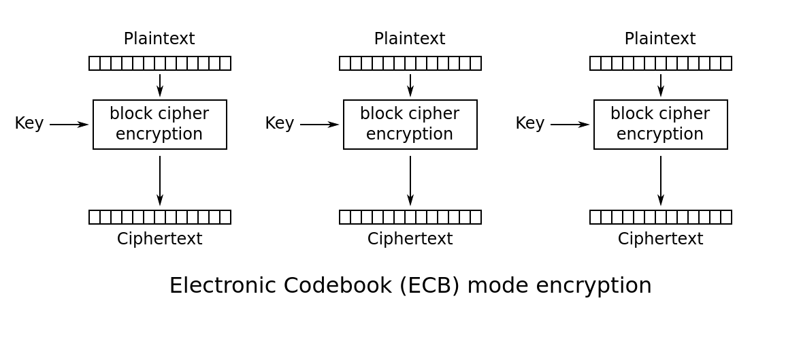

$$P_i = D(K,C_i)$$

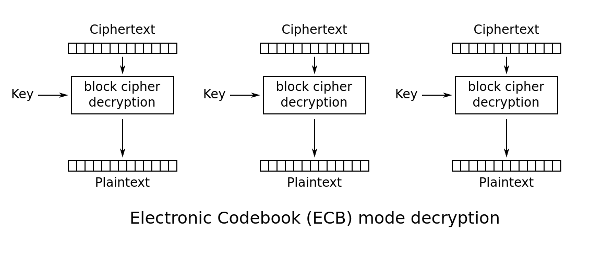

ECB is **insecure** the structure of the encrypted data is not obfuscated.
Same plain text results in same cipher text, an attacker learns something about the content.

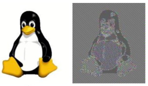

## Cipher Block Chaining (CBC)

Data is made unrecognizable by concatenation.

Idea: plain text block XOR with preceding cipher text block:

$$C_0 = E(K,P_0 \oplus IV)$$

$$...$$

$$C_i = E(K,P_i \oplus C_{i-1})$$

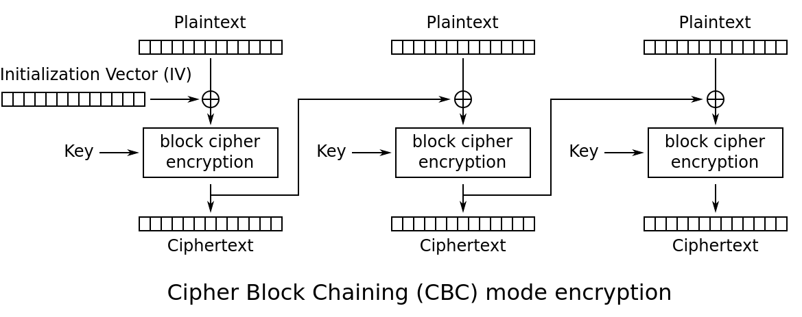

$$P_0=D(K,C_0) \oplus IV$$

$$...$$

$$P_i=D(K,C_i) \oplus C_{i-1}$$

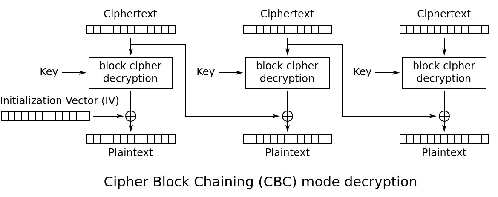

Important property: IV _(random number)_ value must not be repeated and should be unpredictable for an attacker:

- **random** IV. Is sent unencrypted in the message.
- **nonce** based IV (number used once).
  nonce determined from message number and other values.
  The nonce is encrypted and the result is used as the IV.

## Counter Mode (CTR)

A **key stream** for a stream cipher is formed using nonce and a counter.
Every block cipher is a PRNG (pseudo random number generator).

$$i=1,2,3,...n $$

$$K_i=E(K,Nonce||i) $$

$$C_i=P_i \oplus K_i$$

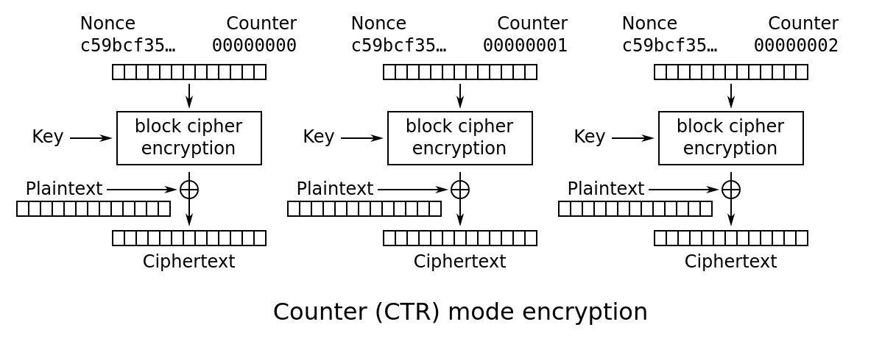

$$i=1,2,3,...n $$

$$K_i=E(K,Nonce||i) $$

$$P_i=C_i \oplus K_i$$

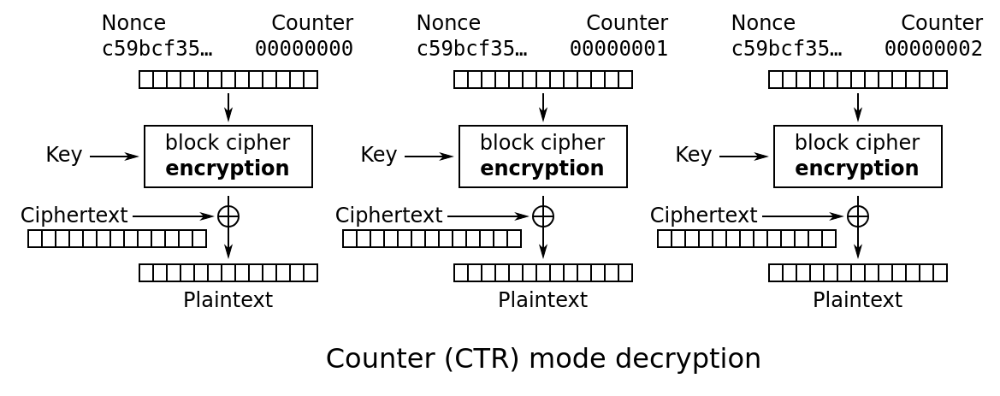

## Which Mode?

Best practice is either

- CBC+random IV
- CTR is also good but it is easier to make mistakes in the implementation.

# AES (Advanced Encryption Standard)

Only the key is always unknown.
Currently considered the most secure block cipher. Successor to DES.
Is an SP-network (substitution/permutation)

- Attack: is always possible - Brute force.
- Defense: Attack duration too long
  - Result worthless.
  - Important: Length of the key
    - 64 bit: Hours to days until cracked
    - 128 bit: Decades
    - 256 bits: Centuries
      - Decades also for quantum computers

**Normal Parameters:**

- Keys: 128, 192, 256 bits
- Block size: 128 bits
- 10 rounds

**Targets:**

- 128 bit block size
- More secure than DES (>=128 bit key)
- Faster than DES (in HW and SW)

With AES-128: 11 round keys are determined from the key - for 10 rounds.

## How it works simplified

1. **Block Processing:** AES works on fixed-size data blocks, typically 128 bits.
   The data is broken into these blocks before encryption.

2. **Key Expansion:** The secret key goes through a process (AES key schedule) to generate multiple round keys used throughout the encryption process.

3. **Rounds of Encryption:** Each data block goes through multiple rounds (typically 10-14 depending on the key size) of transformations using the round keys.
   These rounds involve:

   - **Substitution:** Replacing individual data bits with different bits based on a predefined table. (S-Box)
   - **Shifting Rows:** Shifting rows of the data block by a certain number of positions.
   - **Mixing Columns:** Mixing the data columns using bitwise operations to further scramble the data. (P-Box)
   - **Adding Round Key:** `XOR`ing the current data block with a round key.

4. **Decryption:** Decryption uses the same algorithm in reverse order, with a different set of keys derived from the original secret key.

The multiple rounds with various transformations make it very difficult to crack the encryption without the secret key.
AES is considered a secure and efficient encryption standard for various applications.

## How it works in general

SP network = one round:

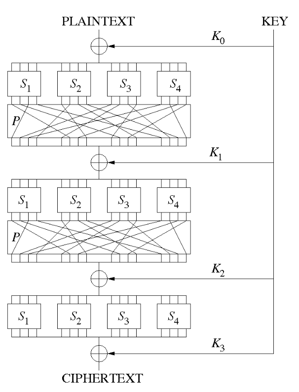

**Round:**

- XOR with round key
- S-boxes (Confidentiality)
  - 4 bits substitution (reversible, e.g. table)
  - Each individual ciphertext bit depends on as many parts of the key as possible.
  - If you change one bit of the key, almost all bits of the ciphertext should change.
  - The bits get substituted according to a **fixed table** (lookup table)
    - even though this table is fixed it is still secure.
- P-box (Diffusion)
  - Bit permutation: The output of an S-Box is distributed as the input of other S-Boxes in the next round.
    - aka. The bit positions get changed.
  - Each individual ciphertext bit depends on as many plaintext bits as possible.
  - Changing a single plaintext bit changes approximately half of the ciphertext bits - _(avalanche effect)_.

The S- and P-boxes are **statically defined**.

## How it works in detail

### Visualization

Visualization of the AES round function

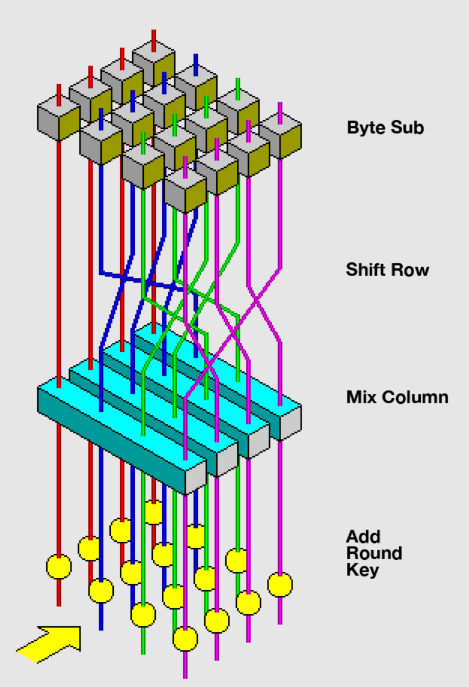

### The SubBytes step

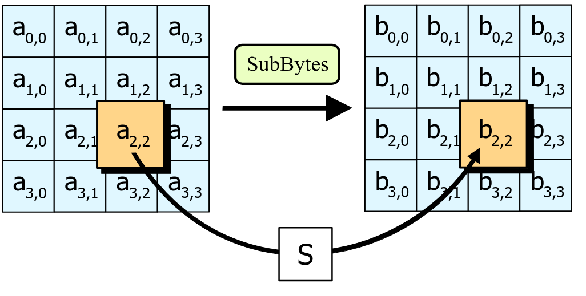

In the SubBytes step, each byte in the state is replaced with its entry in a fixed 8-bit lookup table.
$S; b_{ij} = S(a_{ij})$

### The ShiftRows step

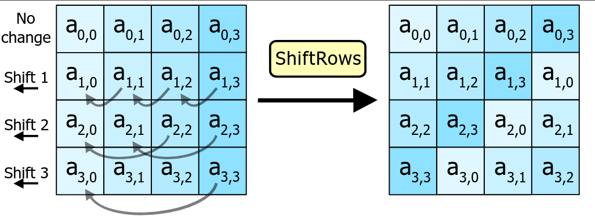

In the ShiftRows step, bytes in each row of the state are shifted cyclically to the left.
The number of places each byte is shifted differs incrementally for each row.

### The MixColumns step

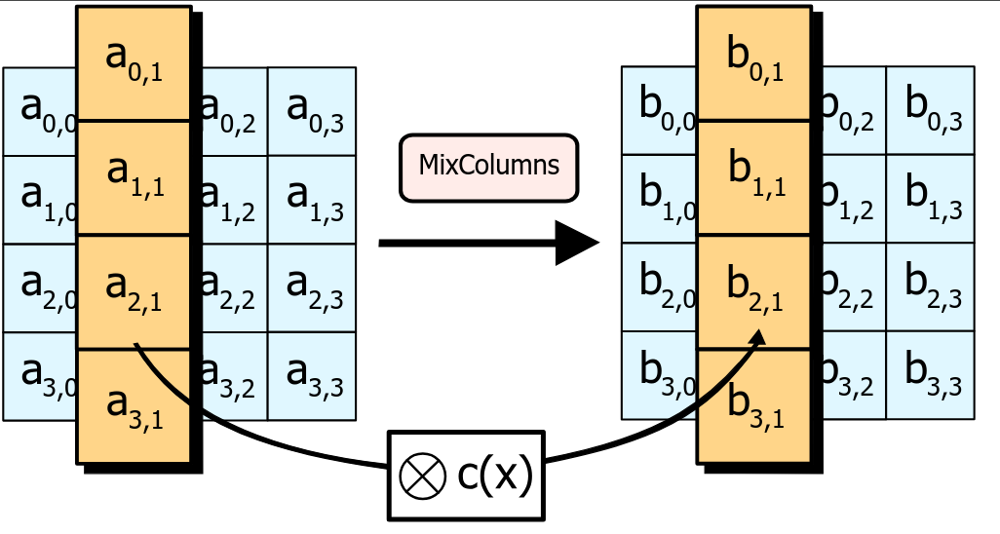

In the MixColumns step, each column of the state is multiplied with a fixed polynomial $c(x)$.

### AddRoundKey step

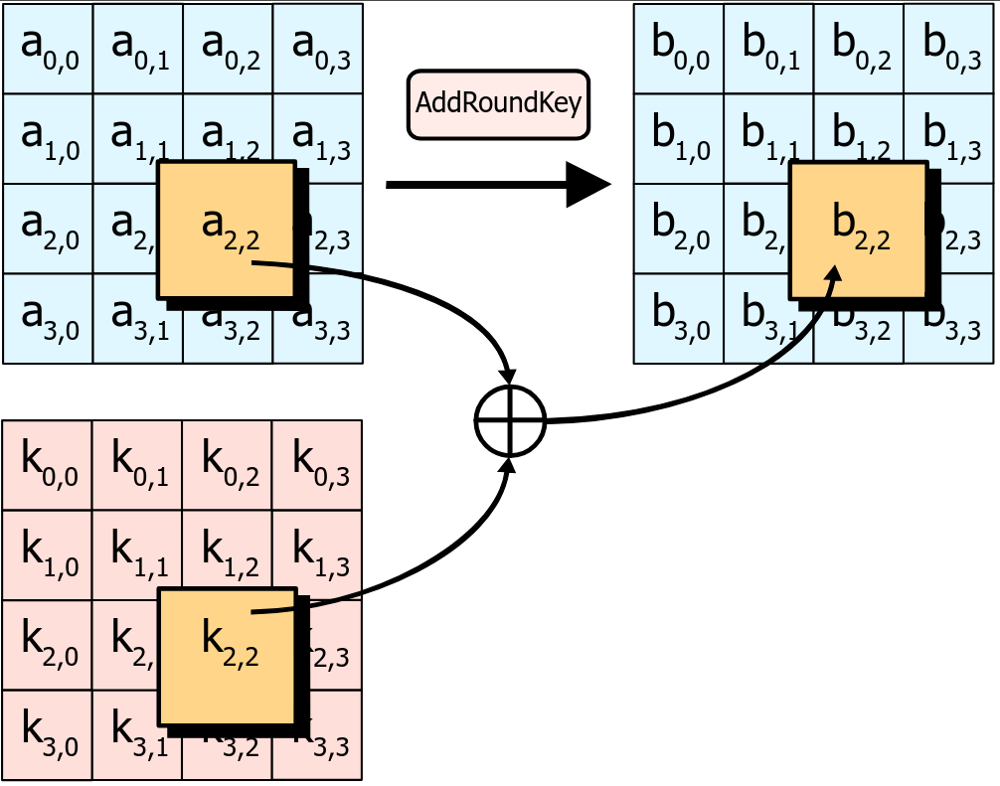

In the AddRoundKey step, each byte of the state is combined with a byte of the round subkey using the XOR operation ($\oplus$).

## Usage

**General Use Cases of AES:**
Data Encryption: AES is commonly used to encrypt sensitive data, such as personal information,
financial records, and confidential documents.

- **Secure Communications:** It's used in protocols like SSL/TLS for securing internet traffic, ensuring that data transferred between servers and clients remains private.
  - RSA is used for the key exchange of AES and then the communications happens over AES.
- **File Encryption:** AES can encrypt files and entire filesystems, protecting data at rest from unauthorized access.
- **VPN (Virtual Private Networks):** AES is often the encryption standard of choice for VPNs, securing data transmitted over public networks.
- **Wireless Security:** It's used in WPA2 (Wi-Fi Protected Access 2) for securing wireless networks.
- **Database Security:** Databases can leverage AES to encrypt sensitive data stored within.

# Testing security

## CPA (Chosen Plaintext Attack)

In this attack, the attacker can pick some plain text messages and get them encrypted with the target encryption system.

Imagine the attacker has a box that performs encryption.
They can't see inside the box, but they can slip pieces of paper with messages (plaintext)
into a slot and get encrypted messages (ciphertext) out.
By analyzing the ciphertext for different messages, they try to crack the secret code the box uses (encryption key).

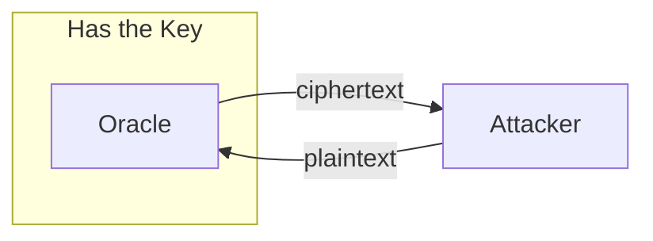

## CCA (Chosen ciphertext attack)

Works similar to CPA and is more dangerous.

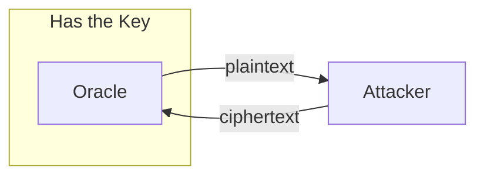

# Sources

- Scripts
- Personal notes
- [Wikipedia: Block Cipher Modes](https://en.wikipedia.org/wiki/Block_cipher_mode_of_operation)
- [Wikipedia: AES](https://en.wikipedia.org/wiki/Advanced_Encryption_Standard)
- [AES use cases](https://dev.to/ruffiano/understanding-and-implementing-advanced-encryption-standard-aes-in-nodejs-with-typescript-57lh)
