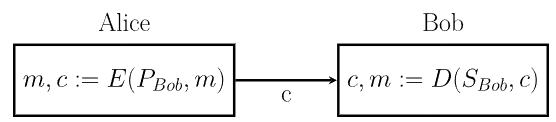

<!--toc:start-->

- [Public Key Cryptography](#public-key-cryptography)
  - [Prinzip](#prinzip)
  - [Anwendungen](#anwendungen)
- [RSA](#rsa)
  - [Ver-Entschlüsselung](#ver-entschlüsselung)
  - [Wie funktioniert das?](#wie-funktioniert-das)

<!--toc:end-->

## Public Key Cryptography

Das Problem bei der Symmetric Cipher ist der unsichere Schlüsselaustausch zwischen Sender und Empfänger. Aus diesem Grund wurde ein anderes Verfahren entwickelt.

### Prinzip:

- Bob (als Empfänger) erstellt 2 Schlüssel: einen public key (PBob) und einen private key (SBob).
- Den public key kann Alice (und jeder andere) zum verschlüsseln verwenden.
- Nur Bob kann den ciphertext mit dem SBob entschlüsseln.

Die Schlüssel sind sehr groß: 4096 Bytes

Für Kommunikation in umgekehrter Richtung (Bob an Alice) muss Alice ein eigenes public/private Schlüsselpaar erzeugen.

### Anwendungen

- **SSL/TLS:** SSL und TLS sind Protokolle, die Public Key Cryptography verwenden, um die über das Internet übertragenen Daten zu sichern. Das ist die Grundlage für HTTPS, so dass eine sichere Kommunikation zwischen Webbrowsern und Servern gewährleistet werden kann.

- **Digitale Signaturen:** Digitale Signaturen nutzen die Kryptographie mit öffentlichen Schlüsseln (in Verbindung mit Hash Funktionen), um die Authentizität und Integrität von digitalen Dokumenten und Software zu überprüfen. Dies wird in der Regel bei der Softwae Distibution verwendet, um sicherzustellen, dass die Software nicht manipuliert wurde.

- **SSH:** SSH nutzt die Kryptographie mit public Keys, um Benutzer zu authentifizieren und einen sicheren Remote Zugriff auf Server einzurichten.

- **Encryption:** Die Public Key Kryptographie wird zwar aus Perfomance Gründen in der Regel nicht zur Verschlüsselung großer Datenmengen verwendet, aber sie wird häufig zum sicheren Austausch symmetrischer Schlüssel eingesetzt.

## RSA

Bekanntestes public key cryptosystem. Rivest-Shamir-Adleman. Turing Preis 2002.

- RSA hat extremen Rechenaufwand, wird daher nur zum verschlüsseln kleiner Datenmengen verwendet (wenige kB – kleiner oder gleich als die Schlüssellänge) -> zB zum verschlüsseln von AES keys

- **hybride Verschlüsselung:** Alice generiert einen symmetrischen session key (z.B. 256 Bits) und schickt diesen public key verschlüsselt an Bob. Weitere Kommunikation mit symmetrischen Verfahren.

- **Prinzip:** RSA funktioniert da die Multiplikation zweier Prizahlen einfach ist, die Faktorisierung jedoch zu viel Rechenleistung benötigt bei großen Primzahlen.

### Ver-Entschlüsselung

Die Nachricht m wird als Zahl dargestellt (z.B. 128/256 bits) und mit dem public key e mod n verschlüsselt (e … encrypt).

**Ciphertext:**

$c=m^e (mod\ n)$

**Entschlüsselung mit private key `d` mod `n` (d .. decrypt):**

$c^d (mod\ n)=m$

**Beispiel:**

Encryption:  
Public Key: $(5/14)$ 
Plain Text: $B -> 2$ 
Cipher Text: $2^5 (mod\ 14) = 4 -> D$ 

Decryption: 
Cipher Text: $4 -> D$ 
Private Key: $(11/14)$ 
Plain Text: $4^{11} (mod\ 14) = 2 -> B$ 

### Wie funktioniert das?

1. Wahl zweie Primzahlen, gängig: 2028 bzw. 4096 Bits (616,1233 Dezimalstellen) 

$$p = 2, q = 7$$

2. Multiplikation der Primzahlen

$$N = 14$$

3. Finden der 'coprime' Zahl zum Produkt der Primzahlen. (coprime -> share no common factor with a number)

Formel:

$$(p-1)*(q-1) = t$$

$$(2-1)*(7-1) = 6$$

4. Wählen der Zahl e (wird für den public Key benötigt)

- Voraussetzung:

  - $1 < e < t$
  - wählen einer Zahl die keinen gemeinsamen Faktor mit N oder t teilt (oder e darf kein Teiler von N sein)
    es gilt: $e \nmid t$

- Mögliche Zahlen: 2,3,4,5
  - 5 -> einzige Zahl ohne gemeinsamen Faktor
  - $e = 5$

5. Public Key ist nun $(5,14)$

6. Berechne ein d (wird für private Key benötigt)

Formel:

$$e * d (mod\ t) = 1$$

$$5_d (mod\ 6) = 1$$

$$5_{11} (mod\ 6) = 1$$

$$d = 11$$

7. Private Key ist $(11, 14)$

**Info:**

- Mit genügen Rechenpower kann jeder Key nach ein paar Jahren geknackt werden -> RSA Keys haben ein Ablaufdatum (zB 2 Jahre)
