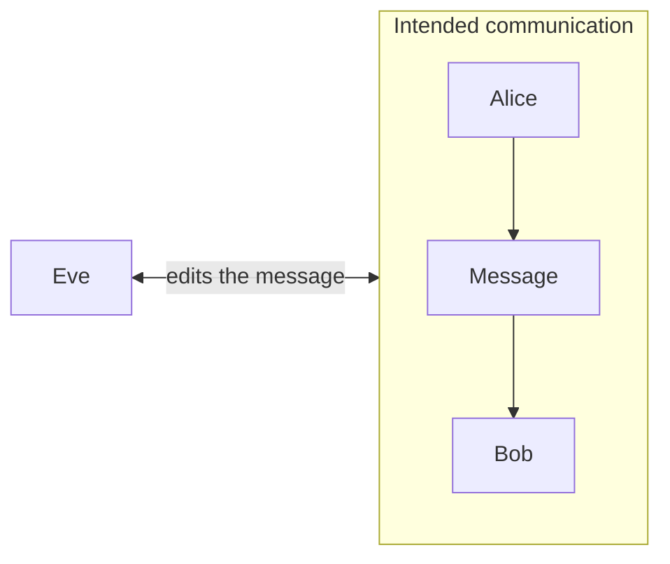

<!--toc:start-->

- [One-Time-Pad](#one-time-pad)
  - [How it works](#how-it-works)
  - [The math](#the-math)
- [Stream-Cipher](#stream-cipher)
  - [The Algorithm](#the-algorithm)
  - [Advantages](#advantages)
  - [Disadvantages](#disadvantages)
  - [Difference to Block Ciphers](#difference-to-block-ciphers)
  - [Usage](#usage)
- [Integrity attack](#integrity-attack)
  - [Example](#example)
  - [Defense: Message Authentication Codes (MACs)](#defense-message-authentication-codes-macs)
- [Sources](#sources)
<!--toc:end-->

# One-Time-Pad

A one-time pad (OTP) is theoretically not crackable.

## How it works

- **The Key**: The key to the code is just as long as the message itself.
  It's a random string of characters, like gibberish.
- **Encryption**: Each character in the message is paired with a corresponding character from the key.
  Then, a mathematical operation (like XOR) is performed on them to create a new character.
  This new character is part of the encrypted message.
- **Decryption**: To decrypt the message, the recipient uses the same key.
  They perform the reverse mathematical operation to get back the original message.

**Important:**

- The key thing about OTP is that the key must be truly random and used only once.
- If you use the same key twice, it becomes vulnerable to hacking.
- The OTP is **unpractical** in the real world.

## The math

**En-/Decryption:**

> 2 `XOR` of the same element offset each other!
> $=> x \oplus x = 0$

1. The plain text gets `XOR`ed with the pad. _(encryption)_
   $c=p \oplus pad$
   _[see Basics](./1.1_Symmetric_Cipher.md#basics)_
1. The cipher text gets `XOR`ed with the pad. _(decryption)_
   $p=c \oplus pad$

**Don't use the same pad twice:**
The pad will be canceled out.

$(p_1 \oplus pad) \oplus (p_2 \oplus pad) = p_1 \oplus p_2$

# Stream-Cipher

Idea: One-time pad is generated from the key using a random number generator.

Well Known procedure: **ChaCha20**.

## The Algorithm

**pseudorandom number generator (PRNG):** Generates a random-looking sequence of numbers from an initial value (seed).
However, it is deterministic: same seed --> same number sequence.

PRNG:

- is a function $R: z_{n+1}=R(z_n)$
- $z_0$ is _seed_
- $z_1 = R(z_0), z_2 = R(z_1), ..., z_n = R(z_{n-1})$
- is a sequence that looks random

For cryptography

- seed = key
- one chooses **very good PRNGs** (are rare)

**Stream cipher:**

- Choose a starting bit sequence $K_0$ (128 or 256 bits) as seed
  - $K_0$ is the symmetric key (shared secret key)
  - $K_1 = R(K_0), K_2 = R(K_1), ..., K_n = R(K_{n-1})$
- the **key streams** $K_1||K_2||...||K_n$ are joined together until the length of the plaintext is reached
- then `XOR` with plaintext as with one-time pad
- Decrypt using `XOR` with the same key stream

As with one-time pad, the key **MUST NOT** be reused!

## Advantages

- **Speed:** Generally, this type of encryption is quicker than others, such as block ciphers.
- **Low complexity:** Stream ciphers are simple to implement into contemporary software,
  and developers don’t require sophisticated hardware to do so.
- **Sequential in nature:** Certain companies handle communications written in a continuous manner.
  Stream ciphers enable them to transmit data when it’s ready instead of waiting
  for everything to be finished because of their bit-by-bit processing.
- **Accessibility:** Using symmetrical encryption methods like stream ciphers saves businesses
  from having to deal with public and private keys.
  Additionally, computers are able to select the appropriate decryption key to utilize
  thanks to mathematical concepts behind current stream ciphers.

## Disadvantages

- If an **error** occurs **during transmission**, it can affect subsequent bits,
  potentially corrupting the entire message because stream ciphers rely on previously stored cipher bits for decryption
- Maintaining and properly **distributing keys** to stream ciphers can be difficult, especially in large systems or networks.
- Some stream ciphers may be **predictable or vulnerable** to attack if their key stream is not properly designed,
  potentially compromising the security of the encrypted data.

## Difference to Block Ciphers

| Stream-Cipher                                                                                           | Block Cipher                                      |
| ------------------------------------------------------------------------------------------------------- | ------------------------------------------------- |
| By taking one bit of ordinary text at a time, the stream cipher transforms plain text into cipher text. | Block Ciphers Encrypts data in fixed-size blocks. |
| Used for data-in-transit encryption.                                                                    | It is basically used for data-at-rest encryption. |
| It requires low processing power.                                                                       | It needs high processing power.                   |
| It has low computational load.                                                                          | It requires high computational load.              |

## Usage

Stream ciphers are often used for their speed and simplicity of implementation in hardware,
and in applications where plaintext comes in quantities of unknowable length like a secure wireless connection.

For example, if a 128-bit block cipher received separate 32-bit bursts of plaintext, three quarters of the data transmitted would be padding.
Stream Ciphers don't have this problem because of their linearity

They are also used when one of the [Advantages](#advantages) are critical for an application.

# Integrity attack

Encryption does **NOT** solve the problem of an attacker changing the message.



## Example

```text
pay Bob 1000 EUR
```

If the attacker now knows that `Bob` is in a known position in the message,
they can **change** the text as they wish and `Bob` becomes `Eve`.
This results comes from a property of `XOR`.

- Encrypted: $c=('Bob' \oplus k)$
- Attacker changes in: $c \oplus('Eve' \oplus 'Bob')$
- Decryption: $('Bob' \oplus k) \oplus ('Eve' \oplus 'Bob') \oplus k = 'Eve'$
  - Because the 2 `Bob` cancel each other out as well as the 2 `k`.

## Defense: Message Authentication Codes (MACs)

- Used alongside encryption to ensure message integrity.
- A secret key is used to generate a cryptographic checksum (MAC) for the message.
  - MAC is basically a hash but the key is private
- The receiver recalculates the MAC and compares it with the received one.
- Any modification during transmission will cause a mismatch, alerting the receiver.

# Sources

- Scripts
- [MAC](https://norbert-pohlmann.com/glossar-cyber-sicherheit/message-authentication-code-mac/)
- [Stream Cipher](https://www.geeksforgeeks.org/stream-ciphers/)
- [Wikipedia Stream Cipher](https://en.wikipedia.org/wiki/Stream_cipher)
