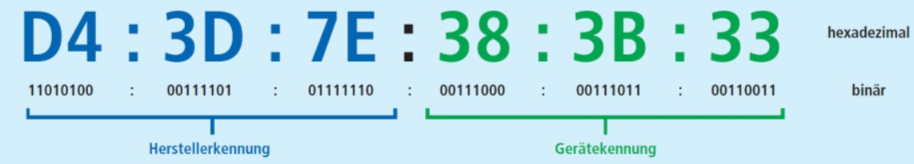
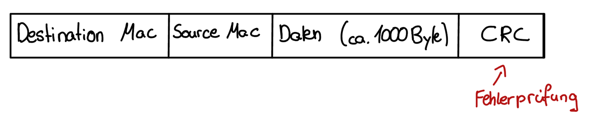
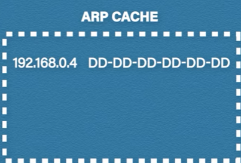
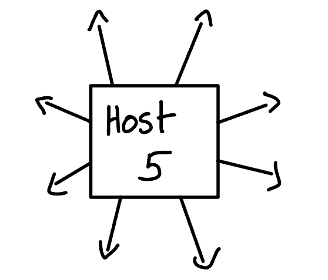
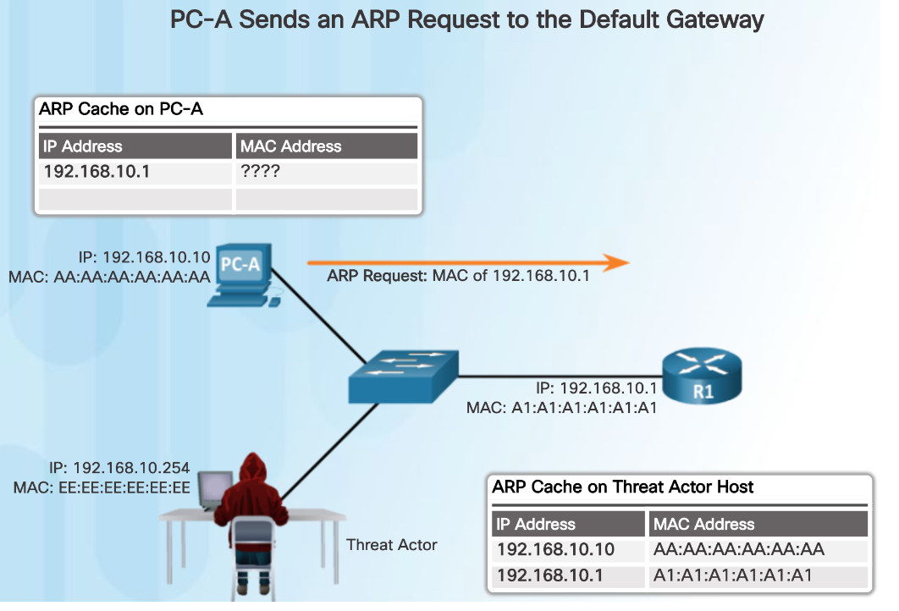
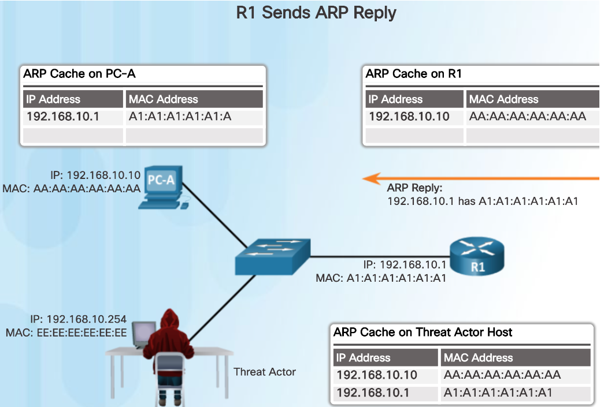
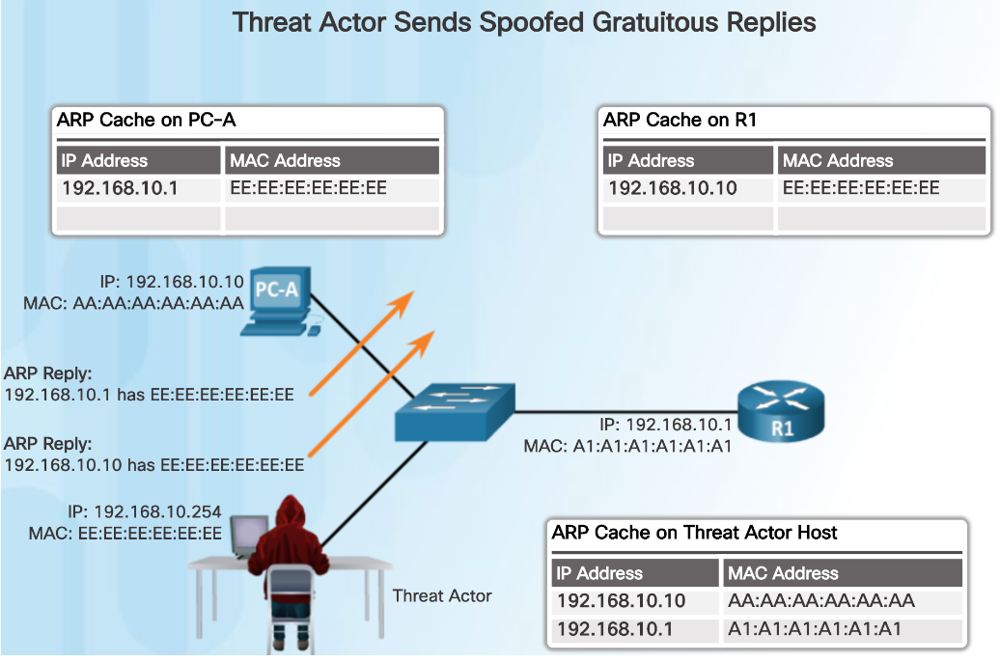

# Inhaltsverzeichnis

<!--toc:start-->

- [Inhaltsverzeichnis](#inhaltsverzeichnis)
- [Allgemein](#allgemein)
- [ARP (Adress Resolution Protocol)](#arp-adress-resolution-protocol)
  - [MAC-Adresse(Media Access Control)](#mac-adressemedia-access-control)
  - [Ablauf eines ARP Requests](#ablauf-eines-arp-requests)
  - [ARP-Cache](#arp-cache)
  - [Gratuitous ARP](#gratuitous-arp)
- [ARP-Cache-Poisoning](#arp-cache-poisoning)
  - [Ablauf eines Angriffs](#ablauf-eines-angriffs)
  - [Arten von ARP-Spoofing](#arten-von-arp-spoofing)
- [Verteidigung](#verteidigung)
- [Schutzziele](#schutzziele)
- [Quellen](#quellen)
<!--toc:end-->

# Allgemein

ARP Poisoning ist ein Angriff bei, dem ein Angreifer die ARP Tabelle eines Netzwerks manipuliert um den Datenverkehr umzuleiten.
Somit entsteht ein Man in the Middle Angriff.
Dadurch kann der Angreifer den Datenverkehr mithören, abfangen und manipulieren.

# ARP (Adress Resolution Protocol)

In TCP/IP-Netzwerken benötigt der Sender die Subnetzmaske, die IP-Adresse sowie die MAC-Adresse um Datenpakete verschicken zu können.
IP Adressen und Subnetzmasken werden den Geräten meist dynamisch zugeordnet.
Da im LAN jedoch auf layer 2 basis und nicht layer 3 arbeitet werden MAC-Adressen benötigt um die einzelnen Hosts zu addressieren.
ARP löst zu einer IP Adressen die zugehörige MAC-Adresse auf.


Wenn beispielsweise Host A mit Host D kommunizieren möchte, muss Host A die MAC-Adresse von Host D herausfinden, da ein Layer 2 Switch nicht mit IP-Adressen arbeiten kann.

## MAC-Adresse(Media Access Control)

Die MAC-Adresse identifiziert ein Netzwerkgerät und ist die physische Adresse von Handys, Tablets und PCs.
Die MAC Adresse besteht aus 48 Bit, was sechs Bytes entspricht.
Im Unterschied zur IP-Adresse wird die MAC Adresse in hexadezimaler Form dargestellt.
Ein Beispiel dafür wäre: 00-1D-60-4A-8C-CB.



Die ersten drei Bytes stellen die Herstellerkennung dar.
Die restlichen drei Bytes werden vom Hersteller beliebig vergeben.

Einfacher Aufbau eines Ethernet-Frames:



## Ablauf eines ARP Requests

Host A will eine Nachricht and Host D senden:

_(Alle Geräte in diesem Beispiel sind im gleichen Subnet.)_

1. Host A schickt einen Broadcast (Destiniation-MAC FF:FF:FF:FF:FF:FF):

```
Wer hat die IP Adresse 192.168.0.4 ?
```

Die Nachricht wird an allen Geräten bis auf Host D abgelehnt.

2. Host D sendet einen ARP-Reply (Unicast) zurück:

```
Hier ist meine MAC-Adresse
```

3. Wenn Host A die Nachricht empfangen hat wird die Adresse in einen ARP-Cache gespeichert.

## ARP-Cache

Im ARP-Cache werden alle IP-Adressen mit der zugehörigen MAC-Adresse gespeischert.

Beispiel:



4. Erfolgreiche Kommunikation ist nun möglich.
   Falls eine Nachricht gesendet wird, werden ab nun die Informationen aus dem ARP-Cache entnommen.
5. Die ARP-Cache Einträge werden nach einer bestimmten Zeit gelöscht **(ARP-time-out)** um sicher zu gehen das die IP-Adresse wirklich zu der MAC-Adresse gehört.

## Gratuitous ARP

Wenn es Änderungen bei den Adressen gibt oder neue Hosts zum Netzwerk hinzukommen wird ein sogenannter `gratuitous` (grundloser) ARP Reply gesendet
um den anderen Geräten im Netzwerk mitzuteilen, dass eine Änderung stattgefunden hat ohne zuerst einen Request zu erhalten.
Dadurch wird der Prozess beschleunigt.

Die anderen Hosts speichern die neue IP/MAC-Adresse in ihrem ARP-Cache.
Dadurch können jedoch bestehende Einträge überschrieben werden oder manipulierte IP-Adressen verteilt werden.
Dieses Prinzip kann von Angreifern ausgenutzt werden was zu einem ARP Cache Poisoning führen kann.

Der Gratuitous ARP ist für folgende funktionen gedacht:

- **Konfliktvermeidung**: Prüft, ob die IP-Adresse bereits verwendet wird.
- **MAC-Adressänderung**: Informiert andere über die neue MAC-Adresse einer IP-Adresse.
- **Switch-Aktualisierung**: Informiert Switches über den Geräteport.



```
Hallo ich bin auch da, das ist meine MAC-Adresse
```

# ARP-Cache-Poisoning

Wenn ein Angreifer Zugriff auf ein Netzwerk hat ist es für ihn möglich gefälschte `gratuitous` Replys zu senden um sich in die Kommunikation zwischen einem Host und dem Default Gateway (Router) zu schleusen.

**ARP-Spoofing:** Der Hacker sendet gefälschte ARP-Pakete, um die MAC-Adresse des Angreifers mit einer bereits im LAN vorhandenen IP-Adresse zu verknüpfen.

**ARP-Poisoning:** Nach erfolgreichem ARP-Spoofing modifiziert der Hacker die ARP-Tabelle der anderen Hosts und manipuliert die MAC-Zuordnungen.

## Ablauf eines Angriffs

1. Host A möchte die MAC-Adresse des Gateways herausfinden um Nachrichten in ein anderes Netzwerk zu senden.
   Dabei wird ein ARP-Request gesendet.
   Der Router lernt die MAC-Adresse des Hosts und fügt diese in seinen ARP-Cache ein.

   

2. Der Router sendet jetzt einen ARP-Reply an den Host zurück PC-A updatet seinen ARP-Cache.

   

3. Der Angreifer muss Zugriff zum Netzwerk haben und hat die IP-Adresse des Gateways (beispielsweise durch Netzwerkscans) und des Hosts.

4. Nun sendet der Hacker mithilfe von `gratuitous` Replys gefälschte ARP Pakete.
   Es wird die IP-Adresse des Gateways und des Hosts mit der MAC-Adresse des Angreifers an andere Geräte geleitet.

   

5. Wenn die anderen Geräte des Netzwerks nun diese Nachricht erhalten updaten sie ihren ARP-Cache mit den gefälschten Informationen.

6. Der PC sendet die Daten nun an den Hacker, dieser kann alle Nachrichten ansehen und diese anschließend an das echte Gateway weiterleiten und auch manipulieren.

## Arten von ARP-Spoofing

- **Man-in-the-Middle-Angriff**: Beim Man-in-the-Middle-Angriff nutzen Hacker ARP-Spoofing,
  um die Kommunikation zwischen Geräten in einem Netzwerk abzufangen und dabei die übertragenen Daten zu stehlen.
  Manchmal verwenden Hacker Man-in-the-Middle auch, um den Datenverkehr zwischen Netzwerkgeräten zu manipulieren.
- **Sitzung hijacking**: Beim Session Hijacking können Hacker mithilfe von ARP-Spoofing die Sitzungs-ID leicht extrahieren
  oder sich unrechtmäßigen Zugriff auf die privaten Systeme und Daten des Opfers verschaffen.
- **Denial-of-Service-Angriffe**: Denial-of-Service-Angriffe (DoS-Angriffe) sind Angriffe,
  bei denen einem oder mehreren Opfern der Zugriff auf das Netzwerk verwehrt wird.
  Mithilfe von ARP-Spoofing wird die MAC-Adresse eines einzelnen Zielopfers mit mehreren IP-Adressen verknüpft.
  Dadurch wird der gesamte Datenverkehr an die MAC-Adresse des Zielopfers umgeleitet, was zu einer Überlastung des Netzwerks des Zielopfers führt.

# Verteidigung

- **Statische ARP-Caches:**
  Es ist möglich, alle MAC-Adressen in einem Netzwerk statisch den IP-Adressen zuzuordnen.
  Das ist sehr effektiv, ist bei großen Netzwerken aber sehr aufwendig.

- **Sicherheit am Switch:**
  Die meisten verwalteten Ethernet-Switches benützen Funktionen, die ARP-Poisoning-Angriffe abwehren sollen.
  Dynamic ARP Inspection (DAI) bewertet die Gültigkeit jeder ARP-Nachricht und verwirft Pakete, die verdächtig oder bösartig erscheinen.

  Die Aktivierung von Port Security auf einem Switch kann auch dazu beitragen, ARP-Cache-Poisoning-Angriffe abzuschwächen.
  Port Security kann so konfiguriert werden, dass nur eine einzige MAC-Adresse an einem Switch-Port zugelassen wird, wodurch einem Angreifer die Möglichkeit genommen wird, böswillig mehrere Netzwerkidentitäten anzunehmen.

- **Physikalische Sicherheit:**
  ARP-Nachrichten werden nicht über die Grenzen des lokalen Netzwerks hinaus weitergeleitet, daher müssen sich Angreifer in der Nähe des Netzwerks befinden oder bereits die Kontrolle über einen Rechner im Netzwerk haben.

- **Segmentierung:** Es ist auch wichtig das Netzwerk gut zu segmentieren, da ein Angriff in einem Subnetz keine Auswirkungen auf Geräte in einem anderen hat.

- **Kryptografische Netzwerkprotokolle**: Mit verschlüsselten Kommunikationsprotokollen wie Transport Layer Security (TLS), HTTP Secure (HTTPS) und Secure Shell (SSH) kann der Angreifer nichts mit den empfangen Packeten anfangen.

- **Paketfilterung**: Mithilfe von Paketfiltern können wir das Netzwerk vor böswillig übertragenen Paketen im Netzwerk sowie verdächtigen IP-Adressen schützen.

- **Virtual Private Network**: Die nützlichste präventive Maßnahme gegen ARP-Spoofing-Angriffe ist die Verwendung einer VPN (Virtual Private Network).

- **ARP-Spoofing-Erkennungssoftware**: Mithilfe von ARP-Spoofing-Erkennungssoftware lassen sich ARP-Spoofing-Angriffe leichter erkennen, da sie die Datenprüfung und -zertifizierung vor der Übertragung unterstützt.

# Schutzziele

Bei diesem Angriff wird vorallem die Vertraulichkeit und Integrität verletzt.
Da der Angreifer sensible Daten abfangen und auch verfälschen kann.

# Quellen

1. https://www-varonis-com.translate.goog/blog/arp-poisoning?_x_tr_sl=en&_x_tr_tl=de&_x_tr_hl=de&_x_tr_pto=sc
2. https://www.youtube.com/watch?v=A7nih6SANYs&t=232s
3. Skripten
4. https://www.geeksforgeeks.org/what-is-arp-spoofing-attack/
