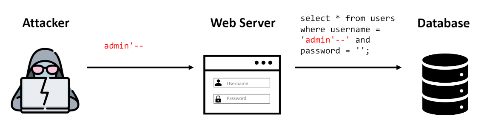
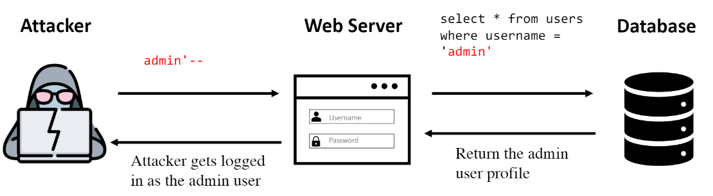
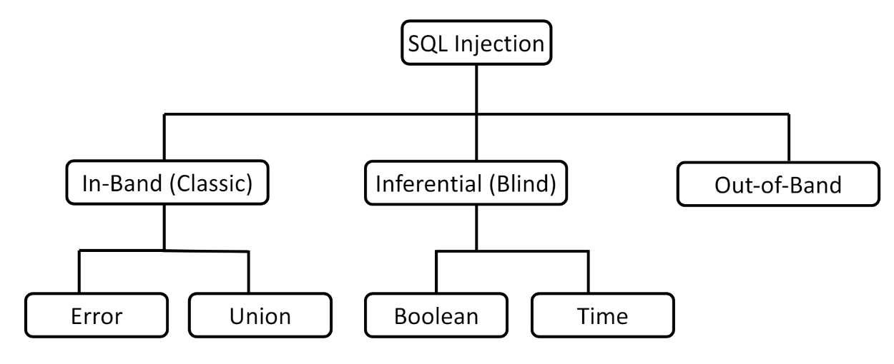
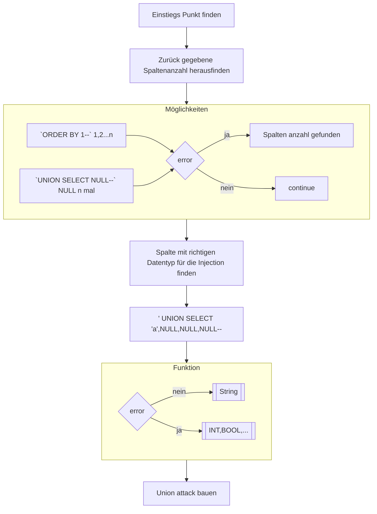

<h1>SQL Injection</h1>

<!--toc:start-->

- [Allgemein](#allgemein)
  - [Arten von SQL Injection](#arten-von-sql-injection)
    - [In-Band](#in-band)
    - [Blind](#blind)
    - [Out-of-band](#out-of-band)
  - [SQL injection detection](#sql-injection-detection)
- [Exploiting Union Based SQLi](#exploiting-union-based-sqli)
  - [Angriffsschema](#angriffsschema)
- [Verteidigung](#verteidigung)
  - [Prepared Statements](#prepared-statements)
  - [Stored Procedures](#stored-procedures)
  - [Whitelisting](#whitelisting)
  - [Beschränkung des Datenbankzugriffs](#beschränkung-des-datenbankzugriffs)
  - [Schutzziele](#schutzziele)
- [Quellen](#quellen)
<!--toc:end-->

# Allgemein

Bei der SQL Injection ist es dem Angreifer möglich die SQL Query zu manipulieren, die eine Applikation an eine Datenbank macht.
Dies kann es dem Angreifer ermöglichen Daten wie beispielsweise Passwörter einzusehen auf die er sonst keinen Zugriff hätte.<br>

Von diesen Angriffen sind vorallem Websiten betroffen, die Formulare, Suchfunktionen oder Benutzeranmeldungen bereitstellen, bei denen Benutzereingaben direkt in SQL-Abfragen verwendet werden, um Datenbankoperationen durchzuführen.

**Beispiel:**<br>



- Der Angreifer hat eine Website identifiziert, die nicht vor einer SQL Injection geschützt ist.
  Als Username wird 'admin' ausprobiert.<br>
- Damit sollen alle Einträge aus der Tabelle `users` ausgewählt werden, welche den eingetragenen Usernamen und das eingetragene Passwort verwenden.
- In SQL wird ein Kommentar als `--` dargestellt.
  In der Query wird nun alles nach dem Kommentar ignoriert.



- Nun wird das Profil mit dem Usernamen `admin` zurückgegeben und dem Angreifer ist es möglich sich einzuloggen.
  Die Query wurde so manipuliert das, es nicht mehr nötig war ein Passwort anzugeben.

## Arten von SQL Injection



### In-Band

Hier erhält der Angreifer direkt ein Ergebnis.
Ein Beispiel ist dass Einfügen eines SQL-Codes in ein Formular, wobei direkt vertrauliche Informationen angezeigt werden.

- **Error SQLi:** Hier versucht der Angreifer mit Absicht fehlerhafte Querys zu erzeugen.
  Dadurch erhält der Angreifer sofort eine Fehlermeldung, die sensible Daten wie Datenbanknamen, Tabellennamen, Datenbankversionen oder Inhalte von Datenbanktabellen extrahieren.

- **Union SQLi:** DieUnion-basedSQL-Injection beinhaltet die Verwendung des UNION-Operators,
  der die Ergebnisse mehrerer SELECT-Statements kombiniert, um Daten aus mehreren Tabellen als ein einzelnes Resultatabzurufen.

  **Beispiel**

  ```SQL
  www.test.com/app.php?id=' UNION SELECT username, password FROM users--
  ```

  Mit dem UNION-Befehl wird versucht, die Ergebnisse einer anderen Abfrage (in diesem Fall Benutzernamen und Passwörter aus der Tabelle "users")
  mit den ursprünglichen Ergebnissen der Anfrage zu kombinieren.
  Das `--` am Ende ist der Kommentar in SQL, der alles nach ihm ignoriert.

### Blind

Anders als bei der In-Band SQLi erhält der Angreifer keine direkte Rückmeldung.
Es werden bestimmte Requests getätigt und das Verhalten der Datenbank beobachtet und anschließend Informationen daraus gewonnen.

- **Boolean SQLi:**
  Boolean-based SQL Injection ist eine Technik, bei der der Angreifer die Datenbank durch Ausnutzen von booleschen Ausdrücken abfragt und dabei ermittelt, ob die Abfrage wahre oder falsche Bedingungen erfüllt.<br><br>
  **Beispiel**

  ```SQL
  SELECT title FROM items WHERE ID = 2 and 1=2
  SELECT title FROM items WHERE ID = 2 and 1=1
  ```

  Wenn eine Anwendung anfällig für SQL-Injection ist, wird sie bei einer fehlerhaften Abfrage keine Antwort zurückgeben.
  Die Query mit (1=1) ist jedoch immer True.
  Wenn die Seite bei 'True' nun eine andere Antwort als zuvor liefert, bestätigt dies dem Angreifer, dass die SQL-Injektion möglich ist.

- **Time SQLi:**
  Bei der zeitbasierten SQL-Injektion sendet ein Angreifer eine bestimmte SQL-Abfrage, die die Datenbank zwingt, für einen bestimmten Zeitraum zu schlafen" oder zu pausieren.
  **Beispiel**

  ```SQL
  SELECT title FROM items WHER id=187 AND SLEEP(5)
  ```

  Falls die Datenbank nun die angegeben Zeit pausiert ist sie anfällig für eine SQLi.

### Out-of-band

Bei einem Out-of-Band-SQL-Injection-Angriff erhält der Angreifer keine Antwort von der angegriffenen Anwendung über denselben Kommunikationskanal,
sondern veranlasst die Anwendung stattdessen, Daten an ein entferntes System zu senden, das er kontrolliert.

Out-of-band SQL-Injection ist nur möglich, wenn der verwendete Server über Befehle verfügt, die DNS- oder HTTP-Anfragen auslösen.
Diese Art von Angriff wird meist nur verwendet wenn die anderen Methoden nicht anwendbar sind.

## SQL injection detection

Manuelle Erkennung von SQL-Injections ist mühsam.

Traditionel testet man aber mit:

- Hochkommas (')
- speziellen SQL-Ausdrücken
- Booleschen Bedingungen (OR 1=1)
- Verzögerungs-Payloads
- OAST-Payloads auf Schwachstellen

Man hält dabei ausschau nach Errors oder Abnormalitäten.

Alternativ bietet der Burp Scanner eine schnellere und zuverlässigere Erkennung.

# Exploiting Union Based SQLi

- **Regeln beim verwenden des UNION Operators:**

  - Die einzelnen Abfragen müssen die **gleiche** Anzahl von Spalten zurückgeben.
  - Die Datentypen in jeder Spalte müssen zwischen den einzelnen Abfragen kompatibel sein.

- **Damit der Angriff erfolgreich ist müssen deswegen folgende Informationen herausgefunden werden:**

  - Wie viele Spalten werden von der ursprünglichen Abfrage zurückgegeben?
  - Welche von der ursprünglichen Abfrage zurückgegebenen Spalten haben einen geeigneten Datentyp,
    um die Ergebnisse der SQL injection aufzunehmen?

- **Ermitteln der ursprünglichen Spalten**

  - Verwenden von `ORDER BY` clauses:

    Die Idee ist, dass durch Hinzufügen von ORDER BY-Klauseln in aufeinanderfolgenden Anfragen und dem Inkrementieren des Indexes der sortierten Spalte ein Fehler erzeugt wird, sobald der Index über die Anzahl der tatsächlichen Spalten hinausgeht.

    ```
    ' ORDER BY 1--
    ' ORDER BY 2--
    ' ORDER BY 3--
    ```

  - Verwenden von `UNION` Select Payloads mit `NULL` values:

    Bei der zweiten Methode wird eine Reihe von UNION SELECT-Payloads übermittelt, die eine unterschiedliche Anzahl von Nullwerten angeben.
    Wenn die Nummer der NULL Values nicht mit der Nummer der Spalten übereinstimmt entsteht ein Error.
    NULL wird verwendet damit die Datentypen der Querys immer übereinstimmen.

            ```
            ' UNION SELECT NULL--
            ' UNION SELECT NULL,NULL--
            ' UNION SELECT NULL,NULL,NULL--
            ```

- **Ermitteln interessanter Spalten**

  Interessante Daten sind meisten Strings.
  Es sollen daher eine oder mehrere Spalten in den ursprünglichen Abfrageergebnissen gefunden werden, die Strings sind oder mit ihnen kompatibel sind.
  Deshalb wird nun jede Zeile einzeln getestet:

        ```
        ' UNION SELECT 'a',NULL,NULL,NULL--
        ' UNION SELECT NULL,'a',NULL,NULL--
        ' UNION SELECT NULL,NULL,'a',NULL--
        ' UNION SELECT NULL,NULL,NULL,'a'--
        ```

        Falls die Spalten keine Strings sind entsteht ein Error.

- **Verwenden des UNION Operators**

  ```SQL
  SELECT name, description FROM products WHERE category = 'Gifts' UNION SELECT username, password FROM users
  ```

  Das UNION-Schlüsselwort kombiniert die Ergebnisse beider Abfragen und gibt sie als eine einziges Ergebnis zurück.

- **Angriffs Bsp** :

  - Die ursprüngliche Abfrage gibt zwei Spalten zurück, die beide string Daten enthalten können.
  - Der injection point ist ein `string` in Anführungszeichen innerhalb der `WHERE` Klausel.
  - Die Datenbank enthält eine Tabelle namens `users` mit den Spalten `username` und `password`.

  In diesem Beispiel können Sie den Inhalt der Tabelle `users` abrufen, indem Sie die Eingabe übermitteln:

  ```sql
  ' UNION SELECT username, password FROM users--
  ```

  > Note: Es muss bekannt sein, dass es die Tabellen username & password gibt.
  > Sonst muss man raten.

## Angriffsschema



# Verteidigung

## Prepared Statements

Angreifbarer Code:

```SQL
String query = "SELECT * FROM products WHERE category = '"+ input + "'";
Statement statement = connection.createStatement();
ResultSet resultSet = statement.executeQuery(query);
```

Der Code ist angreifbar da die Benutzereingabe direkt ohne Kontrollen in die Query eingefügt wird.

Verbesserung:

```SQL
PreparedStatement statement = connection.prepareStatement("SELECT * FROM products WHERE category = ?");
statement.setString(1, input);
ResultSet resultSet = statement.executeQuery();
```

Durch ein 'prepared Statement' greift der Input des Benutzers nicht direkt in die Abfrage ein.
Es gibt bereits vorgefertigte Platzhalter für die Daten.
Die Struktur der Query kann nun nicht mehr geändert werden.

## Stored Procedures

Stored Procedures schützen vor SQL-Injection, indem sie die direkte Interaktion mit der Datenbank über Benutzereingaben verhindern und stattdessen vordefinierte Anweisungen ausführen.

## Whitelisting

Entwickler erstellen eine Whitelist erlaubter SQL-Anweisungen.
Nur diese gelangen in die Datenbank, alle anderen Eingaben werden geblockt (Eingabeprüfung).
Zusätzlich werden Eingabefelder für Benutzerdaten kontextbezogen konfiguriert (z.B. nur erlaubte Zeichen für Emails).
Whitelists machen SQL-Injection zwar nicht unmöglich, aber schwerer für Angreifer.

## Beschränkung des Datenbankzugriffs

Auch bei erfolgreichem Angriff sollen Angreifer möglichst wenig Schaden anrichten können. Erreicht wird dies durch:

- **Firewalls:** Externe Zugriffe auf die Datenbank beschränken.
- **Minimale Benutzerrechte:** Nur Zugriffe auf benötigte Daten und Funktionen erlauben.
- **Datenverschlüsselung:** Sensible Daten verschlüsselt speichern.
- **Minimale geteilte Konten:** Je Nutzer ein eigenes Konto mit spezifischen Rechten.

## Schutzziele

SQL-Injection kann auf verschiedene Arten eingesetzt werden und verschiedene negative Auswirkungen haben.

- **Vertraulichkeit:** Der Angreifer kann verschiedene vetrauliche Informationen auslesen, wie Usernamen, Passwörter oder Kreditkartennummern.
- **Integrität:** Der Angreifer kann Daten in der Datenbank verändern und manipulieren.
- **Verfügbarkeit:** Es können auch Daten aus der Datenbank gelöscht werden.

# Quellen

1. https://www.youtube.com/watch?v=1nJgupaUPEQ
2. https://portswigger.net/web-security/sql-injection/union-attacks
3. https://portswigger.net/web-security/sql-injectionhow-to-detect-sql-injection-vulnerabilities
4. Skripte
5. https://www.esecurityplanet.com/threats/how-to-prevent-sql-injection-attacks/
