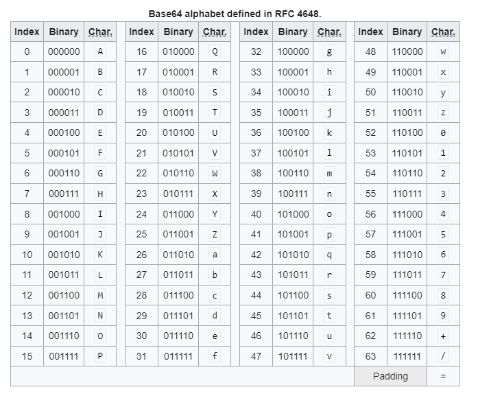

<!--toc:start-->

- [Hashing](#hashing)
  - [Kryptographische Anwendung](#kryptographische-anwendung)
  - [Eigenschaften](#eigenschaften)
  - [Technische Details und Beispiele](#technische-details-und-beispiele)
  - [Codebeispiele](#codebeispiele)
  - [Limitierungen](#limitierungen)
- [Encoding:](#encoding)
  - [Grundlagen der Kodierung](#grundlagen-der-kodierung)
  - [Warum encoding](#warum-encoding)
  - [ASCII-Kodierung](#ascii-kodierung)
  - [Base64-Kodierung](#base64-kodierung)
    - [Key points](#key-points)
    - [Beispiele](#beispiele)
    - [Padding](#padding)
  - [Hex Encoding](#hex-encoding)
    - [Manuelle umrechnung](#manuelle-umrechnung)
  - [Anwendungsgebiete](#anwendungsgebiete)
- [Quellen](#quellen)
<!--toc:end-->

# Hashing

> Hashwerte sind Binärdaten und können nicht immer problemlos übertragen/gespeichert werden.
> Lösung: Encoding


## Kryptographische Anwendung

- **Erkennen von Fälschungen (Integrität von Nachrichten):**
  - Verwendung eines kryptografischen Hashes zur Überprüfung der Integrität einer Nachricht.
    Jede Änderung in der Nachricht führt zu einem anderen Hashwert.
- **Digitale Signaturen (Authentizität):**
  - Sicherstellung der Authentizität von digitalen Nachrichten oder Dokumenten.
    Der Absender signiert einen Hash der Nachricht mit seinem privaten Schlüssel.
- **Speicherung von Passwörtern:**
  - Passwörter sollten niemals im Klartext gespeichert werden.
    Stattdessen werden sie gehasht und gespeichert, oft mit einem eindeutigen Salt, um Rainbow-Table-Angriffe zu verhindern.
- **Kryptowährungen (z. B. Bitcoin mit SHA-256):**
  - Überprüfung von Transaktionen und Erzeugung von Blöcken in Blockchain-Technologien.

## Eigenschaften

- **Ausgabe mit fester Länge:** Wandelt Eingabedaten beliebiger Größe in einen Hash-Wert fester Länge um (z. B. 128, 256 oder 512 Bit).
  - Wirkt wie ein „Fingerabdruck“ für die Daten.
- **Einwegfunktion:** Es ist rechnerisch nicht machbar, den Hashwert umzukehren, um die ursprüngliche Eingabe zu erhalten.
- **Kollisionssicherheit:** Es ist praktisch unmöglich, zwei verschiedene Eingaben zu finden, die denselben Hash-Wert ergeben.
- **Deterministisch:** Dieselbe Eingabe wird immer dieselbe Hash-Ausgabe ergeben.
- **Effizienz:** Schnelles Berechnen des Hashwerts für jede beliebige Eingabe.

## Technische Details und Beispiele

- **MD5** (Message Digest Algorithm 5): Erzeugt einen 128-Bit-Hashwert.
  Aufgrund von Sicherheitslücken, insbesondere der Möglichkeit, Kollisionen (zwei unterschiedliche Eingaben, die denselben Hashwert ergeben) zu erzeugen, gilt MD5 heute als unsicher.

- **SHA-1** (Secure Hash Algorithm 1): Produziert einen 160-Bit-Hashwert.
  Ähnlich wie MD5 ist SHA-1 anfällig für Kollisionen, was seine Sicherheit untergräbt.
  Die erste praktische Kollision wurde 2017 vorgestellt, was die Notwendigkeit unterstreicht, zu sichereren Hashfunktionen wie SHA-256 überzugehen.

- **SHA-2** (inklusive SHA-256 und SHA-512): Diese Algorithmen sind Weiterentwicklungen von SHA-1 mit längeren Hashwerten (256 und 512 Bit) und bieten eine höhere Sicherheit gegen Kollisionen.

- **SHA-3**: Die neueste Ergänzung der Secure Hash Algorithm Familie, eingeführt 2015, die eine unterschiedliche Konstruktionsweise im Vergleich zu SHA-2 aufweist und zusätzliche Sicherheitsmargen bietet.

## Codebeispiele

Ein einfaches Beispiel einer Hashfunktion ist die Summierung der ASCII-Werte eines Textes und die anschließende Modulo-Operation, um sie auf eine bestimmte Hashlänge zu bringen.
Dies ist jedoch eine sehr unsichere Methode, da sie anfällig für Kollisionen ist.

```plaintext
Text: "LUKAS"
ASCII Summe: 76 + 85 + 75 + 65 + 83 = 384
Hash (Modulo 256): 384 % 256 = 128
```

Ist nicht umkehrbar (viele Texte können 128 ergeben)

Ein sichereres Beispiel unter Verwendung von SHA-256:

```bash
echo -n "Hallo Welt" | openssl dgst -sha256
```

Dieser Befehl berechnet den SHA-256 Hash des Strings "Hallo Welt":

```plaintext
SHA2-256(stdin)= 2d2da19605a34e037dbe82173f98a992a530a5fdd53dad882f570d4ba204ef30
```

## Limitierungen

- **Second-Preimage-Attacke:** Bei dieser Art von Angriff versucht ein Angreifer nicht den Originaltext aus einem Hashwert zu rekonstruieren, sondern einen komplett neuen Text zu finden, der zu demselben Hashwert führt.

- **Kollisionen:** Zwar sind moderne Hashfunktionen wie SHA-256 sehr kollisionssicher, die theoretische Möglichkeit von Kollisionen besteht jedoch weiterhin.

- **Salting bei Passwörtern:** Angreifer können bei Kenntnis gängiger Hashfunktionen womöglich Wörterbücher mit bereits gehashten Passwörtern (sog. Rainbow Tables) verwenden, um das Originalpasswort zu erraten. **Lösung** => Salt

# Encoding:

## Grundlagen der Kodierung

Kodierung bezieht sich auf den Prozess der Umwandlung von Daten von einem Format in ein anderes.
In der Informatik und Datenkommunikation wird dieser Vorgang oft verwendet, um Daten in einem kompatiblen Format für Übertragung oder Speicherung zu konvertieren.
Kodierungsmechanismen sind essentiell, um die Integrität und Effizienz der Datenübertragung über unterschiedliche Medien sicherzustellen.

## Warum encoding

Speichern und Übertragen von Binärdaten ist nicht immer problemlos möglich.

Eine Einschränkung auf ASCII Zeichen (printable characters) ist dann sinnvoll.
Binärdaten werden daher oft in eine ASCII Text Darstellung umgewandelt.

Binärdaten bestehen aus einer Folge von Bytes.
Jedes Byte kann einen Wert von 0…255 haben – nicht
jedes dieser Werte entspricht einem druckbaren Zeichen

## ASCII-Kodierung

Die ASCII-Kodierung ist eine der grundlegendsten Formen, bei der jedes Zeichen eines Textes durch eine spezifische Zahl repräsentiert wird.
Dies ist nützlich für einfache Textübertragungen.

## Base64-Kodierung

Base64 ist eine Kodierungsform, die Binärdaten in ASCII-Text umwandelt.
Sie wird häufig verwendet, um binäre Daten (wie Bilder und Audio-Dateien) in Formaten zu speichern und zu übertragen, die primär für Textdaten gedacht sind.
Base64 teilt die Eingabedaten in 6-Bit-Blöcke auf und ordnet jedem Block ein entsprechendes Zeichen aus einem Alphabet von 64 Zeichen zu.



**Beispiel für Base64-Kodierung:**

- Original: "Beispiel"
- Base64: "QmVpc3BpZWw="

Für das Kodieren und Dekodieren von Daten, zum Beispiel in Unix-Systemen, kann der `openssl`-Befehl verwendet werden:

### Key points

- auch Radix-64 genannt
- 1 Buchstabe = 6 Bit
- 3 Byte Binär => 4 Buchstaben
- `A–Z`, `a–z`, `0–9 `, `+`, `/` und `=` (64 Buchstaben und = als Padding)
- Platzbedarf nur 33% mehr als Binär

**Padding:**

- Die = am Ende des Base64 Strings.
- 3 Bytes (3*8=24 Bits) werden als 4 Buchstaben dargestellt (4*6=24).
- Wenn die Länge der Daten kein Vielfaches von 3 ist wird = oder == hinten angefügt.
- Die Länge eines Base64 Strings ist daher immer ein Vielfaches von 4.

### Beispiele

```bash
openssl base64 -in input.bin -out output.base64
```

Dies wandelt die Datei `input.bin` in eine Base64-kodierte Datei `output.base64` um.
Base64 wird oft genutzt, um Daten in Webanwendungen einzubetten und Ladezeiten zu verbessern.

**oder**

```bash
echo 'Hallo Welt' | base64
```

Dieser Befehl konvertiert den String "Hallo Welt" in eine Base64-kodierte Form.

**Vergleich Hex vs Base64:**

**Hex**

```
a36110e65caab98c5bfdaa2f75d731e54c58f496e4e1e73bc9bdf79543f0cac74fe866cfa0d21372793c3dc6ea36f5bd04079593f25d991e72d7fd558f1082c9
```

**Base64**

```
o2EQ5lyquYxb/aovddcx5UxY9Jbk4ec7yb33lUPwysdP6GbPoNITcnk8PcbqNvW9BAeVk/JdmR5y1/1VjxCCyQ==
```

### Padding

Base64 verwendet das Padding mit Gleichheitszeichen (=), um die kodierte Zeichenkette auf eine Länge zu bringen, die ein Vielfaches von vier ist, was für die Kodierung notwendig ist.
Dies gewährleistet, dass die Datenmenge korrekt in 6-Bit-Blöcke aufgeteilt werden kann.
Falls die Originaldaten nicht durch drei teilbar sind, was zu einem 24-Bit-Block führen würde, füllt das Padding die fehlenden Bits auf.

**Zum Padding:**

- Bei Bedarf werden ein oder zwei "=" am Ende der Base64-kodierten Daten hinzugefügt.
- Dies zeigt an, dass die letzten Gruppen nicht vollständig sind.

Ein kurzes Beispiel:

```sh
echo Ola | base64
T2xhCg==
```

## Hex Encoding

Bei der hexadezimalen Kodierung werden Binärdaten in eine Darstellung umgewandelt, die auf dem 16-stelligen Zahlensystem basiert, wobei jede Ziffer einen 4-Bit-Binärblock repräsentiert.
Dies ist hilfreich für Debugging-Zwecke oder zur einfacheren Anzeige binärer Daten.

- auch Radix-16 gennant
- 1 Buchstabe = 4 Bit (1 Byte => 2 Buchstaben)
- `0–9`,`a–f`
- doppelter Platzbedarf im Vergleich zu Binär

**Example**

```sh
$ openssl dgst -sha256 -hex goethe.txt
SHA256(goethe.txt)= a911a35ff92bcd4250c063a0547dae3f1ba2b839eaf12b64c955cf3ff7e570e0
```

### Manuelle umrechnung

```
Bin:  1 1 1 0
Wert: 8 4 2 1
      -------
Dec:  8 4 2 0 = 14
Hex:  14 = E
```

## Anwendungsgebiete

- **Datenspeicherung:** Computer speichern Daten in binärer Form, d. h. als Folge von 0en und 1en.
  Um Textzeichen in dieser Form speichern zu können, muss jedes Zeichen einem bestimmten Binärmuster zugeordnet werden.
  Dies geschieht mithilfe einer Zeichencodierung wie ASCII, UTF-8 oder UTF-16.

- **Datenübertragung:** Wenn Daten über ein Netzwerk oder ein anderes Kommunikationssystem übertragen werden, müssen sie in eine Form codiert werden, die für die Übertragung geeignet ist.
  Dies kann eine einfache binäre Codierung wie ASCII oder eine komplexere Codierung wie z. B. eine Komprimierungscodierung sein, die die Datenmenge reduziert, die übertragen werden muss.

- **Bild- und Audioverarbeitung:** Bilder und Audiodaten werden häufig in digitalen Formaten gespeichert, die eine Codierung der ursprünglichen Daten erfordern.
  Zum Beispiel wird das JPEG-Format zur Codierung von Bildern und das MP3-Format zur Codierung von Audio verwendet.

- **Fehlerkorrektur:** Encoding-Techniken können verwendet werden, um Daten vor Beschädigung zu schützen.
  Dies geschieht durch Hinzufügen von Redundanzdaten zu den Daten, die verwendet werden können, um Fehler zu erkennen und zu korrigieren, die während der Übertragung oder Speicherung auftreten können.

- **Kryptographie:** Encoding spielt eine wichtige Rolle in der Kryptographie, wo es zur Verschlüsselung von Daten verwendet wird, um sie vor unbefugtem Zugriff zu schützen.
  Verschiedene Verschlüsselungsverfahren wie z. B. AES verwenden komplexe mathematische Algorithmen zum Codieren von Daten in eine Form, die nur mit dem richtigen Schlüssel entschlüsselt werden kann.

# Quellen

- [Base64](https://en.wikipedia.org/wiki/Base64)
- [04_encoding](http://web275.142.hosttech.eu/htl/ITSI_2/04_hashing_encoding/04_encoding.html)
- [announcing-first-sha1-collision.html](https://security.googleblog.com/2017/02/announcing-first-sha1-collision.html)
- [01_hashing](http://web275.142.hosttech.eu/htl/ITSI_2/04_hashing_encoding/01_hashing.html)
- [MD5](https://en.wikipedia.org/wiki/MD5)
- [SHA-1](https://en.wikipedia.org/wiki/SHA-1)
- [SHA-2](https://en.wikipedia.org/wiki/SHA-2)
- [SHA-3](https://en.wikipedia.org/wiki/SHA-3)
