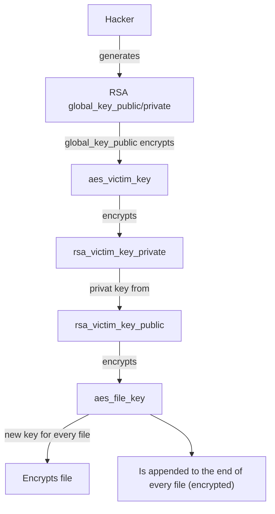
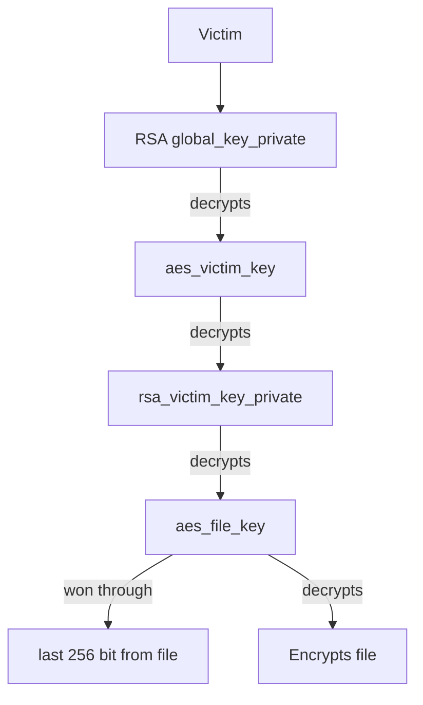

<!--toc:start-->

- [Task](#task)
- [How Ryuk works](#how-ryuk-works)
- [Schema (Encryption)](#schema-encryption)
- [Schema (Decryption)](#schema-decryption)
- [Script Explained](#script-explained)
  - [1. Encryption of the AES Key with the Global Public RSA Key](#1-encryption-of-the-aes-key-with-the-global-public-rsa-key)
  - [2. Encrypted Private RSA Key of the Victim](#2-encrypted-private-rsa-key-of-the-victim)
  - [3. Decryption of the AES Key with the Global Private RSA Key](#3-decryption-of-the-aes-key-with-the-global-private-rsa-key)
  - [4. Using the AES Key to Decrypt the Victim's Private RSA Key](#4-using-the-aes-key-to-decrypt-the-victims-private-rsa-key)
  - [5. Extraction and Decryption of the File Key](#5-extraction-and-decryption-of-the-file-key)
  - [6. Decryption of the File Key with the Victim's Private RSA Key](#6-decryption-of-the-file-key-with-the-victims-private-rsa-key)
  - [7. Decryption of the File](#7-decryption-of-the-file)
  <!--toc:end-->

# Task

Erkläre die Arbeitsweise der Ryuk Ransomware anhand des folgenden Entschlüsselungsskripts:

```sh
# AES Key der den Victim Private RSA Key verschlüsselt
# Dieser ist wieder mit Global Public RSA Key verschlüsselt
echo "hEVXLZ+3woCSEwCsvLY69glGpc9...5fbJyYZE4LUk1g==" > aes_victim_key.enc.b64
base64 --decode aes_victim_key.enc.b64 > aes_victim_key.enc
# der mit aes_victim_key AES-256-CBC verschlüsselte Victim Private RSA Key
echo "uYbycbZFVF....CnxZ3DDD6WU1+cPRgBH7JdmkRTvblnF" > rsa_victim_key.enc.b64
base64 --decode rsa_victim_key.enc.b64 > rsa_victim_key.enc
# Entschlüssele aes_victim_key mit Global Private RSA Key
openssl rsautl -decrypt -in aes_victim_key.enc -inkey global_key.pem > aes_victim_key
echo "aes_victim_key als hex"
xxd -p aes_victim_key | tr -d '\n'
# das was hier ausgegeben wird ist der AES victim key in hex - einsetzten im nächsten Kommando in der -K option
openssl aes-256-cbc -d -in rsa_victim_key.enc -K '0106eb4887051520fcf40b5e8fa5acceab272785c1055ce53e3c201b1d3441fe' -iv 0 >rsa_victim_key.pem
# Fehlermeldung "hex string is too short, padding with zero bytes to length" kann ignoriert werden
# vom ende von watchme das Ende wegschneiden. ist mit 2048 Bit verschlüsselt, d.h. die letzten 256 Bytes der Datei ist der verschlüsselte AES Key
tail -c 256 watchme.txt.enc > aes_file_key.enc
head -c -256 watchme.txt.enc > watchme.txt.enc.data
# Entschlüssele aes_file_key mit Victim Private RSA Key
openssl rsautl -decrypt -in aes_file_key.enc -inkey rsa_victim_key.pem > aes_file_key
echo "aes_aes_file_keyvictim_key als hex"
xxd -p aes_file_key | tr -d '\n'
openssl aes-256-cbc -d -in watchme.txt.enc.data -K '4313
ba62692390aede1bcac8f7da82a6201cf4edd59873859b8b7eafeb49de70' -iv 0 >watchme.txt
```

# How Ryuk works

A 2048-bit RSA key pair `rsa_victim_key_public` and `rsa_victim_key_private` is generated for **each victim system**.

A separate 256-bit AES key is generated for `each file` (`aes_file_key`) and the file is encrypted using AES-256-CBC, IV=0.
The per-file key `aes_file_key` is **encrypted** using `rsa_victim_key_public` and the **result is appended to the end of the encrypted file**.

This process is carried out for each file and the **original files** are then **deleted**.

The `rsa_victim_key_private` is required to **decrypt the per-file keys** in the event of a ransom payment and therefore **remains** on the **victim system in encrypted form**.
Another AES key is generated for this purpose `(aes_victim_key`, AES-256-CBC, IV=0).
The `rsa_victim_key_private` **encrypted** with `aes_victim_key` is stored in a file on the victim system.

The `aes_victim_key` in turn also remains (in encrypted form) on the victim system.
This is now done with an **RSA master key**.
The attacker has a central 2048-bit RSA key pair (`global_key_public` and `global_key_private`).
This is the **master key** that is used for all attacks.
`aes_victim_key` is encrypted with `global_key_public` and the result is stored in a file on the victim system.

**Note**: In the real scenario, a ransomware (in Java) is customized for each victim system, which contains:

- `rsa_victim_key_public`
- `rsa_victim_key_private` but already AES encrypted with `aes_victim_key`!
- `aes_victim_key` but also already RSA encrypted with `global_key_public`

This “pre-packaging” increases security (for the malware!) as compromising the keys on the victim system is ruled out.
This means that if the ransomware remains on the victim system and is analyzed, this does not jeopardize the security of the encryption.
In addition, the ransom note is adapted to the victim during packaging, e.g. the amount of the ransom.

# Schema (Encryption)



# Schema (Decryption)



# Script Explained

## 1. Encryption of the AES Key with the Global Public RSA Key

- The `aes_victim_key`, the AES key of the victim, is encrypted and stored in a Base64-encoded file `aes_victim_key.enc.b64`.
- This Base64-encoded file is decoded to obtain the encrypted AES key file `aes_victim_key.enc`.

```sh
echo "hEVXLZ+3woCSEwCsvLY69glGpc9...5fbJyYZE4LUk1g==" > aes_victim_key.enc.b64
base64 --decode aes_victim_key.enc.b64 > aes_victim_key.enc
```

**Purpose**: The encrypted AES key needs to be in its raw binary form for decryption, as the Base64 format is just an encoding for safe text storage and transport.

## 2. Encrypted Private RSA Key of the Victim

- The private RSA key of the victim is also encrypted and stored in a Base64-encoded file `rsa_victim_key.enc.b64`.
- This file is decoded to obtain the encrypted RSA key file `rsa_victim_key.enc`.

```sh
echo "uYbycbZFVF....CnxZ3DDD6WU1+cPRgBH7JdmkRTvblnF" > rsa_victim_key.enc.b64
base64 --decode rsa_victim_key.enc.b64 > rsa_victim_key.enc
```

**Purpose**: Similar to the previous step, the RSA key must be in binary form for decryption.

## 3. Decryption of the AES Key with the Global Private RSA Key

- The encrypted `aes_victim_key` is decrypted using the global private RSA key to obtain the actual AES key.

```sh
openssl rsautl -decrypt -in aes_victim_key.enc -inkey global_key.pem > aes_victim_key
```

`openssl rsautl -decrypt`: Uses OpenSSL to decrypt the file `aes_victim_key.enc` using the private RSA key (`global_key.pem`), outputting the decrypted AES key to `aes_victim_key`.

## 4. Using the AES Key to Decrypt the Victim's Private RSA Key

- The decrypted `aes_victim_key` is displayed in hex format and used to decrypt the victim's private RSA key (`rsa_victim_key.enc`).

```sh
xxd -p aes_victim_key | tr -d '\n'
openssl aes-256-cbc -d -in rsa_victim_key.enc -K '0106eb4887051520fcf40b5e8fa5acceab272785c1055ce53e3c201b1d3441fe' -iv 0 > rsa_victim_key.pem
```

- `xxd -p`: Converts the binary file (`aes_victim_key`) to a plain hexadecimal string.
- `tr -d '\n'`: Removes newline characters from the output.

**Purpose**: The AES key is needed in hexadecimal format for the next decryption step. This command converts and formats the AES key accordingly.

- `openssl aes-256-cbc -d`: Uses OpenSSL to decrypt the file (`rsa_victim_key.enc`) with the AES key (-K specifies the key in hex format) and an initialization vector (-iv 0), outputting the decrypted private RSA key to `rsa_victim_key.pem`.

## 5. Extraction and Decryption of the File Key

- The encrypted `watchme.txt.enc` contains the encrypted AES file key in the last 256 bytes. This key is extracted and stored in `aes_file_key.enc`.
- The rest of the file is stored in `watchme.txt.enc.data`.

```sh
tail -c 256 watchme.txt.enc > aes_file_key.enc
head -c -256 watchme.txt.enc > watchme.txt.enc.data
```

- `tail -c 256`: Extracts the last 256 bytes from `watchme.txt.enc` and saves it as `aes_file_key.enc`.
- `head -c -256`: Extracts all but the last 256 bytes from `watchme.txt.enc` and saves it as `watchme.txt.enc.data`.

## 6. Decryption of the File Key with the Victim's Private RSA Key

- The `aes_file_key` is decrypted using the victim's private RSA key to obtain the actual file key.

```sh
openssl rsautl -decrypt -in aes_file_key.enc -inkey rsa_victim_key.pem > aes_file_key
```

## 7. Decryption of the File

- The decrypted `aes_file_key` is displayed in hex format and used to decrypt the actual file `watchme.txt.enc.data`.

```sh
xxd -p aes_file_key | tr -d '\n'
openssl aes-256-cbc -d -in watchme.txt.enc.data -K '4313ba62692390aede1bcac8f7da82a6201cf4edd59873859b8b7eafeb49de70' -iv 0 > watchme.txt
```
