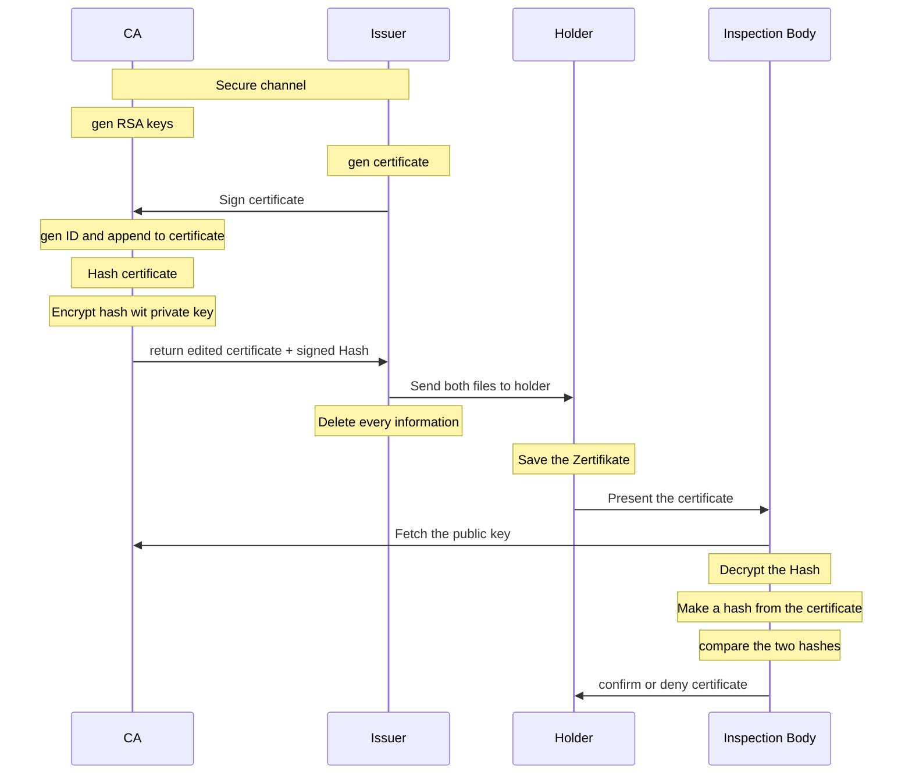

<!--toc:start-->

- [Allgemein](#allgemein)
- [Anwendungsgebiete](#anwendungsgebiete)
- [How it works](#how-it-works)
  - [Schema](#schema)
- [Technischen Details](#technischen-details)
  - [Schritt 1 (CA): Vorbereitungen](#schritt-1-ca-vorbereitungen)
  - [Schritt 2 (Issuer): Zertifikat erstellen](#schritt-2-issuer-zertifikat-erstellen)
  - [Schritt 3 (CA): Zertifikat unterschreiben](#schritt-3-ca-zertifikat-unterschreiben)
  - [Schritt 4 (Issuer) Wipe](#schritt-4-issuer-wipe)
  - [Schritt 5 (Holder) Save](#schritt-5-holder-save)
  - [Schritt 6 (Inspection Body) Check](#schritt-6-inspection-body-check)
  - [Fällschungsversuch](#fällschungsversuch)
  <!--toc:end-->

# Allgemein

**Digitale Zertifikate** dienen dazu gewisse Eigenschaften oder Berechtigungen von Firmen, Personen, usw. fälschungssicher zu bestätigen.

Zertifikate werden von einer **vertrauenswürdigen Stelle** ausgestellt und mit **kryptografischen** Methoden (Hashing, public/private key) abgesichert.

# Anwendungsgebiete

- Ein **Public Key** ist tatsächlich einer bestimmten Person/Firma **zugeordnet**
- Zur Bestätigung, dass jemand bestimmte Berechtigungen oder Eigenschaften hat
  - digitaler Personalausweis
  - digitaler Führerschein
  - digitales Impfzertifikat (Grüner Pass)
- **Websites:** Sichere Verbindung (HTTPS) und Verschlüsselung von Datenübertragung.
  - Die Web Site gehört wirklich zu Person/Firma so und so
- **E-Mails:** Digitale Signaturen und Verschlüsselung für Authentifizierung und Schutz.
- **Authentifizierung:** Benutzer- und Geräteauthentifizierung für sicheren Zugriff auf Systeme und Netzwerke.
- **Digitale Signaturen:** Rechtlich bindende digitale Unterschriften für Verträge und Dokumente sowie Zeitstempel für Dokumente.

# How it works

Es sind 4 Personen/Organisationen beteiligt:

- **Issuer** - Aussteller des Zertifikats (z.B. der impfende Arzt)
- **Certification Authority (CA)** - unterschreibt das Zertifikat mit einem private key
- **Holder** - Person für die das Zertifikat ausgestellt wurde
- **Inspection Body** - Person/Organisation (Kellner, Polizei, …) die das Zertifikat mit dem public key prüft.

Außerdem

- **Mallory** – versucht sich an einer Fälschung

**Ablauf (short summary)**

- (CA) Vorbereitungen
- (Issuer): Zertifikat erstellen
- (CA): Zertifikat unterschreiben
- (Issuer) Wipe
- (Holder) Save
- (Inspection Body) Check
- (Mallory) Fälschungsversuch

## Schema



# Technischen Details

## Schritt 1 (CA): Vorbereitungen

Generieren eines private/public **RSA Schlüsselpaars** mit 4096 Bits:

```sh
$ openssl genpkey -algorithm RSA -pkeyopt rsa_keygen_bits:4096 -out private-key.pem
#oder
$ openssl genrsa -out private-key.pem 4096
```

> Privacy-Enhanced Mail (PEM) ist ein Base64 kodiertes Binärformat.

Anzeige des Inhalts:

```sh
$ openssl pkey -in private-key.pem -text
```

In `private-key.pem` ist der private und der public key enthalten.
Weitergeben möchte man jedoch nur den public key.
Diesen kann man aus dem `pem` File extrahieren (in ein eigenes `pem` File):

```sh
$ openssl pkey -in private-key.pem -out public-key.pem -pubout
```

Anzeige des Inhalts:

```sh
$ openssl pkey -in public-key.pem -pubin -text
```

## Schritt 2 (Issuer): Zertifikat erstellen

Eine Person (Max Mustermann) wird nun geimpft.
Unmittelbar nach der Impfung erstellt eine authorisierte Stelle (Issuer) die Grundlage für das Zertifkat.
Das kann z.B. ein einfaches Textfile (`green_cert.txt`) sein:

```
=======================
Vaccination certificate
=======================
name: Mustermann Max
date of birth: 12.03.1994
disease : COVID-19
vaccine medicinal product: COMIRNATY BNT162b2 (mRNA)
manufacturer: Pfizer-BioNTech
vaccine dose: 2/2
date of vaccination: 07.08.2021
state: Austria
certificate issuer: Dr. Mabuse
```

Dieses Rohzertifikat wird vom Issuer an die Certification Athority (CA) über einen sicheren Kanal geschickt.
Dieser Kanal ist so ausgelegt, dass die CA die Identität des Issuers zweifelsfrei feststellen kann.
Zwischen dem CA und dem Issuer besteht ein gegenseitiges Vertrauensverhältnis.

## Schritt 3 (CA): Zertifikat unterschreiben

Dem Zertifikat wird eine **eindeutige ID** zugewiesen, z.B. eine zufällige Zahl.
Diese erhöht die Fälschungssicherheit und dient dazu das Zertifikat eindeutig zu identifizieren.

In der Regel speichert die CA die erhaltenen Daten in einer Datenbank und verwendet die ID als Schlüssel darauf.

Zuordnen einer eindeutigen ID (Zufallszahl):

```sh
openssl rand -hex 16
b71fee4dd87a424d415dcb4e84b9a067
```

Der vollständigkeit halber müsste jetzt noch geprüft werden ob die ID auch wirklich eindeutig ist.
Die Wahrscheinlichkeit dafür ist aber extrem hoch.

Hinzufügen der ID zum Textfile:

```sh
cat green_cert.txt >green_cert.ser.txt; echo "unique certificate identifier: $( openssl rand -hex 16 )" >>green_cert.ser.txt
```

```
=======================
Vaccination certificate
=======================
name: Mustermann Max
date of birth: 12.03.1994
disease : COVID-19
vaccine medicinal product: COMIRNATY BNT162b2 (mRNA)
manufacturer: Pfizer-BioNTech
vaccine dose: 2/2
date of vaccination: 07.08.2021
state: Austria
certificate issuer: Dr. Mabuse
unique certificate identifier: b71fee4dd87a424d415dcb4e84b9a067
```

Die CA **unterschreibt** nun das Zertifikat mit dem **private key**.
Dazu werden die Daten zuerst gehasht (z.B. SHA512) und dann mit dem private key verschlüsselt.
Das Ergebnis ist die digitale Unterschrift.

```sh
openssl dgst -sha512 -sign private-key.pem -out green_cert.sign green_cert.ser.txt
```

Das Signatur-File (`green_cert.sign`) ist im Binärformat.

Der CA schickt nun auf einem sicheren Kanal das Zertifikat mit Seriennummer (`green_cert.ser.txt`) und das Signatur-File (`green_cert.sign`) zurück zum Issuer.

## Schritt 4 (Issuer) Wipe

Gibt beide erhaltene Files an die geimpfte Person (Holder) weiter und löscht alle Daten die diesen Vorgang betreffen.

## Schritt 5 (Holder) Save

Die geimpfte Person ist nun im Besitz des Zertifikats (certificate holder) und speichert dieses in einem digital wallet (am Handy bspw.).

## Schritt 6 (Inspection Body) Check

Der Holder präsentiert das Zertifikat (z.B. per QR Code) dem Inspection Body.

Dem Inspection Body ist der Public Key des CA bekannt (Datei `public-key.pem`) und kann nun die Gültigkeit des Zertifikats überprüfen.

Aus den Daten des QR Codes sind die Dateien `green_cert.ser.txt` und `green_cert.sign` wiederherstellbar.

Überprüfen der Gültikeit des Zertifikats:

```sh
openssl dgst -sha512 -verify public-key.pem -signature green_cert.sign green_cert.ser.txt
Verified OK
```

## Fällschungsversuch

Mallory möchte sich nicht impfen lassen und versucht stattdessen das Zertifikat von Max Mustermann zu fälschen.

Dazu ändert Mallory den Namen in green_cert.ser.txt:

```
=======================
Vaccination certificate
=======================
name: Mallory Eve
date of birth: 12.03.1994
disease : COVID-19
vaccine medicinal product: COMIRNATY BNT162b2 (mRNA)
manufacturer: Pfizer-BioNTech
vaccine dose: 2/2
date of vaccination: 07.08.2021
state: Austria
certificate issuer: Dr. Mabuse
unique certificate identifier: b71fee4dd87a424d415dcb4e84b9a067
```

Mallory marschiert nun mit diesem Zertifikat zum Inspection Body – dieser kann nun die **Ungültigkeit** des Zertifikats feststellen:

```sh
openssl dgst -sha512 -verify public-key.pem -signature green_cert.sign green_cert.ser.txt
Verification Failure
```

Aufgrund der kryptografischen Stärke der verwendeten Hashing und Verschlüsselungsverfahrens ist es für Mallory unpraktikabel die korrekte Signatur für die manipulierten Daten herauszufinden.
Das geht nur mit dem private key.

Der private key muss vom CA super sicher verwahrt werden.
