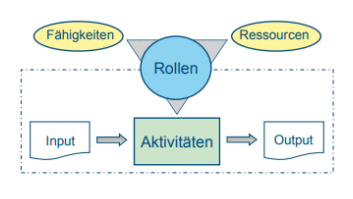
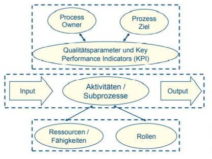

<!--toc:start-->

- [Grundlagen](#grundlagen)
  - [Prozesse in der Informationssicherheit](#prozesse-in-der-informationssicherheit)
  - [Eigenschaften definierter Prozesse](#eigenschaften-definierter-prozesse)
- [Prozessmodell](#prozessmodell)
  - [Generisches Prozessmodell](#generisches-prozessmodell)
    - [Prozesssteuerung](#prozesssteuerung)
    - [Prozess](#prozess)
    - [Prozess-Enabler](#prozess-enabler)
    - [Visual](#visual)
- [Quellen](#quellen)
<!--toc:end-->

# Grundlagen

## Prozesse in der Informationssicherheit

- **Prozesse** beschreiben die Schritte zur Planung, Vereinbarung, Gestaltung und zum Betrieb der IT-Services.
- **Ein Prozess** besteht im einfachsten Fall aus:
  - **Inputs:** Benötigte Informationen oder Ressourcen.
  - **Aktivitäten:** Bearbeitung des Inputs.
  - **Output:** Erwartetes Ergebnis.
- **Die Aktivitäten** werden durch vorhandene Fähigkeiten und Ressourcen beeinflusst.

**Kurz gesagt:** IT-Services werden durch klar definierte Prozesse mit definierten Inputs, Aktivitäten und Outputs effizient verwaltet.

**Zusätzliche Punkte:**

- **Rollendefinitionen:**
  - Zuordnung von Ressourcen und Fähigkeiten zu Aktivitäten.
  - Klare Informationen für Mitarbeiter über ihre Aufgaben und Verantwortlichkeiten.
- **Erfolgreiche Serviceerbringung:**
  - Definierte, dokumentierte, wiederholbare und gelebte Prozesse.
  - Orientierung an den Zielen der IT-Organisation und den Unternehmensanforderungen.
- Prozesse beschreiben **Aktivitäten**, **Abhängigkeiten** und **Abläufe**.

## Eigenschaften definierter Prozesse

- **Messbarkeit:** Kosten, Qualität und andere relevante Aspekte können gemessen und überwacht werden.
- **Spezifische Ergebnisse:** Klare und erkennbare Ergebnisse, die quantifizierbar sein können.
- **Spezifische Abnehmer:** Prozesse liefern Wert für definierte interne oder externe Stakeholder.
- **Reaktion auf Ereignisse:** Prozesse werden durch bestimmte Ereignisse (Trigger) ausgelöst.

> Prozesse liefern einen klaren Mehrwert für Kunden oder Stakeholder.

# Prozessmodell

## Generisches Prozessmodell

Generische Prozessmodelle dienen als Grundlage für die konsistente Beschreibung von Prozessen, insbesondere bei der Neugestaltung von IT-Prozessen.
Besteht aus 3 abstrakten Ebenen:

- **Prozesssteuerung**
  - Prozessziel
  - Wichtige Erfolgsfaktoren und Kennzahlen
- **Prozess**
  - Input und Trigger
  - Aktivitäten
  - Output
- **Prozess-Enabler**
  - Fähigkeiten und Ressourcen
  - Rollen

### Prozesssteuerung

- **Prozessziel:** Klarer Zweck des Prozesses, der den Nutzen für die Organisation oder den Kunden beschreibt.
- **Erfolgsfaktoren:** Qualitative Faktoren, die für die Erreichung des Prozessziels entscheidend sind (z. B. Kundenzufriedenheit, Fehlerquote).
- **Kennzahlen (KPIs):** Quantitative Messgrößen zur Erfassung und Analyse der Prozessleistung (z. B. Verfügbarkeit von IT-Systemen, Bearbeitungszeit von Tickets).
- **Herausforderungen:** Definition geeigneter Kennzahlen, Auswahl relevanter Kennzahlen, regelmäßige Überprüfung und Aktualisierung.

### Prozess

**Kern des Prozesses:** Input-Output-Transformation mit klar definierten und messbaren Aktivitäten und Output.

- **Trigger:** Auslöser (z. B. eingang Kundenanfrage)
- **Input:** Definiert (z. B. Kundenanfrage)
- **Aktivitäten:** Transformation des Inputs (z. B. Bearbeitung der Anfrage)
- **Output:** Klar definiert und messbar (z. B. bearbeitete Anfrage)

### Prozess-Enabler

**Prozess-Enabler:** Voraussetzungen für die erfolgreiche Prozessdurchführung.

- **Ressourcen:** Technische und menschliche Ressourcen
- **Fähigkeiten:** Benötigte Kompetenzen und Fachwissen
- **Rollen:** Verantwortlichkeiten und Aufgaben (z. B. RACI-Modell)

### Visual

# Quellen

- handout
