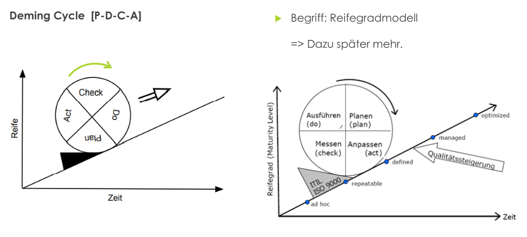
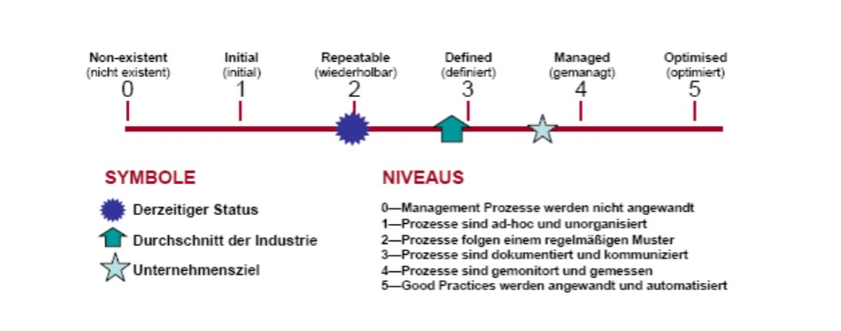

<!--toc:start-->

- [Deming-Zyklus im ISMS](#deming-zyklus-im-isms)
- [Visual](#visual)
- [PDAC in detail](#pdac-in-detail)
  - [Plan](#plan)
  - [Do](#do)
  - [Check](#check)
    - [Konformität](#konformität)
    - [Effektivität](#effektivität)
    - [Effizienz](#effizienz)
  - [Act](#act)
- [Beispiel](#beispiel)
- [Reifegradmodell](#reifegradmodell)
- [KPIs](#kpis)
<!--toc:end-->

# Deming-Cycle im ISMS

**Prinzip:** Kontinuierliche Verbesserung des Informationssicherheitsmanagementsystems (ISMS)

**Phasen:**

1. Plan: Ziele und Maßnahmen definieren
2. Do: Maßnahmen umsetzen
3. Check: Wirksamkeit bewerten
4. Act: Ergebnisse dokumentieren, Korrekturmaßnahmen ergreifen, Plan aktualisieren

**Vorteile:**

- Systematische Verbesserung
- Besseres Risikomanagement
- Erhöhte Compliance
- Gesteigerte Effizienz

Diese Methodik ist so generisch und abstrakt, dass sie sich auf nahezu jedes Betrachtungsobjekt anwenden lässt

# Visual

# PDAC in detail

## Plan

**Kernpunkte:**

- Klare Zielsetzung
- Ressourcen- und Aktivitätenplanung
- Zeit- und Verantwortlichkeitenplanung
- Umfassende Dokumentation

**Erfolgsfaktoren:**

- Einbeziehung aller Stakeholder
- Risikobasierte Vorgehensweise
- SMARTe Zielsetzung
- Regelmäßiger Review

## Do

**Kernpunkte:**

- Umsetzung der in der Planungsphase definierten Maßnahmen
- Bereitstellung der erforderlichen Ressourcen
- Zuweisung von Verantwortlichkeiten
- Dokumentation der Durchführungsschritte

**Erfolgsfaktoren:**

- Klare Kommunikation und Schulung
- Effektives Risikomanagement
- Kontinuierliches Monitoring und Reporting
- Regelmäßiges Feedback

## Check

> Beispiel Autowaschanlage

**Kernpunkte:**

- Überprüfung der erreichten Ergebnisse im Vergleich zu den definierten Zielen
- Analyse von Konformität, Effektivität und Effizienz
- Identifizierung von Verbesserungspotenzialen
- Sammlung von Daten und Informationen

**Erfolgsfaktoren:**

- Objektive und unabhängige Überprüfungen
- Kennzahlenbasierte Bewertung
- Einbeziehung von internen und externen Stakeholdern
- Regelmäßige Überprüfung und Anpassung der Überwachungsmechanismen

### Konformität

Werden Vorgaben eingehalten?

- **Ziel:** Einhaltung von Richtlinien, Standards und Vorgaben im ISMS prüfen.
- **Fokus:** Richtige Umsetzung, Vollständigkeit und Dokumentierung.
- **Methoden:** Audits, Reviews, Kontrollen, Stichproben, Befragungen.
- **Erfolgsfaktoren:** Klare Anforderungen, objektive Prüfungen, regelmäßige Anpassung.
- **Beispiel:** Einhaltung der Passwortrichtlinie, Patch-Stand von Systemen, Firewall-Konfiguration.

### Effektivität

Werden Ziele erreicht?

- **Ziel:** Beurteilen, ob die gesetzten Ziele durch die Maßnahmen erreicht wurden.
- **Fokus:** Zielerreichung, Wirkung und Nutzen.
- **Methoden:** Kennzahlen, Erfolgsindikatoren, Ziel-Ist-Vergleiche, Anwenderbefragungen.
- **Erfolgsfaktoren:** SMARTE Ziele, geeignete Kennzahlen, regelmäßige Auswertung.
- **Beispiel:** Reduzierung der Anzahl von IT-Sicherheitsvorfällen, Steigerung der Kundenzufriedenheit mit dem IT-Support, Verbesserung der Verfügbarkeit von IT-Systemen.

### Effizienz

Werden Ressourcen optimal eingesetzt?

- **Ziel:** Beurteilen, ob die eingesetzten Ressourcen optimal genutzt werden.
- **Fokus:** Ressourcennutzung, Kosten-Nutzen-Verhältnis, Verschwendung vermeiden.
- **Methoden:** Kennzahlen, Kostenanalysen, Prozessoptimierung, Benchmarking.
- **Erfolgsfaktoren:** Klare Ressourcenplanung, geeignete Kennzahlen, kontinuierliche Verbesserung.
- **Beispiel:** Reduzierung von Papierverbrauch im Büro, Optimierung von Logistikrouten, Senkung der Energiekosten in Rechenzentren.

## Act

**Kernpunkte:**

- Analyse der Ergebnisse aus der Überprüfungsphase
- Identifizierung von Verbesserungspotenzialen
- Entwicklung und Umsetzung von **korrigierenden** und **präventiven** Maßnahmen
- Anpassung des ISMS
- Dokumentation der durchgeführten Maßnahmen

**Erfolgsfaktoren:**

- Datenbasierte Entscheidungsfindung
- Einbeziehung aller Stakeholder
- Fokus auf nachhaltige Verbesserungen
- Regelmäßige Überprüfung der Wirksamkeit der Maßnahmen

# Beispiel

Ein Beispiel aus der Praxis: Firma vergibt Laptops an Mitarbeiter:

- Findungsprozess für Richtlinien durchläuft kontinuierliche Optimierung mittels PDCA-Modell.
- Initial erfolgt umfassende Risikobewertung, inklusive Diebstahl, Spionage und Fehlbedienungen.
- Potenzielle Schwachstellen: Betriebssysteme, Anwendungen, Verschlüsselungstechniken sowie hardwareabhängige Komponenten (z.B. USB-Ports, CD/DVD-Brenner, WLAN-Sender, Netzwerkanschlüsse).
- Dokumentation nach ISO 27001:2005 umfasst Richtlinien, Ziele des ISMS, Wirkungsbereich mit Verfahren, Kontrollmöglichkeiten, Risikobewertungen und getätigte Vorgänge.
- Laufende Kontrolle und Optimierung der Dokumentation im PDCA-Lebenszyklusmodell.
- Ergebnis der Dokumentation ist Momentaufnahme des ISMS, externes Audit zur Überprüfung möglich.
- ISO 27001:2005 erfordert von Unternehmensführung Vorbildfunktion, konsequente Umsetzung und Verantwortlichkeit für das Informationssicherheitsmanagementsystem.
- Fortlaufende Anwendung des PDCA-Modells in jeder Phase, einschließlich Risikobewertung, Sicherheitsmaßnahmen und Dokumentation des ISMS.

# Reifegradmodell

# KPIs

**KPIs** (Schlüsselkennzahlen) sind quantifizierbare Messwerte für den Erfolg von Aktivitäten in Unternehmen.
Sie dienen zur:

- **Zielsetzung und -verfolgung**
- **Entscheidungsfindung auf Datenbasis**
- **Steigerung von Effizienz und Qualität**
- **Förderung einer Kultur der kontinuierlichen Verbesserung**

**KPIs sind**:

- **SMART:** Spezifisch, Messbar, Erreichbar, Relevant, Zeitgebunden
- **Zielorientiert**
- **Datenbasiert**
- **Verständlich**
- **Handlungsfähig**
