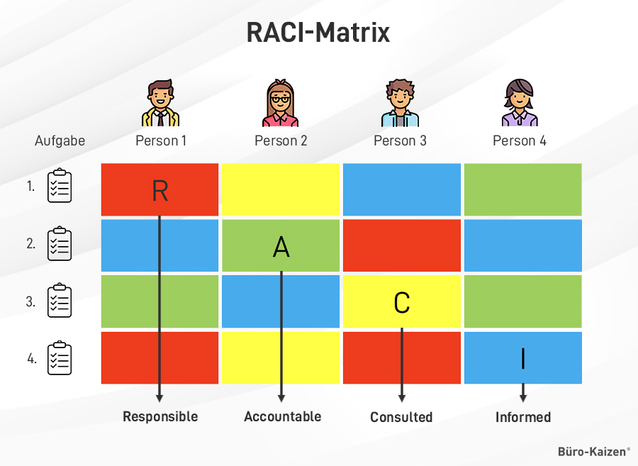
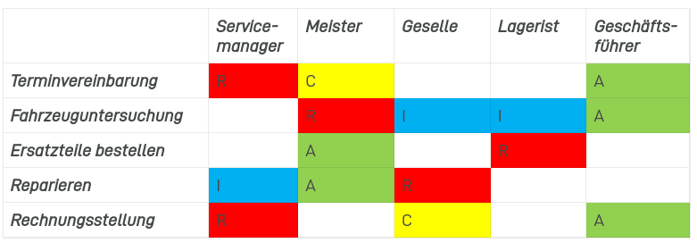

<!--toc:start-->

- [Rollenbeschreibungen](#rollenbeschreibungen)
- [Beschreibung von Verantwortlichkeiten](#beschreibung-von-verantwortlichkeiten)
  - [Die vier Rollen im Detail:](#die-vier-rollen-im-detail)
- [Warum RACI?](#warum-raci)
- [Die Matrix](#die-matrix)
- [Anwendungsbeispiele](#anwendungsbeispiele)
- [Ad-hoc-Verfahren im RACI-Modell:](#ad-hoc-verfahren-im-raci-modell)
- [Rollen und Personen im RACI-Modell:](#rollen-und-personen-im-raci-modell)
- [Quellen](#quellen)
- [Bsp](#bsp)
<!--toc:end-->

# Rollenbeschreibungen

- Definieren Aufgaben und Verantwortlichkeiten in Prozessen.
- Nicht personenbezogen, sondern rollenbezogen.
- Häufig mit Stellenbeschreibungen verknüpft.

# Beschreibung von Verantwortlichkeiten

- **Responsible:** Verantwortlich für die Durchführung
- **Accountable:** Rechtlich oder kaufmännisch verantwortlich (Genehmiger)
- **Consulted:** Fachleute, die um Rat gefragt werden oder beteiligt sind
- **Informed:** Erhält Informationen über den Verlauf bzw. das Ergebnis

## Die vier Rollen im Detail:

**Responsible:**

Der verantwortlichen Person wird im Modell R zugewiesen.
Eine Task kann dabei mehrere verantwortliche Personen haben.
Diese Personen müssen dann diese Task innerhalb der vereinbarten Parameter erledigen.
Es ist sehr wichtig, dass jede Task mindestens einen genau festgelegtne Verantwortlichen hat.

**Accountible:**

Das A wird jener Person zugewiesen, die dafür sorgen muss dass die Task von den verantworlichen Personen `R` erfüllt wird.
Diese Aufgabe sollte nur eine verantwortliche Person bekommen, die während des gesamten Projekts als Entscheidungsträger handelt.
Sie muss dafür sorgen, dass die Task nach den richtigen Standards erledigt wird.

**Consulted:**

Das C im Modell ist der Wissensträger im Team.
Diese Personen bieten Hilfe, zusätzlichen Kontext und Ratschläge zur jeweiligen Task.
Sie gewährt Zugriff damit die verantwortliche Person`R` mit ihrer Task fortfahren kann.
Es kann mehrere C's bei einer Task geben.

**Informed:**

Das I bekommen die Personen die Informationen zu dem Projekt benötigen.
Dies können viele Personen sein.
Führungsteam, Abteilungsleiter, Stakeholder, Genehmiger, etc.
Dies fördert die Transparenz eines Projekts und stellt sicher, dass das Projekt genehmigt und der Zufriedenheit der Stakeholder entspricht.

# Warum RACI?

1. **Klarheit schaffen über Verantwortlichkeiten:** Es stellt sicher, dass alle Beteiligten wissen, wer für welche Aufgaben und Entscheidungen verantwortlich ist, was die Effizienz und Effektivität der Sicherheitsprozesse verbessert.

2. **Minimierung von Verwirrung und Überschneidungen:** Durch klare Zuordnung von Rollen wird verhindert, dass Aufgaben doppelt ausgeführt werden oder wichtige Aufgaben unbeachtet bleiben.

3. **Verbesserung der Kommunikation:** Indem es festlegt, wer informiert oder konsultiert werden muss, trägt das Modell zu einer besseren und gezielten Kommunikation bei.

4. **Nachvollziehbarkeit und Verantwortlichkeit:** Es erleichtert die Nachverfolgung von Entscheidungen und Handlungen, was besonders in sicherheitskritischen Bereichen wichtig ist.

# Die Matrix

Beispiels einer Autoinspektion in einer Kfz-Werkstatt:

# Anwendungsbeispiele

- **Risikobewertung:** Wer ist verantwortlich für die Identifizierung, Bewertung und Priorisierung von IT-Risiken?
- **Incident Response:** Wer ist im Falle eines Sicherheitsvorfalls zuständig für die Erstaufnahme, Untersuchung und Behebung des Vorfalls?
- **Schulungen:** Wer ist dafür verantwortlich, dass Mitarbeiterinnen und Mitarbeiter in IS-Themen geschult werden?
- **Patch-Management:** Wer ist dafür verantwortlich, dass Sicherheitspatches für Systeme und Anwendungen eingespielt werden?
- **Zugriffskontrolle:** Wer ist dafür verantwortlich, dass Benutzerberechtigungen verwaltet und kontrolliert werden?

# Ad-hoc-Verfahren im RACI-Modell:

**Ad-hoc-Verfahren:**

- **Situationsabhängige Aufgabenverteilung und Entscheidungsfindung**
- **Keine im Vorfeld definierten Rollen und Verantwortlichkeiten**
- **Anpassung an spezifische Anforderungen der Situation**

**Geeignet für:**

- Einmalige oder seltene Aufgaben
- Unerwartete Ereignisse
- Komplexe oder unvorhersehbare Aufgaben

| Vorteile     | Nachteile          |
| ------------ | ------------------ |
| Flexibilität | Mangelnde Klarheit |
| Effizienz    | Inkonsistenz       |
| Pragmatismus | Fehlende Kontrolle |

**Anwendung:**

- Sparsam und mit Dokumentation
- Abhängig von Unternehmenskultur und Situation
- Grundprinzipien des RACI-Modells beachten

# Rollen und Personen im RACI-Modell:

- **Keine 1:1-Zuordnung:** Eine Person kann mehrere Rollen haben, eine Rolle kann mehrere Personen haben.
- **Zuordnung:** Situationsabhängig nach Expertise, Verfügbarkeit, Autorität und Interesse.
- **Vorteile von Rollen:** Klarheit, Effizienz, Flexibilität, Skalierbarkeit, Verantwortlichkeit.
- **RACI:** Matrix definiert Rollen und Verantwortlichkeiten, Personen werden zugeordnet.

# Quellen

- Handout
- [buero-kaizen](https://www.buero-kaizen.de/raci-matrix-diagramm-erklaerung-und-vorlagen/)

# Bsp

**RACI-Modell für die standardisierte Durchführung von Serversystem-Updates bei der IT Solutions GmbH**

**Ziel:** Standardisierung des ad-hoc Ablaufs für das wartungsplanmäßige Update der Serversysteme

**Anwendungsbereich:** IT-Abteilung der IT Solutions GmbH

**RACI-Matrix:**

| Aufgabe                                   | IT-Sicherheitsbeauftragter | Fachabteilungen | Systembetreuer | Geschäftsführung | IT-Leitung |
| ----------------------------------------- | -------------------------- | --------------- | -------------- | ---------------- | ---------- |
| **Planung der Serverupdates**             | R                          | C               | I              | I                | A          |
| **Erstellung des Update-Plans**           | I                          | C               | R              | A                | I          |
| **Durchführung der Updates**              | I                          | I               | R              | A                | I          |
| **Dokumentation der Updates**             | I                          |                 | R              | A                |            |
| **Überwachung der Systeme nach Updates**  | A                          | C               | R              |                  |            |
| **Kommunikation mit den Fachabteilungen** | R                          | C               |                |                  | A          |
