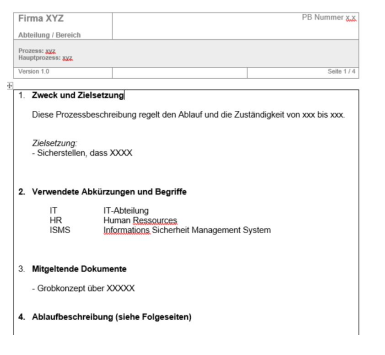
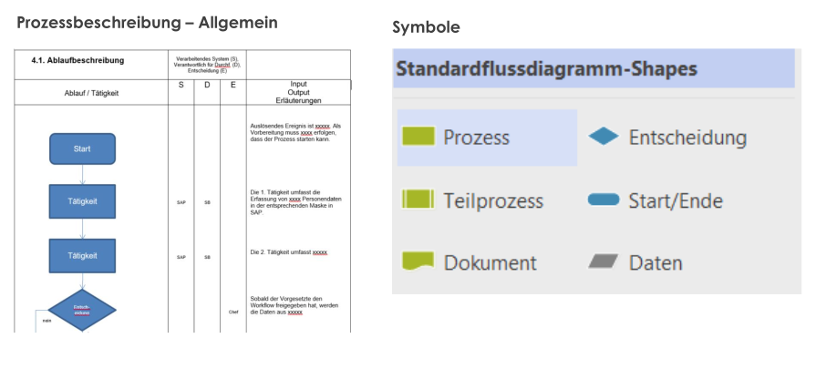
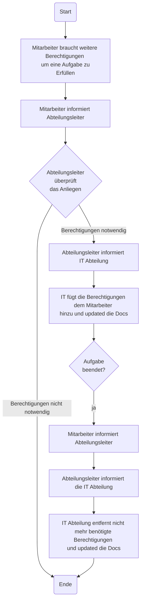

<!--toc:start-->

- [Allgemein](#allgemein)
  - [Visuals](#visuals)
- [Zweck und Zielsetzung erklärt](#zweck-und-zielsetzung-erklärt)
- [Prozessziele definieren](#prozessziele-definieren)
  - [Beispiel](#beispiel)
- [Angabe von ergänzenden Dokumenten](#angabe-von-ergänzenden-dokumenten)
- [Anwendungszustimmung, Prüfung und Freigabe](#anwendungszustimmung-prüfung-und-freigabe)
- [Ablaufbeschreibung Checklist](#ablaufbeschreibung-checklist)
- [Matura Aufgabenstellung](#matura-aufgabenstellung)
  - [Zweck und Zielsetzung:](#zweck-und-zielsetzung)
  - [Prozessziele](#prozessziele)
  - [Mitgeltende Dokumente](#mitgeltende-dokumente)
  - [Ablaufbeschreibung](#ablaufbeschreibung)
  - [Flussdiagram](#flussdiagram)
  <!--toc:end-->

# Allgemein

- Eine Prozessbeschreibung für ein Informationssicherheitsmanagementsystem (ISMS) zeigt, was einzelne Personen im Unternehmen tun, wie deren Aktivitäten zusammenhängen und worauf es ankommt, damit der Prozess seinen Zweck erfüllt.
- Die Prozessbeschreibung wird in standardisierten Formularen abgebildet.

Für ein follständiges Beispiel siehe: [Prozessbeschreibung](./Lösung_Prozessbeschreibung_Beispiel_2.pdf)

Warum ist folgendes wichtig?:

- Gelenktes Dokument --> PB Nummer
- Versionsnummer
- Basically alles jede Rubrik in [Prozessbeschreibung](./Lösung_Prozessbeschreibung_Beispiel_2.pdf)

## Visuals

# Zweck und Zielsetzung erklärt

Zweck und Zielsetzung einer Prozessbeschreibung sind die klare Definition des **"Was"**, **"Wo"** und **"Warum"** des Prozesses.
Sie dienen dazu, die einzelnen Prozessziele zusammenzufassen und die oberste Zielsetzung des Prozesses zu verdeutlichen.

**Wird in 2-3 Sätzen formuliert, die beschreiben:**

- **Wo und wie** der Prozess angewendet wird
- **Welche Inhalte** er hat
- **Was die oberste Zielsetzung** ist

**Beispiel**

> "Es ist sichergestellt, dass alle Mitarbeiter und Auftragnehmer ihre Verantwortlichkeiten
> im Bereich der Informationssicherheit verstehen und für ihre Rollen geeignet sind."

# Prozessziele definieren

Ziele sollen SMART sein:

- **S** pezifisch [Werde möglichst konkret]
- **M** essbar [Gib eine Messgröße an!]
- **A** kzeptiert [Definiere einen Verantwortlichen!]
- **R** ealsitisch [Formuliere realistische Ergebnisse unter Beachtung der vorhandenen Ressourcen!]
- **T** erminiert [Gib Zeitangaben an!]

## Beispiel

- **Schlecht:** Ich will weniger rauchen.
- **Besser:** Ab dem 1.5. Rauche ich keine einzige Zigarette mehr – bis zum Rest meines Lebens.

# Angabe von ergänzenden Dokumenten

In einer Prozessbeschreibung müssen alle relevanten Dokumente aufgelistet sein:

**Beispiel:** Technische Dokumentation (z.B. Usermanuals),

# Anwendungszustimmung, Prüfung und Freigabe

**Vor der Aktivierung:**

- **Inhaltliche Freigabe:** Fachbereiche bestätigen Richtigkeit, Vollständigkeit und Umsetzbarkeit.
- **Prozessfreigabe:** Unterschrift von Verantwortlichen (z.B. Fachbereiche, CISO, Geschäftsleitung).

**Zweck:** Sicherstellen der Prozessqualität, -funktionalität und -akzeptanz.

**Vorteile:** Verbesserte Qualität, Effizienz, klare Verantwortlichkeiten, hohe Akzeptanz.

# Ablaufbeschreibung Checklist

- **Prozessinput:**
  - **Materialien, Teile:** Was wird benötigt?
  - **Mitarbeiter:** Welche Kompetenzen sind erforderlich?
  - **Informationen:** Welche Daten sind relevant?
  - **Ressourcen:** Räume, Maschinen, Geräte, Anlagen, Energie etc.
- **Tätigkeit/Prozessschritt:**
  - Die kleinste Einheit einer Aktivität im Prozess.
- **Prozessoutput:**
  - Ergebnis des Prozesses: Produkt, Dienstleistung oder Information.
- **Anfang/Ende:**
  - Jeder Prozess hat einen definierten Start- und Endpunkt.

# Matura Aufgabenstellung

**Prozessbeschreibung: IT-Sicherheitsprozess für die Änderung von Benutzerberechtigungen im CRM-Projekt**

## Zweck und Zielsetzung:

Dieser Prozess definiert die Vorgehensweise zur Änderung von Benutzerberechtigungen im CRM-System während der Implementierungsphase des CRM-Projekts bei der Müller IT AG. Ziel ist es, den berechtigten Zugriff für Power-User zu gewährleisten und gleichzeitig die Datensicherheit zu bewahren.

## Prozessziele

- Sicherstellung des berechtigten Zugriffs für Power-User auf das CRM-System während der Implementierungsphase
- Minimierung des Risikos von Datenmissbrauch durch unberechtigte Zugriffe
- Rücknahme der zusätzlichen Berechtigungen nach Abschluss der Implementierungsphase

## Mitgeltende Dokumente

- Benutzer Berechtigungs Verzeichniss
- Antrag auf Änderung der Berechtigungen
- ...

## Ablaufbeschreibung

**Prozessschritte:**

**1. Antrag auf Berechtigungsänderung:**

- Der Teamleiter Sales stellt beim CRM-Projektleiter einen Antrag auf Berechtigungsänderung für die beiden Power-User.
- Der Antrag muss folgende Informationen enthalten:
  - Name des Power-Users
  - Benötigte Berechtigungen
  - Begründung für die benötigten Berechtigungen
  - Geplante Dauer der benötigten Berechtigungen

**2. Prüfung des Antrags:**

- Der CRM-Projektleiter prüft den Antrag auf Vollständigkeit und Plausibilität.
- Bei Unklarheiten holt er Rücksprache mit dem Teamleiter Sales ein.
- Der CRM-Projektleiter stimmt dem Antrag zu oder lehnt ihn ab.

**3. Genehmigung der Berechtigungsänderung:**

- Bei Zustimmung des CRM-Projektleiters wird der Antrag dem CISO zur Genehmigung vorgelegt.
- Der CISO prüft den Antrag unter Sicherheitsaspekten und genehmigt ihn oder lehnt ihn ab.

**4. Umsetzung der Berechtigungsänderung:**

- Bei Genehmigung durch den CISO setzt der Teamleiter IT die Berechtigungsänderung im CRM-System um.
- Die Änderung wird protokolliert.

**5. Kommunikation der Berechtigungsänderung:**

- Der Teamleiter Sales informiert die beiden Power-User über die gewährten Berechtigungen.
- Der Teamleiter IT informiert den CISO über die erfolgte Umsetzung der Berechtigungsänderung.

**6. Rücknahme der Berechtigungsänderung:**

- Nach Ablauf der Implementierungsphase erinnert der CRM-Projektleiter den Teamleiter Sales an die Rücknahme der zusätzlichen Berechtigungen.
- Der Teamleiter Sales bestätigt die Beendigung der benötigten Berechtigungen.
- Der Teamleiter IT setzt die Rücknahme der Berechtigungen im CRM-System um.
- Die Änderung wird protokolliert.

**7. Dokumentation:**

- Alle Anträge, Genehmigungen und Änderungen von Berechtigungen werden dokumentiert.
- Die Dokumentation wird für einen definierten Zeitraum aufbewahrt.

## Flussdiagram

Änderung von Benutzerberechtigungen:

