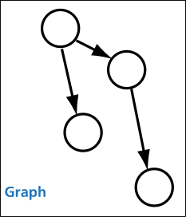
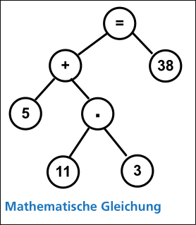

---
title: "Abenteuer Informatik TUW"
subtitle: "A notebook and summary"
author: [Michael Obernhumer]
date: \the\day.\the\month.\the\year
titlepage: true
titlepage-background: "../../template/background10.pdf"
footnotes-pretty: true
...

<!--toc:start-->

- [1. Sag mir wohin](#1-sag-mir-wohin)
  - [Dijkstra-Algorithm](#dijkstra-algorithm)
  - [Graphenalgorithmen](#graphenalgorithmen)
    - [Runtime](#runtime)
    - [Komplexität](#komplexität)
  - [TODO](#todo)
  <!--toc:end-->

# 1. Sag mir wohin

## Dijkstra-Algorithm

**Dijkstra-Algorithmus als Blockdiagramm:**

**Fertige Landkarte nach Durchlauf des Dijkstra-Algorithmus (I $\rightarrow$ O):**

## Graphenalgorithmen

Man unterscheidet ungerichtete Graphen, also solche, bei denen die Verbindung zweier Knoten in beide Richtungen geht (ohne Pfeil), und gerichtete Graphen (mit Pfeil).

**Verwendung:**

- Landkarte bzw. der Stadtplan
- Produktionspläne
- Mathematische Gleichungen

### Runtime

Wenn man versuchen würde den kürzesten Weg durch den Graphen zu Brutforcen würde die Dauer exponentiell ansteigen:
$(n - 1) * (n - 1)!$

Optimal wäre ein linearer Aufwand.
Das bedeutet, dass zur Lösung eines Problems der Größe $n$ der Aufwand $x * n$ beträgt (mit konstantem $x$).
Leider gibt es kaum Algorithmen, die so gut sind.

**Aufwand von Dijkstra:**\
Vom Startknoten aus werden alle benachbarten Knoten (also die, zu denen eine Verbindung besteht) betrachtet.
Bei einem vollständigen Graphen mit $n$ Knoten sind das $(n - 1)$.

Nun wird der Knoten mit der kleinsten Markierung gesucht und von dort geht es wiederum zu allen benachbarten Knoten - das sind $(n - 2)$

Dies setzt sich fort.
Daher ist der Aufwand für den Dijkstra-Algorithmus:
$(n-1) + (n-2) + (n-3) + ... + (1)$

### Komplexität

Die Komplexität gibt an, wie stark die Rechenzeit in Relation zur Problemgröße anwächst.
Im Falle von Brute-Force ist die Komplexität $n^n$, während Dijkstra eine Komplexität von $n^2$ aufweist.

Alles, was sich in polynomieller Laufzeit lösen lässt, gehört zur Klasse „P“.
Das bedeutet, die Laufzeit steigt im Verhältnis zur Problemgröße in einem Verhältnis an, das sich durch ein Polynom ausdrücken lässt.
(z.B.: $n^2$, $n^4+ n^2+ n$, $n*log(n)$ oder auch $n^{100}$)

Darüber hinaus gibt es die Klasse der „**N**icht **P**raktisch berechenbaren“ Probleme oder
„NP“.
Diese haben eine Laufzeit, die sich nicht durch ein Polynom ausdrücken lässt.
Dies bedeutet, dass in der Komplexitätsfunktion die Problemgröße irgendwo in einem Exponenten auftaucht.

NP-Komplexitäten sind $2^n$, $n!$ oder $n^n$.

## TODO
