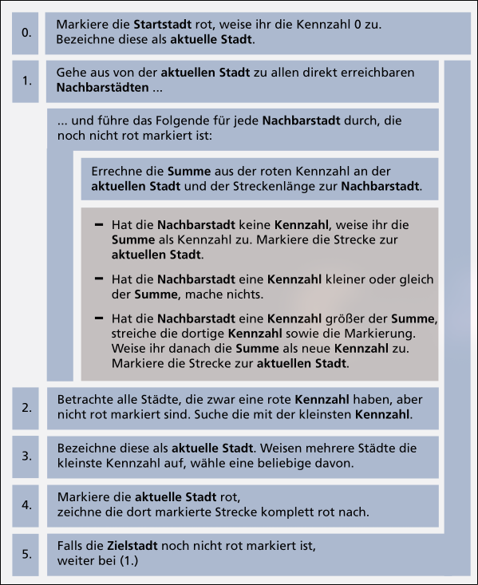
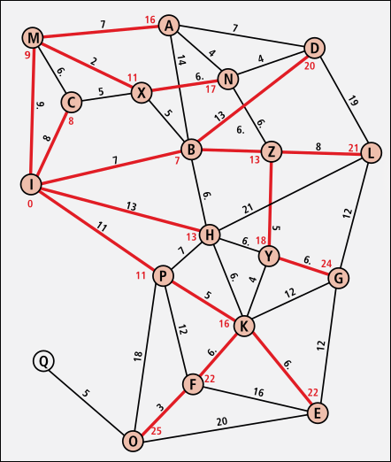

<!--toc:start-->

- [1. Sag mir wohin](#1-sag-mir-wohin)
  - [Dijkstra-Algorithm](#dijkstra-algorithm)
  - [Die Schilda-Rallye](#die-schilda-rallye)
  <!--toc:end-->

# 1. Sag mir wohin

## Dijkstra-Algorithm

**Dijkstra-Algorithmus als Blockdiagramm:**

**Fertige Landkarte nach Durchlauf des Dijkstra-Algorithmus (I $\rightarrow$ O):**

## Die Schilda-Rallye
