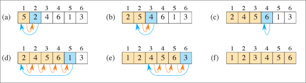

<h1>Introduction to Algorithms Fourth Edition</h1>

**Written by:**

> Thomas H. Cormen \
> Charles E. Leiserson \
> Ronald L. Rivest \
> Clifford Stein 

<h1>Content</h1>

<!--toc:start-->
- [I Foundations](#i-foundations)
  - [1 The Role of Algorithms in Computing](#1-the-role-of-algorithms-in-computing)
    - [1.1 Algorithms](#11-algorithms)
      - [1.1.1 Exercises:](#111-exercises)
    - [1.2 Algorithms as a technology](#12-algorithms-as-a-technology)
      - [1.2.1 Exercises](#121-exercises)
  - [2 Getting Started](#2-getting-started)
    - [2.1 Insertion sort](#21-insertion-sort)
      - [2.1.1 The Algorithm](#211-the-algorithm)
      - [2.1.2 What are loop invariants](#212-what-are-loop-invariants)
      - [2.1.3 Insertion sort loop invariant](#213-insertion-sort-loop-invariant)
    - [2.2 Analyzing algorithms](#22-analyzing-algorithms)
    - [2.3 Designing algorithms](#23-designing-algorithms)
<!--toc:end-->

# I Foundations 
## 1 The Role of Algorithms in Computing 
### 1.1 Algorithms
#### 1.1.1 Exercises:

**1.1-1**
Describe your own real-world example that requires sorting. 
Describe one that requires ûnding the shortest distance between two points. 

**1.1-2**
Other than speed, what other measures of efûciency might you need to consider in a real-world setting? 

**1.1-3**
Select a data structure that you have seen, and discuss its strengths and limitations. 

**1.1-4**
How are the shortest-path and traveling-salesperson problems given above similar? 
How are they different? 

**1.1-5**
Suggest a real-world problem in which only the best solution will do. 
Then come up with one in which approximately the best solution is good enough. 

**1.1-6**
Describe a real-world problem in which sometimes the entire input is available before you need to solve the problem, but other times the input is not entirely available in advance and arrives over time. 

### 1.2 Algorithms as a technology

- Total system performance depends on choosing eficient algorithms as much as on choosing fast hardware

#### 1.2.1 Exercises

**1.2-1** 
Give an example of an application that requires algorithmic content at the application level, and discuss the function of the algorithms involved. 

**1.2-2** 
Suppose that for inputs of size $n$ on a particular computer, insertion sort runs in $8n^2$ steps and merge sort runs in $64n\ \log n$ steps. 
For which values of n does insertion sort beat merge sort? 

**1.2-3** 
What is the smallest value of n such that an algorithm whose running time is $100n^2$ runs faster than an algorithm whose running time is $2^n$ on the same machine? 

## 2 Getting Started 
### 2.1 Insertion sort 

#### 2.1.1 The Algorithm
**Input:** A sequence of $n$ numbers $\left\langle a_1, a_2, ... ,a_n \right\rangle$. 

**Output:** A permutation (reordering) $\left\langle a'_1, a'_2, ... ,a'_n \right\rangle$ of the input sequence such that $\left\langle a'_1 \leq a'_2 \leq ... \leq a'_n \right\rangle$.

- The numbers to be sorted are also known as the keys.
- When we want to sort numbers, it’s often because they are the keys associated with other data, which we call satellite data. 
  Together, a key and satellite data form a record. 

**INSERTION-SORT $(A;n)$:**

 

**Visualized:**

 

#### 2.1.2 What are loop invariants

Loop invariants help us understand why an algorithm is correct.
When you’re using a loop invariant, you need to show three things: 

**Initialization:** It is true prior to the first iteration of the loop.

**Maintenance:** If it is true before an iteration of the loop, it remains true before the next iteration.

**Termination:** The loop terminates, and when it terminates, the invariant *- usually along with the reason that the loop terminated -* gives us a useful property that helps show that the algorithm is correct.

#### 2.1.3 Insertion sort loop invariant

**Initialization:** 

We start by showing that the loop invariant holds before the first loop iteration, when $i=2$.
The subarray $A[1:i-1]$ consists of just the single element $A[1]$ , which is in fact the original element in $A[1]$ .
Moreover, this subarray is sorted (after all, how could a subarray with just one value not be sorted?), which shows that the loop invariant holds prior to the first iteration of the loop.

**Maintenance:** 

Next, we tackle the second property: showing that each iteration maintains the loop invariant.
Informally, the body of the **for** loop works by moving the values in $A[i-1], A[i-2], A[i-3]$ and so on by one position to the right until it finds the proper position for $A[i]$ (lines 4-7), at which point it inserts the value of $A[i]$ (line 8).
The subarray $A[1:i]$ then consists of the elements originally in $A[1:i]$ , but in sorted order.
`Incrementing` i (increasing its value by 1 ) for the next iteration of the **for** loop then preserves the loop invariant.

A more formal treatment of the second property would require us to state and show a loop invariant for the **while** loop of lines 5-7.
Let’s not get bogged down in such formalism just yet.
Instead, we’ll rely on our informal analysis to show that the second property holds for the outer loop.

### 2.2 Analyzing algorithms 
### 2.3 Designing algorithms 
